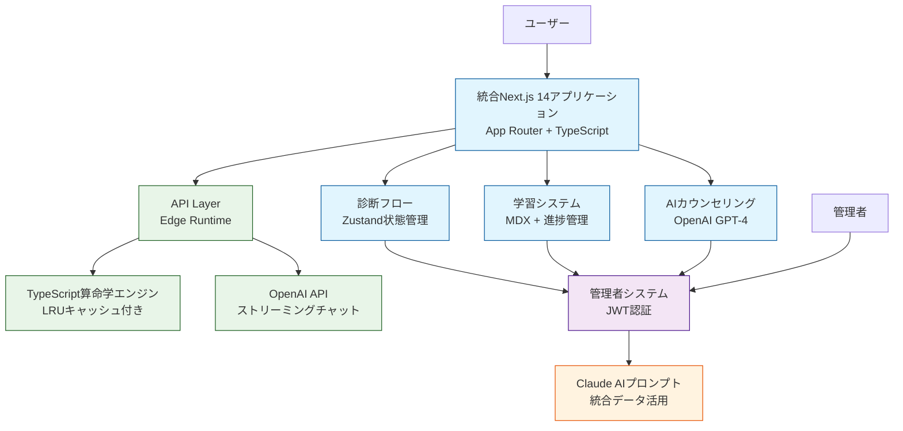

# COCOSiL（ココシル）- 統合診断分析システム

体癖理論・MBTI・動物占い・算命学を統合した包括的な人間理解プラットフォーム

## TL;DR（30秒でわかる COCOSiL）

```bash
# 依存関係インストール & 開発サーバー起動
npm install && npm run dev
# ブラウザで http://localhost:3000/ を開く

# Python環境も必要（算命学計算用）
pip install -r requirements.txt
```

**何ができる？**  
4つの診断手法（体癖・MBTI・算命学・動物占い）を1つのフローで実行し、Claude AI向けの最適化されたプロンプトを自動生成。テストユーザーから収集したデータで診断精度を継続改善します。

---

## 📋 目次

- [プロジェクト概要](#プロジェクト概要)
- [主要機能](#主要機能)
- [技術スタック](#技術スタック)
- [システム構成](#システム構成)
- [セットアップ](#セットアップ)
- [開発スクリプト](#開発スクリプト)
- [プロジェクト構造](#プロジェクト構造)
- [API仕様](#api仕様)
- [テスト](#テスト)
- [デプロイ](#デプロイ)
- [要件対応状況](#要件対応状況)
- [ライセンス・利用上の注意](#ライセンス利用上の注意)

---

## プロジェクト概要

### 背景・課題
- **従来の問題**: 体癖理論・MBTI・算命学・動物占いが個別に運用されており、統合的な人間理解が困難
- **データ収集の課題**: Claude AI を活用した診断精度向上のための体系的なデータ収集基盤が不在
- **学習機会の不足**: 専門的な体癖理論の学習と実践的診断の統合が不十分

### COCOSiL が提供する価値
- **統合診断**: 4つの診断手法を1つのフローで実行し、包括的な分析を提供
- **AI最適化**: 収集データを基にClaude AI向けの最適なプロンプトを自動生成  
- **検証プラットフォーム**: テストユーザー50-100人での診断手法検証基盤
- **プライバシー保護**: 個人データの厳格な管理と他診断への非活用を保証

### システム目標
- **検証フェーズでのデータ収集**: テストユーザーの基本情報を体系的に収集し、分析精度の向上を図る
- **Claude AI活用の最適化**: 収集したデータを基に管理者向けの最適なプロンプト生成を行う  
- **統合診断システムの構築**: 複数の診断手法を統合した新しい分析手法の確立

---

## 主要機能

### ✅ コア機能（Phase 1実装）
- **[F001] ココシル入口サイト**: 基本情報収集、診断結果統合表示、Claude AI向けデータ生成
- **[F002] 体癖診断システム**: 20問診断、主体癖・副体癖算出、結果画像生成  
- **[F003] 体癖理論学習サイト**: 体癖論教育コンテンツ、インタラクティブ学習機能
- **[F004] 管理者データベース**: 診断データ管理、統計分析、プロンプト生成
- **[F005] サイト間連携**: 4サイト間のシームレスなデータ共有

### 🔄 進行中の機能（Phase 2-3）
- **OpenAI API統合**: GPT-4を使用したストリーミング対話機能
- **Python算命学エンジン**: 生年月日からの自動算命学・動物占い算出
- **統計分析ダッシュボード**: 収集データの傾向分析・可視化

### 📊 差別化・付加価値機能
- **複合診断アルゴリズム**: 複数の診断手法を統合した独自の分析ロジック
- **学習支援システム**: 体癖論等の専門知識を段階的に学習できる教育機能  
- **プライバシー保護機能**: 個人データの厳格な管理と他診断への非活用保証

---

## 技術スタック

### フロントエンド
- **Next.js 14** (App Router) - React フレームワーク
- **TypeScript** - 型安全性の確保
- **React Hook Form** - フォーム管理・バリデーション
- **Zustand** - 軽量状態管理（サイト間データ共有）
- **Tailwind CSS** - ユーティリティファーストCSS
- **shadcn/ui** - 再利用可能なUIコンポーネント

### バックエンド・API
- **Next.js API Routes** - サーバーサイド処理（Edge Runtime対応）
- **TypeScript算命学エンジン** - Edge Runtime最適化済み計算システム
- **OpenAI API** (GPT-4) - ストリーミングAI対話・プロンプト最適化
- **LRU Cache** - 算命学計算結果の効率的キャッシュ（7日TTL）

### データ管理
- **Zustand + localStorage** - 状態管理・永続化（30日自動削除）
- **TypeScript定数** - 算命学・動物占い計算ロジック（CSVからマイグレーション完了）
- **JSON** - 診断結果・設定データ・MDXメタデータ
- **Session UUID** - ユーザー識別・データ整合性管理

### 開発・運用
- **ESLint + Prettier** - コード品質・フォーマット統一
- **Jest + Testing Library** - 単体・統合テスト
- **Playwright** - E2Eテスト
- **Vercel** - ホスティング・デプロイ

---

## システム構成・ユーザーフロー

### 📊 **統合ユーザーフロー（現在の実装）**

```mermaid
flowchart TD
    %% Updated COCOSiL User Flow - Current Implementation (2024)
    %% Unified Next.js 14 Application with AI Integration

    subgraph "Entry & Basic Info"
        A[ランディングページ<br/>src/app/page.tsx]
        B[基本情報入力開始<br/>src/app/diagnosis/page.tsx]
        C[名前・生年月日・性別入力<br/>src/ui/features/forms/basic-info-form.tsx]
        D[入力検証<br/>Zod validation]
    end

    subgraph "Fortune Calculation (Background)"
        E[算命学・動物占い自動算出<br/>src/app/api/fortune-calc-v2/route.ts]
        E1[Edge Runtime TypeScript計算<br/>src/lib/fortune/precision-calculator.ts]
        E2[LRUキャッシュ（7日TTL）]
    end

    subgraph "MBTI Collection"
        F[MBTI収集開始<br/>src/app/diagnosis/mbti/page.tsx]
        G{MBTI既知?}
        H[MBTI入力<br/>ドロップダウン選択]
        I[簡易診断（12問）<br/>src/lib/data/mbti-questions.ts]
        J[MBTI結果確定<br/>信頼度スコア付き]
    end

    subgraph "Taiheki Learning (Optional)"
        K[体癖学習システム<br/>src/app/learn/taiheki/page.tsx]
        L[MDXコンテンツ表示<br/>src/content/taiheki/]
        M[チャプター進行管理<br/>Zustand learning-store]
        N[クイズシステム<br/>src/app/learn/taiheki/quiz/]
    end

    subgraph "Taiheki Diagnosis"
        O[体癖診断開始<br/>src/app/diagnosis/taiheki/page.tsx]
        P[20問診断アルゴリズム<br/>src/lib/data/taiheki-questions.ts]
        Q[動的スコアリング<br/>src/app/api/taiheki/bulk/route.ts]
        R[主体癖・副体癖決定]
    end

    subgraph "AI Counseling (Optional)"
        S[AIカウンセリング選択<br/>src/app/diagnosis/chat/page.tsx]
        T[相談トピック選択<br/>人間関係・キャリア・性格・将来]
        U[OpenAI GPT-4 ストリーミングチャット<br/>src/app/api/ai/chat/route.ts]
        V[チャット要約生成<br/>src/app/api/ai/summary/route.ts]
    end

    subgraph "Integrated Results"
        W[統合診断結果<br/>src/ui/features/diagnosis/results.tsx]
        X[ワードベース文章生成<br/>3:2重み付けシステム]
        Y{AIカウンセリング完了?}
        Z[チャットサマリー表示<br/>SummarizedQAList]
        AA[空のQ&A状態<br/>EmptyQAState]
        BB[結果出力・コピー機能]
    end

    subgraph "Data Management"
        CC[Zustand状態管理<br/>src/lib/zustand/diagnosis-store.ts]
        DD[localStorage永続化<br/>30日自動削除]
        EE[セッション管理<br/>UUID生成]
    end

    subgraph "Admin System"
        FF[管理者ログイン<br/>src/app/admin/page.tsx]
        GG[JWT認証<br/>src/lib/jwt-session.ts]
        HH[ダッシュボード<br/>診断統計・分析]
        II[Claude AIプロンプト生成<br/>src/app/api/admin/claude-prompt/]
    end

    %% Main Flow
    A --> B
    B --> C
    C --> D
    D --> E
    E --> E1
    E1 --> E2
    E --> F

    F --> G
    G -->|既知| H
    G -->|不明| I
    H --> J
    I --> J

    J --> K
    K -->|学習する| L
    L --> M
    M --> N
    N --> O
    K -->|スキップ| O

    O --> P
    P --> Q
    Q --> R

    R --> S
    S -->|カウンセリング実施| T
    T --> U
    U --> V
    V --> W
    S -->|スキップ| W

    W --> X
    X --> Y
    Y -->|完了| Z
    Y -->|未完了| AA
    Z --> BB
    AA --> BB

    %% Data Flow
    C --> CC
    J --> CC
    R --> CC
    V --> CC
    CC --> DD
    CC --> EE

    %% Admin Flow
    FF --> GG
    GG --> HH
    BB --> II

    %% Background Processes
    CC -.-> E
    DD -.-> CC

    %% Styling
    classDef entry fill:#e1f5fe,stroke:#01579b,stroke-width:2px
    classDef diagnosis fill:#f3e5f5,stroke:#4a148c,stroke-width:2px
    classDef ai fill:#e8f5e8,stroke:#1b5e20,stroke-width:2px
    classDef results fill:#fff3e0,stroke:#e65100,stroke-width:2px
    classDef system fill:#fce4ec,stroke:#880e4f,stroke-width:2px
    classDef admin fill:#e0f2f1,stroke:#00695c,stroke-width:2px

    class A,B,C,D entry
    class F,G,H,I,J,O,P,Q,R diagnosis
    class S,T,U,V ai
    class W,X,Y,Z,AA,BB results
    class CC,DD,EE system
    class FF,GG,HH,II admin
```



### 🏗️ **システムアーキテクチャ概要**



### 🔄 **データフロー（現在の実装）**

1. **基本情報収集** → Edge Runtime TypeScript API → **算命学・動物占い結果**（バックグラウンド処理）
2. **MBTI診断** → 既知入力 or 12問簡易診断 → **信頼度スコア付き結果**
3. **体癖学習** → MDXコンテンツ + 進捗管理 → **理解度向上**（オプション）
4. **体癖診断** → 20問動的スコアリング → **主体癖・副体癖決定**
5. **AIカウンセリング** → OpenAI GPT-4ストリーミング → **チャット要約生成**（オプション）
6. **統合結果** → ワードベース文章生成（3:2重み付け） → **結果出力・コピー機能**
7. **管理者システム** → Claude AIプロンプト生成 → **分析・改善活用**

### 💾 **状態管理・永続化**
- **Zustand Store**: 診断データの集中管理・セッション状態保持
- **localStorage**: 30日自動削除付きデータ永続化
- **UUID セッション**: ユーザー識別・データ整合性確保

---

## セットアップ

### 前提条件
- **Node.js**: 18.0.0 以上
- **Python**: 3.8 以上  
- **npm/yarn/pnpm**: 最新版
- **Git**: バージョン管理

### 1. リポジトリクローン・依存関係インストール

```bash
# リポジトリクローン
git clone https://github.com/your-org/cocosil-analysis.git
cd cocosil-analysis

# Node.js依存関係
npm install
# または
yarn install
# または  
pnpm install

# Python依存関係
pip install -r requirements.txt
```

### 2. 環境変数設定

`.env.local` ファイルを作成し、以下の変数を設定：

```bash
# OpenAI API
OPENAI_API_KEY=sk-your-openai-api-key

# Next.js設定  
NEXT_PUBLIC_APP_URL=http://localhost:3000
NEXTAUTH_URL=http://localhost:3000
NEXTAUTH_SECRET=your-nextauth-secret

# データベース（将来実装）
DATABASE_URL=postgresql://...

# 管理者認証
ADMIN_PASSWORD=your-admin-password
```

### 3. データファイル準備

```bash
# 算命学CSVデータを配置
mkdir -p data
cp data/fortune_data.csv.example data/fortune_data.csv
# CSV内容を実際のデータに編集
```

### 4. 開発サーバー起動

```bash
# 開発サーバー起動
npm run dev

# ブラウザで以下にアクセス
# http://localhost:3000 - ココシル入口
# http://localhost:3000/taiheki-diagnosis - 体癖診断  
# http://localhost:3000/taiheki-theory - 体癖理論学習
# http://localhost:3000/admin - 管理者データベース（認証必要）
```

---

## 開発スクリプト

| スクリプト | 説明 | 用途 |
|-----------|------|------|
| `npm run dev` | 開発サーバー起動 | ホットリロード付き開発 |
| `npm run build` | 本番ビルド | Vercelデプロイ前の確認 |
| `npm run start` | 本番サーバー起動 | ビルド後の動作確認 |
| `npm run lint` | ESLint実行 | コード品質チェック |
| `npm run type-check` | TypeScript型チェック | 型エラーの確認 |
| `npm test` | Jestテスト実行 | 単体・統合テスト |
| `npm run test:e2e` | Playwright E2Eテスト | エンドツーエンドテスト |
| `npm run format` | Prettierフォーマット | コードフォーマット統一 |

### Python関連

| スクリプト | 説明 |
|-----------|------|
| `python scripts/fortune_calculator.py 1990 5 15` | 算命学計算テスト |
| `python -m pytest tests/` | Pythonテスト実行 |

---

## プロジェクト構造

```
src/
├── app/                    # Next.js App Router
│   ├── (sites)/           # サイト別グルーピング
│   │   ├── cocosil/       # ココシル入口サイト
│   │   ├── taiheki-diagnosis/  # 体癖診断システム
│   │   ├── taiheki-theory/     # 体癖理論学習サイト  
│   │   └── admin/              # 管理者データベース
│   ├── api/               # API Routes
│   │   ├── fortune-calc/  # 算命学計算API
│   │   ├── admin-submit/  # 管理者向けデータ送信
│   │   └── chat/          # OpenAI API連携
│   ├── globals.css        # グローバルスタイル
│   └── layout.tsx         # ルートレイアウト
├── components/             # 再利用可能コンポーネント
│   ├── ui/                # shadcn/ui基本コンポーネント
│   ├── forms/             # フォーム関連コンポーネント  
│   └── shared/            # サイト間共通コンポーネント
├── lib/                   # ユーティリティ・設定
│   ├── zustand/           # 状態管理ストア
│   ├── utils.ts           # 共通ユーティリティ
│   └── validations.ts     # バリデーション設定
├── types/                 # TypeScript型定義
│   └── index.ts           # 全体の型定義
data/                      # データファイル
├── fortune_data.csv       # 算命学・動物占いマスター
└── taiheki_questions.json # 体癖診断質問データ
scripts/                  # Python・ユーティリティスクリプト  
├── fortune_calculator.py # 算命学計算エンジン
└── data_migration.py     # データ移行スクリプト
docs/                     # プロジェクトドキュメント
├── output/               # 生成済みドキュメント
│   ├── system_requirements.md    # システム要件定義書
│   └── detailed_requirements.md  # 詳細要件定義書
├── input/                # 入力資料・図表
└── api/                  # API仕様書
tests/                    # テストファイル
├── __tests__/            # 単体・統合テスト
├── e2e/                  # E2Eテスト（Playwright）
└── fixtures/             # テストデータ
```

---

## API仕様

### 算命学計算 API
**エンドポイント**: `POST /api/fortune-calc`

```typescript
// リクエスト
interface FortuneCalcRequest {
  year: number;   // 1900-2025
  month: number;  // 1-12  
  day: number;    // 1-31
}

// レスポンス
interface FortuneCalcResponse {
  success: boolean;
  data?: {
    age: number;
    zodiac: string;      // 十二支
    animal: string;      // 動物占い
    sixStar: string;     // 六星占術
    element: string;     // 五行
    fortune: string;     // 運勢概要
  };
  error?: string;
}
```

### 管理者データ送信 API
**エンドポイント**: `POST /api/admin-submit`

```typescript
interface AdminSubmitRequest {
  userData: UserDiagnosisData;  // 診断結果全データ
  mdContent: string;            // Claude AI向け.mdファイル
  metadata: {
    sessionDuration: number;     // 診断所要時間
    browserInfo: string;         // ブラウザ情報
  };
}
```

### OpenAI チャット API
**エンドポイント**: `POST /api/chat/stream`  
**機能**: Server-Sent Eventsによるストリーミング対話

---

## テスト

### テストカバレッジ目標
- **単体テスト**: 80%以上
- **統合テスト**: 主要API・コンポーネント100%
- **E2Eテスト**: クリティカルパス100%

### テスト実行

```bash
# 全テスト実行
npm test

# 単体テスト（Jest + Testing Library）
npm run test:unit

# E2Eテスト（Playwright）  
npm run test:e2e

# テストカバレッジ確認
npm run test:coverage

# Pythonテスト
python -m pytest tests/ -v
```

### 主要テストシナリオ
- **完全診断フロー**: 基本情報入力 → MBTI → 体癖診断 → 結果表示 → データ送信
- **エラーハンドリング**: API障害時のリトライ・フォールバック  
- **レスポンシブデザイン**: スマートフォン・タブレット・デスクトップ対応
- **アクセシビリティ**: キーボード操作・スクリーンリーダー対応

---

## デプロイ

### Vercel（推奨）

```bash
# Vercel CLI
npm i -g vercel
vercel

# 環境変数設定（Vercelダッシュボードで）
OPENAI_API_KEY=sk-...
ADMIN_PASSWORD=...
```

### Docker（代替案）

```dockerfile
# Dockerfile（参考）
FROM node:18-alpine AS deps
WORKDIR /app
COPY package*.json ./
RUN npm ci --only=production

FROM node:18-alpine AS builder  
WORKDIR /app
COPY . .
RUN npm run build

FROM node:18-alpine AS runner
WORKDIR /app
COPY --from=builder /app/public ./public
COPY --from=builder /app/.next ./.next
COPY --from=builder /app/node_modules ./node_modules
COPY --from=builder /app/package.json ./package.json

EXPOSE 3000
CMD ["npm", "start"]
```

---

## 要件対応状況

### システム要件トレーサビリティ

| 要件ID | 要件名 | 設計状況 | 実装予定場所 | 優先度 |
|--------|--------|----------|----------|-----------|
| **F001** | ユーザー向け統合システム | ✅ 設計完了 | `src/app/(sites)/cocosil/` | 🔴 高 |
| F001-1 | 基本情報入力フォーム | ✅ 詳細設計済 | `ui/features/forms/BasicInfoForm.tsx` | 🔴 高 |
| F001-2 | MBTI情報収集 | ✅ 詳細設計済 | `domain/mbti/ + ui/features/forms/` | 🔴 高 |  
| F001-3 | 統合結果表示・プロンプト生成 | ✅ 詳細設計済 | `application/diagnose.ts` | 🔴 高 |
| **F002** | 体癖診断システム | ✅ 設計完了 | `src/app/(sites)/taiheki-diagnosis/` | 🔴 高 |
| F002-1 | 20問体癖診断フロー | ✅ 詳細設計済 | `domain/taiheki/diagnosis.ts` | 🔴 高 |
| F002-2 | 主体癖・副体癖算出 | ✅ アルゴリズム設計済 | `domain/taiheki/calculator.ts` | 🔴 高 |
| F002-3 | 診断結果詳細表示 | ✅ 画面設計済 | `ui/features/results/` | 🟡 中 |
| **F003** | 体癖理論学習サイト | ✅ 設計完了 | `src/app/(sites)/taiheki-theory/` | 🟡 中 |
| **F004** | 管理者向けデータベース | ✅ 設計完了 | `src/app/(sites)/admin/` | 🟡 中 |
| **F005** | サイト間連携システム | ✅ 設計完了 | `lib/zustand/stores/` | 🔴 高 |

### 非機能要件達成状況

| 要件 | 目標値 | 現在値 | 状況 |
|------|--------|--------|------|
| ページロード時間 | ≤2秒 | TBD | ⏳ 測定待ち |
| 診断算出時間 | ≤3秒 | TBD | ⏳ 測定待ち |  
| API応答時間 | ≤1秒 | TBD | ⏳ 測定待ち |
| 同時接続対応 | 50人 | TBD | ⏳ 負荷テスト待ち |
| テストカバレッジ | ≥80% | 0% | ⏳ テスト実装待ち |
| WCAG準拠 | AA | 未確認 | ⏳ アクセシビリティテスト待ち |

### 開発ロードマップ

- **Phase 1 (Week 1-4)**: 基盤構築・基本機能実装
- **Phase 2 (Week 5-7)**: 診断機能拡充・UI/UX改善  
- **Phase 3 (Week 8-10)**: 検証・最適化・運用準備

**現在**: Phase 1 開発中（要件定義・設計完了）

---

## ライセンス・利用上の注意

### ライセンス
MIT License - 詳細は [LICENSE](./LICENSE) を参照

### 利用上の重要な注意事項

⚠️ **医療・診断に関する免責事項**  
本システムが提供する分析結果は**参考情報**であり、**医療診断・心理診断・人事評価**等の判断材料として使用することはできません。

⚠️ **個人情報保護**  
- 個人識別情報は診断完了から**30日後に自動削除**
- 診断データは**他の目的には一切使用しない**  
- ユーザーからの削除要求には**即座に対応**

⚠️ **検証フェーズでの利用**  
本システムは現在**検証フェーズ**であり、診断精度の改善を目的としたテストユーザー（50-100人程度）での運用を想定しています。

### 貢献・サポート

- **Issues**: バグ報告・機能要望は [GitHub Issues](https://github.com/your-org/cocosil-analysis/issues)
- **Pull Requests**: 改善提案歓迎（[CONTRIBUTING.md](./CONTRIBUTING.md) 参照）
- **ドキュメント**: 詳細仕様は [`docs/`](./docs/) ディレクトリ参照

---

**COCOSiL Development Team**  
最終更新: 2025-01-15
