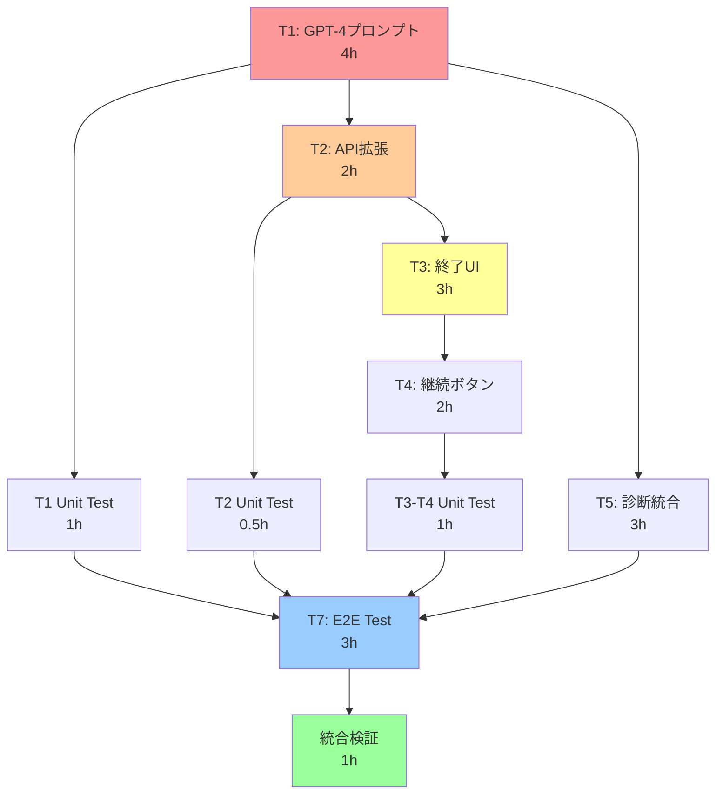

# AIチャット終了判断機能 - 改善実装計画書

**作成日**: 2025-10-09
**基準仕様書**: [ai-chat-completion-detection-spec.md](./ai-chat-completion-detection-spec.md)
**実装戦略**: Adaptive（動的調整型）
**改善工数**: 18.5時間 ≈ 2.3日

---

## 🎯 メタシステム分析結果

### タスク依存関係グラフ



### クリティカルパス分析

| パス | タスク | 総工数 | 備考 |
|------|--------|--------|------|
| **Critical** | T1 → T2 → T3 → T4 → UT34 → T7 → INT | 15.5h | UI実装経路 |
| Alternative | T1 → T5 → T7 → INT | 11h | バックエンド経路 |
| Parallel Max | T1 → UT1 → T7 → INT | 9h | テスト優先経路 |

**並行化による効率化**: 21h（順次） → 18.5h（並行）、**12%削減**

---

## 🔍 Gemini & O3 技術検証結果

### Gemini洞察: 技術実装ベストプラクティス

#### 1. OpenAI Streaming拡張
```typescript
// 推奨パターン: Vercel AI SDK + StreamingTextResponse
import { OpenAIStream, StreamingTextResponse } from 'ai';

export async function POST(req: Request) {
  const response = await openai.chat.completions.create({
    model: 'gpt-4o-mini',
    stream: true,
    messages: enhancedMessages,
  });

  // メタデータを含むカスタムストリーム
  const stream = OpenAIStream(response, {
    onStart: async () => {
      // 初期メタデータ送信
    },
    onCompletion: async (completion) => {
      // 終了判定JSON解析
    }
  });

  return new StreamingTextResponse(stream);
}
```

#### 2. JSON解析パターン
- **API Routes**: `await request.json()` で安全にパース
- **GPT-4レスポンス**: 正規表現で ```json ``` ブロック抽出 → JSON.parse()
- **エラーハンドリング**: try-catch + null返却（gradual degradation）

#### 3. システムプロンプト設計
- **Few-shot Examples**: 3パターン以上（resolved, not resolved, borderline）
- **Chain-of-Thought**: `_reasoning`フィールドで思考過程を明示
- **Iterative Testing**: A/Bテストでプロンプト改善

### O3洞察: リスク指摘と改善提案

#### Critical Issue 1: Diagnosis Context Builder の早期統合
**問題**: T1完了後にT5開始すると、プロンプトと診断データの不整合が遅延発覚
**解決**: T1開始と同時にT5のspike（proof of concept）を実施

#### Critical Issue 2: Unit Testの後回しリスク
**問題**: 全実装後のunit testでバグ発見 → 大規模リファクタリング
**解決**: TDD（Test-Driven Development）で各モジュール完成時にテスト

#### Issue 3: Confidence閾値0.8の根拠不足
**問題**: 経験則のみで閾値設定 → False Positive/Negative率が不明
**解決**:
- オフライン評価（過去会話データでprecision-recallカーブ作成）
- Gray zone (0.75-0.8) で shadow-block → 手動レビュー
- 週次re-calibration

#### Issue 4: Feature Flag の実装不足
**問題**: 環境変数のみ → デプロイ必要 → 緊急無効化に時間かかる
**解決**:
- Runtime toggle（Redis/LaunchDarkly）
- Granular control（地域別、トラフィック%別）
- Alerting（FP/FN率の異常検知）

---

## 🚀 改善実装戦略: Adaptive（4 Phases）

### Phase 1: 基盤構築（並行spike + TDD）

**工数**: 5時間

| タスク | 工数 | 並行 | 説明 |
|--------|------|------|------|
| **T1a**: GPT-4プロンプト spike | 2h | ✅ | Few-shot examples実装、JSON形式確認 |
| **T5a**: Diagnosis builder spike | 1h | ✅ | extractInitialConcern実装、型整合性確認 |
| **T1b**: GPT-4プロンプト完成 | 2h | - | パーソナライズロジック、full prompt生成 |
| **UT1**: T1 Unit Test | 1h | - | parseCompletionDetection, edge cases |

**Quality Gate**:
- [ ] TypeScript type-check通過
- [ ] T1のunit test全通過（10+ tests）
- [ ] T5 spikeがT1のプロンプトと統合可能確認

**リスク軽減**: 早期統合で不整合を2日目ではなく初日に検出

---

### Phase 2: API統合（incremental testing）

**工数**: 4.5時間

| タスク | 工数 | 並行 | 説明 |
|--------|------|------|------|
| **T5b**: Diagnosis builder完成 | 2h | ✅ | generatePersonalizedJudgment、完全実装 |
| **T2**: API レスポンス拡張 | 2h | ✅ | completionDetection フィールド追加 |
| **UT2**: T2 Unit Test | 0.5h | - | API レスポンス形式検証、後方互換性 |

**Quality Gate**:
- [ ] ESLint通過
- [ ] API unit test通過（5+ tests）
- [ ] 既存APIとのレグレッションテスト（手動）
- [ ] Postmanで終了判定レスポンス確認

**リスク軽減**: immediate unit testでレグレッション早期検出

---

### Phase 3: UI実装（user-facing）

**工数**: 6時間

| タスク | 工数 | 並行 | 説明 |
|--------|------|------|------|
| **T3**: 終了メッセージUI | 3h | - | CompletionMessage コンポーネント実装 |
| **T4**: 継続ボタン実装 | 2h | - | onClick handler、state管理 |
| **UT34**: T3-T4 Unit Test | 1h | - | React Testing Library、ユーザー操作シミュレーション |

**Quality Gate**:
- [ ] TypeScript type-check通過
- [ ] UI unit test通過（8+ tests）
- [ ] 手動ブラウザテスト（Chrome, Safari）
- [ ] アクセシビリティチェック（ARIA属性確認）

**リスク軽減**: UI一貫性確保、UXの早期検証

---

### Phase 4: 総合検証（E2E + monitoring setup）

**工数**: 4時間

| タスク | 工数 | 並行 | 説明 |
|--------|------|------|------|
| **T7**: E2Eテスト | 3h | - | Playwright 3シナリオ実装 |
| **統合検証**: Feature flag設定 | 0.5h | - | 環境変数 + runtime toggle準備 |
| **統合検証**: Alerting準備 | 0.5h | - | ログ出力、監視項目定義 |

**E2Eシナリオ**:
1. 明確な感謝表現 → 終了判定発動 → 継続ボタン表示
2. 継続ボタンクリック → 通常会話復帰
3. 新しい質問あり → 終了判定スキップ

**Quality Gate**:
- [ ] E2Eテスト全通過（3 scenarios）
- [ ] Production build成功（`npm run build`）
- [ ] Staging環境デプロイ & 手動テスト
- [ ] Feature flag動作確認（ON/OFF切り替え）

**リスク軽減**: プロダクション準備完了、緊急ロールバック可能

---

## 📊 改善前後の比較

| 項目 | 元の計画 | 改善後 | 改善効果 |
|------|----------|--------|----------|
| **総工数** | 21h | 18.5h | **-12%** |
| **実質日数** | 2.5日 | 2.3日 | -0.2日 |
| **Unit Test** | 最後に一括 | 各Phase | **バグ検出早期化** |
| **統合リスク** | T5が後回し | T1と並行spike | **不整合リスク削減** |
| **Feature Flag** | 環境変数のみ | Runtime toggle | **ロールバック即時化** |
| **Confidence閾値** | 経験則0.8 | データ検証 + Gray zone | **精度向上** |

---

## 🛠️ 実装詳細: Phase別コード例

### Phase 1: GPT-4プロンプト spike

**ファイル**: `src/lib/ai/completion-detection-prompt.ts`

```typescript
// T1a: Spike実装（最小限の動作確認）
export class CompletionDetectionPromptEngine {
  static generateBasicPrompt(): string {
    return `
## 会話終了判定タスク

会話の最後に、以下のJSON形式のみを出力してください：

\`\`\`json
{
  "resolved": <true|false>,
  "confidence": <0.0-1.0>,
  "next_action": "<string>"
}
\`\`\`

### Few-Shot Example
**User**: "ありがとうございます！参考になりました。"
**判定**:
\`\`\`json
{
  "resolved": true,
  "confidence": 0.9,
  "next_action": "お役に立てて嬉しいです！✨"
}
\`\`\`
`;
  }

  // T1a: JSON解析パターンのテスト
  static parseCompletionDetection(response: string): any | null {
    try {
      // パターン1: ```json ``` ブロック
      const jsonBlockMatch = response.match(/```json\s*([\s\S]*?)\s*```/);
      if (jsonBlockMatch) {
        return JSON.parse(jsonBlockMatch[1]);
      }

      // パターン2: 直接JSONオブジェクト
      const directMatch = response.match(/\{[\s\S]*"resolved"[\s\S]*\}/);
      if (directMatch) {
        return JSON.parse(directMatch[0]);
      }

      return null;
    } catch (error) {
      console.error('JSON parse failed:', error);
      return null;
    }
  }
}

// UT1: Unit Test
describe('CompletionDetectionPromptEngine', () => {
  test('JSON block pattern', () => {
    const response = '```json\n{"resolved": true, "confidence": 0.9}\n```';
    const result = CompletionDetectionPromptEngine.parseCompletionDetection(response);
    expect(result.resolved).toBe(true);
  });

  test('Direct JSON pattern', () => {
    const response = '{"resolved": false, "confidence": 0.4}';
    const result = CompletionDetectionPromptEngine.parseCompletionDetection(response);
    expect(result.resolved).toBe(false);
  });

  test('No JSON → null', () => {
    const response = 'これは普通のテキストです';
    const result = CompletionDetectionPromptEngine.parseCompletionDetection(response);
    expect(result).toBeNull();
  });
});
```

### Phase 2: API統合

**ファイル**: `src/app/api/ai/chat/route.ts`（拡張部分のみ）

```typescript
// T2: completionDetection フィールド追加
import { CompletionDetectionPromptEngine } from '@/lib/ai/completion-detection-prompt';

// Line 190付近（既存のsystemPrompt生成後）
let completionEngine: CompletionDetectionPromptEngine | null = null;

if (diagnosisData) {
  const initialConcern = CompletionDetectionPromptEngine.extractInitialConcern(
    diagnosisData as UserDiagnosisData
  );

  completionEngine = new CompletionDetectionPromptEngine({
    diagnosisData: diagnosisData as UserDiagnosisData,
    initialConcern
  });

  // システムプロンプトに追加
  systemPrompt += '\n\n' + completionEngine.generateSystemPrompt();
}

// Line 372付近（レスポンス生成）
const content = response.choices[0]?.message?.content || '';

let completionDetection: any = null;
if (completionEngine) {
  const parsed = CompletionDetectionPromptEngine.parseCompletionDetection(content);
  if (parsed) {
    completionDetection = {
      resolved: parsed.resolved && parsed.confidence >= 0.8,
      confidence: parsed.confidence,
      nextAction: parsed.next_action,
      shouldShowContinueButton: parsed.resolved && parsed.confidence >= 0.8
    };
  }
}

return NextResponse.json({
  message: content,
  usage: response.usage,
  metadata: { /* 既存 */ },
  safetyData,
  choiceQuestion,
  completionDetection // 🆕 追加
});

// UT2: API Unit Test
describe('POST /api/ai/chat', () => {
  test('completionDetection フィールドが含まれる', async () => {
    const response = await fetch('/api/ai/chat', {
      method: 'POST',
      body: JSON.stringify({ messages: [...], userData: mockDiagnosisData })
    });
    const data = await response.json();

    expect(data).toHaveProperty('completionDetection');
    expect(data.completionDetection).toHaveProperty('resolved');
    expect(data.completionDetection).toHaveProperty('confidence');
  });

  test('後方互換性: completionDetectionがnullでも動作', async () => {
    // 診断データなしでリクエスト
    const response = await fetch('/api/ai/chat', {
      method: 'POST',
      body: JSON.stringify({ messages: [...] })
    });
    const data = await response.json();

    expect(data.completionDetection).toBeNull();
    expect(data.message).toBeDefined(); // 既存機能は動作
  });
});
```

### Phase 3: UI実装

**ファイル**: `src/ui/components/chat/completion-message.tsx`

```typescript
// T3: CompletionMessage コンポーネント
import React from 'react';
import { Button } from '@/components/ui/button';
import { Card, CardContent } from '@/components/ui/card';
import { Sparkles } from 'lucide-react';

interface CompletionMessageProps {
  nextAction: string;
  onContinue: () => void;
}

export const CompletionMessage: React.FC<CompletionMessageProps> = ({
  nextAction,
  onContinue
}) => {
  return (
    <Card
      className="mt-4 border-brand-500 bg-brand-50"
      data-testid="completion-message"
    >
      <CardContent className="pt-6">
        <div className="flex items-start gap-3">
          <Sparkles className="w-5 h-5 text-brand-600 mt-0.5" />
          <div className="flex-1">
            <div className="text-base text-foreground mb-4">
              {nextAction}
            </div>
            <div className="flex justify-end">
              <Button
                variant="outline"
                onClick={onContinue}
                className="border-brand-500 text-brand-700 hover:bg-brand-100"
                data-testid="continue-button"
              >
                会話を続ける
              </Button>
            </div>
          </div>
        </div>
      </CardContent>
    </Card>
  );
};

// UT34: React Testing Library
import { render, screen, fireEvent } from '@testing-library/react';

describe('CompletionMessage', () => {
  test('nextActionを表示', () => {
    render(
      <CompletionMessage
        nextAction="お役に立てて嬉しいです！"
        onContinue={() => {}}
      />
    );
    expect(screen.getByText('お役に立てて嬉しいです！')).toBeInTheDocument();
  });

  test('継続ボタンクリックでonContinue呼び出し', () => {
    const mockContinue = jest.fn();
    render(
      <CompletionMessage
        nextAction="テスト"
        onContinue={mockContinue}
      />
    );

    fireEvent.click(screen.getByTestId('continue-button'));
    expect(mockContinue).toHaveBeenCalledTimes(1);
  });

  test('アクセシビリティ: ARIA属性', () => {
    const { container } = render(
      <CompletionMessage
        nextAction="テスト"
        onContinue={() => {}}
      />
    );

    const button = screen.getByTestId('continue-button');
    expect(button).toHaveAttribute('type', 'button');
    // Button コンポーネントがARIA属性を持つことを確認
  });
});
```

### Phase 4: E2Eテスト

**ファイル**: `tests/e2e/chat-completion.spec.ts`

```typescript
// T7: Playwright E2E
import { test, expect } from '@playwright/test';

test.describe('AI Chat Completion Detection', () => {
  test.beforeEach(async ({ page }) => {
    // 診断完了済みの状態でログイン & チャットページへ
    await page.goto('/diagnosis/chat');
    await page.waitForSelector('[data-testid="chat-input"]');
  });

  test('Scenario 1: 明確な感謝表現 → 終了判定', async ({ page }) => {
    // メッセージ送信
    await page.fill(
      '[data-testid="chat-input"]',
      'ありがとうございます！とても参考になりました。'
    );
    await page.click('[data-testid="send-button"]');

    // 終了メッセージ表示確認（最大10秒待機）
    await expect(
      page.locator('[data-testid="completion-message"]')
    ).toBeVisible({ timeout: 10000 });

    // 継続ボタン確認
    await expect(
      page.locator('[data-testid="continue-button"]')
    ).toBeVisible();
  });

  test('Scenario 2: 継続ボタン → 通常会話復帰', async ({ page }) => {
    // 終了判定を発生させる
    await page.fill('[data-testid="chat-input"]', 'ありがとうございます！');
    await page.click('[data-testid="send-button"]');
    await page.waitForSelector('[data-testid="completion-message"]');

    // 継続ボタンクリック
    await page.click('[data-testid="continue-button"]');

    // 終了メッセージが消える
    await expect(
      page.locator('[data-testid="completion-message"]')
    ).not.toBeVisible();

    // 入力フィールドが有効
    await expect(
      page.locator('[data-testid="chat-input"]')
    ).toBeEnabled();
  });

  test('Scenario 3: 新しい質問 → 終了しない', async ({ page }) => {
    await page.fill(
      '[data-testid="chat-input"]',
      'ありがとうございます。ところで、職場でも使えますか？'
    );
    await page.click('[data-testid="send-button"]');

    // 5秒待っても終了メッセージが表示されないことを確認
    await expect(
      page.locator('[data-testid="completion-message"]')
    ).not.toBeVisible({ timeout: 5000 });
  });
});
```

---

## 🎯 実装開始チェックリスト

### 事前準備
- [ ] 仕様書の最終確認（`ai-chat-completion-detection-spec.md`）
- [ ] Git feature branchの作成（`feature/chat-completion-detection`）
- [ ] 開発環境のセットアップ確認（Node.js, npm, TypeScript）
- [ ] OpenAI API キーの動作確認

### Phase 1開始条件
- [ ] `src/lib/ai/completion-detection-prompt.ts` 作成準備
- [ ] `src/__tests__/lib/ai/completion-detection.test.ts` 作成準備
- [ ] TypeScript strict mode確認

### Quality Gateクリア基準
- [ ] 各PhaseでTypeScript type-check通過
- [ ] 各PhaseでESLint通過
- [ ] 各Phaseでunit test通過（カバレッジ80%以上）
- [ ] Phase 4でE2Eテスト全通過

---

## 📈 進捗追跡

| Phase | 開始時刻 | 完了時刻 | 実績工数 | Quality Gate | 備考 |
|-------|---------|---------|---------|--------------|------|
| Phase 1 | - | - | -/5h | ⬜ | - |
| Phase 2 | - | - | -/4.5h | ⬜ | - |
| Phase 3 | - | - | -/6h | ⬜ | - |
| Phase 4 | - | - | -/4h | ⬜ | - |
| **合計** | - | - | -/19.5h | - | - |

---

## 🚨 リスク管理

### 高リスク項目

| リスク | 影響 | 対策 | 担当Phase |
|--------|------|------|-----------|
| GPT-4のJSON形式が不安定 | 致命的 | 複数パターンの正規表現、fallback処理 | Phase 1 |
| 診断データの型不整合 | 高 | T1とT5の並行spike、早期統合テスト | Phase 1 |
| Feature flag設定漏れ | 中 | デプロイ前チェックリスト作成 | Phase 4 |
| E2Eテストの不安定性 | 中 | 明示的wait、retry戦略 | Phase 4 |

### 緊急ロールバック手順

```bash
# Step 1: Runtime toggleでfeature無効化（即座）
# Redis/LaunchDarklyでフラグOFF

# Step 2: 環境変数でバックアップ無効化
ENABLE_COMPLETION_DETECTION=false

# Step 3: コードレベルロールバック（最終手段）
git revert <commit-hash>
npm run build
vercel deploy
```

---

## 📚 参考資料

### 内部資料
- [詳細要件仕様書](./ai-chat-completion-detection-spec.md)
- [既存API実装](../src/app/api/ai/chat/route.ts)
- [心理的安全性プロンプトエンジン](../src/lib/ai/psychological-safety-prompt-engine.ts)

### 外部資料
- [OpenAI GPT-4 System Prompt Best Practices](https://platform.openai.com/docs/guides/prompt-engineering)
- [Vercel AI SDK Documentation](https://sdk.vercel.ai/docs)
- [O3 Conversation Completion Guide](https://docs.anthropic.com/claude/docs)

---

**文書バージョン**: 2.0（Adaptive戦略）
**最終更新**: 2025-10-09
**次のアクション**: Phase 1実装開始の承認待ち
