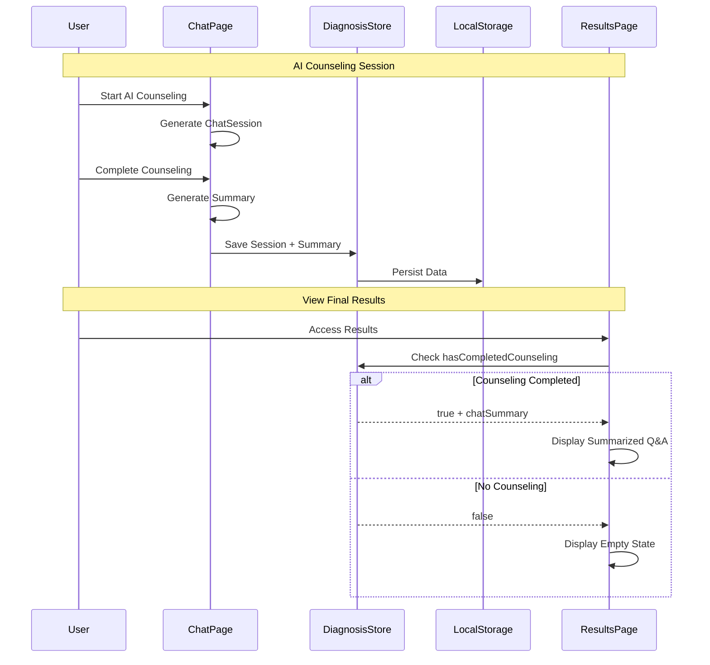
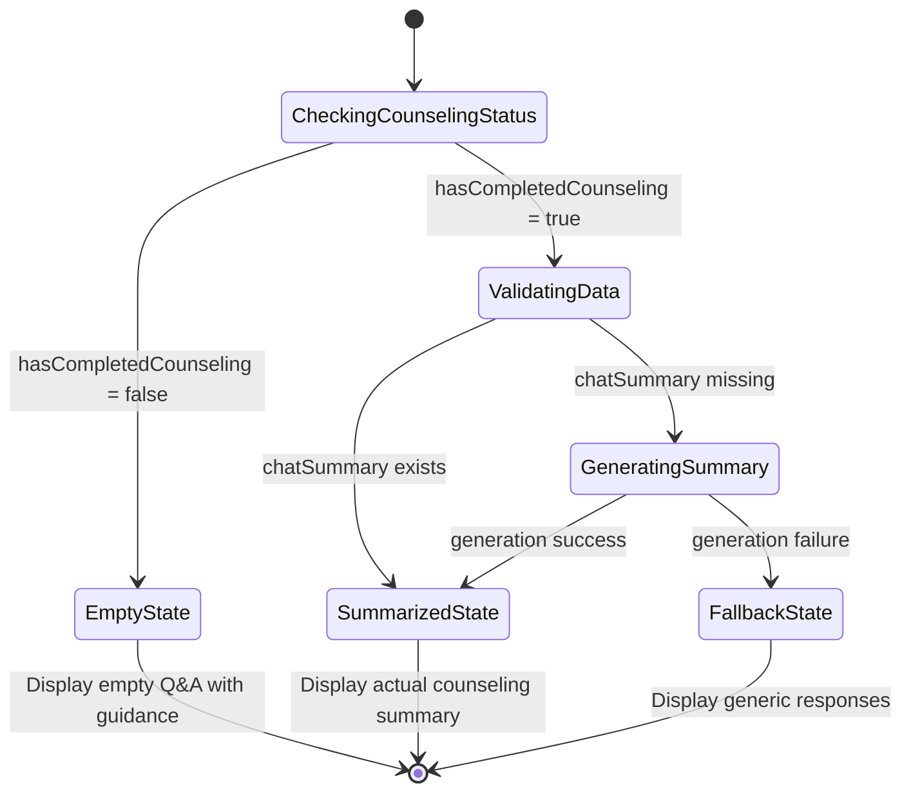

# Q&A Conditional Display Flow Diagram

## System Architecture Overview

```mermaid
graph TB
    A[User Accesses Final Results] --> B{Check hasCompletedCounseling}
    
    B -->|false| C[Empty Q&A State]
    B -->|true| D{Check chatSummary exists}
    
    C --> C1[Display: "AIカウンセリングを利用すると..."]
    C1 --> C2[Show: AIカウンセリング開始ボタン]
    
    D -->|exists| E[Summarized Q&A Display]
    D -->|missing| F[Generate Summary from chatSession]
    
    E --> E1[Show: Topic + User Concerns + AI Advice]
    E1 --> E2[Show: Action Items + Session Duration]
    
    F --> F1{Summary Generation Success?}
    F1 -->|success| E
    F1 -->|failure| G[Fallback Q&A Display]
    
    G --> G1[Show: Generic Template Responses]
```

## Data Flow Architecture



## Component State Machine



## UI State Components

### Empty State
```
┌─────────────────────────────────────────────┐
│                                             │
│    🤖 AIカウンセリング結果がありません        │
│                                             │
│    AIカウンセリングを利用すると、            │
│    あなただけの個別アドバイスが              │
│    ここに表示されます。                      │
│                                             │
│                                             │
└─────────────────────────────────────────────┘
```

### Summarized State  
```
┌─────────────────────────────────────────────┐
│ 💬 AIカウンセリング記録                      │
├─────────────────────────────────────────────┤
│ 相談カテゴリ: 👥 人間関係の悩み              │
├─────────────────────────────────────────────┤
│                                             │
│ Q1: [OpenAI質問要約]                        │
│ 職場の人間関係についてどのような            │
│ 悩みがありますか？                          │
│                                             │
│ A1: [ユーザー回答要約]                      │  
│ 上司とのコミュニケーションがうまくいかず、   │
│ チームメンバーとの関係も気まずい状況です。   │
│                                             │
├─────────────────────────────────────────────┤
│                                             │
│ Q2: [OpenAI質問要約]                        │
│ 具体的にどのような場面で                    │
│ 困っていますか？                            │
│                                             │
│ A2: [ユーザー回答要約]                      │
│ 意見を伝える際の言葉選びや、                │
│ フィードバックを受け取る時の反応に          │
│ 悩んでいます。                              │
│                                             │
├─────────────────────────────────────────────┤
│ ※ Claude向け要約: 全3回のやり取り            │
└─────────────────────────────────────────────┘
```

### Fallback State
```
┌─────────────────────────────────────────────┐
│ 💬 質問＆回答リスト（基本版）                │
├─────────────────────────────────────────────┤
│ 👥 人間関係の悩み                           │
│    質問: 職場、友人、恋愛などについて        │
│    回答: [診断結果に基づく一般的アドバイス]   │
├─────────────────────────────────────────────┤
│ 💼 キャリア・仕事の悩み                     │
│    質問: 転職、昇進、働き方などについて      │
│    回答: [診断結果に基づく一般的アドバイス]   │
├─────────────────────────────────────────────┤
│ ... (継続)                                  │
└─────────────────────────────────────────────┘
```

## Implementation Priority

### Phase 1: Foundation (High Priority)
- ✅ Extend DiagnosisStore with counseling fields
- ✅ Update localStorage persistence 
- ✅ Add hasCompletedCounseling detection

### Phase 2: Chat Integration (High Priority)
- ✅ Modify chat page to save session data
- ✅ Implement basic summarization
- ✅ Update store on completion

### Phase 3: Display Logic (Medium Priority)
- ✅ Implement conditional rendering
- ✅ Create empty state component
- ✅ Create summarized display component

### Phase 4: Enhancement (Low Priority)
- 🔄 Advanced summarization algorithms
- 🔄 Better error handling
- 🔄 Performance optimizations

## Technical Validation Checklist

### Data Integrity
- [ ] Session data persists across browser restarts
- [ ] Summary generation handles edge cases
- [ ] 30-day deletion policy compliance
- [ ] No server-side data leakage

### User Experience
- [ ] Empty state provides clear guidance
- [ ] Summarized content is relevant and accurate
- [ ] Fallback gracefully handles errors
- [ ] Performance remains acceptable

### Privacy Compliance
- [ ] All counseling data remains client-side
- [ ] Data deletion after 30 days verified
- [ ] No personal data in error logs
- [ ] Encryption for sensitive content (optional)