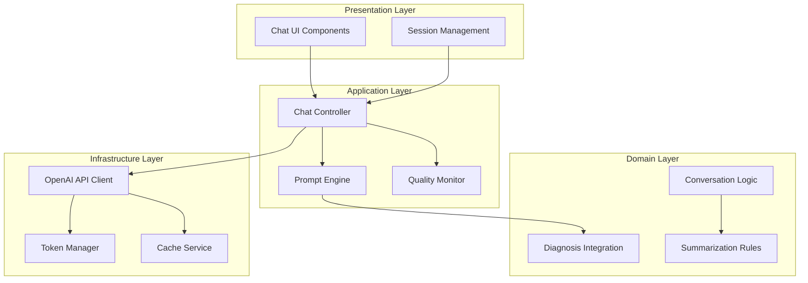
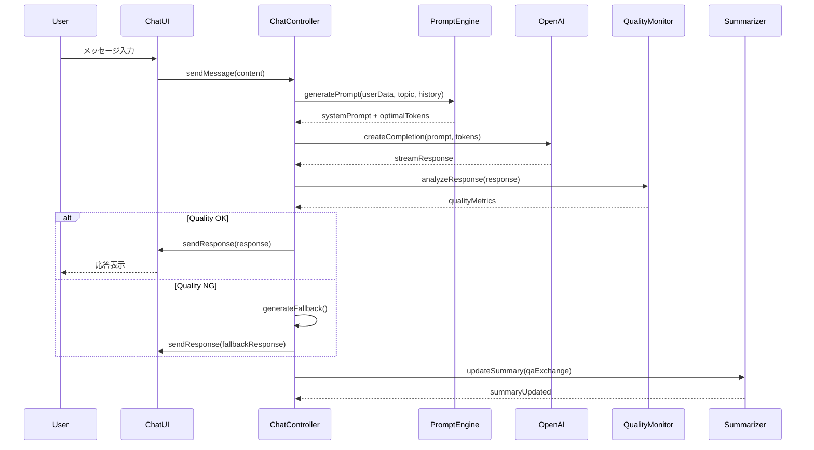

# COCOSiL AIチャット機能 - システム設計書

## 1. システム概要

### 1.1 アーキテクチャパターン
**レイヤードアーキテクチャ** + **責任分離パターン**を採用



### 1.2 核心コンポーネント

| コンポーネント | 責任 | 実装ファイル |
|---------------|------|-------------|
| **IntegratedPromptEngine** | 4診断統合プロンプト生成 | `src/lib/ai/prompt-engine.ts` |
| **IntelligentSummarizer** | AI要約・内容理解 | `src/lib/ai/intelligent-summarizer.ts` |
| **QualityMonitor** | 応答品質監視・異常検知 | `src/lib/monitoring/quality-monitor.ts` |
| **TokenManager** | 動的Token管理・最適化 | `src/lib/ai/token-manager.ts` |
| **ErrorHandler** | 障害対策・フォールバック | `src/lib/reliability/error-handler.ts` |

## 2. 詳細設計

### 2.1 IntegratedPromptEngine クラス設計

```typescript
interface DiagnosisData {
  mbti: {
    type: string;
    functions: {
      dominant: string;
      auxiliary: string;
      tertiary: string;
      inferior: string;
    };
  };
  taiheki: {
    primary: number;
    secondary: number;
    characteristics: string[];
    bodyTendencies: string[];
  };
  fortune: {
    animal: string;
    sixStar: string;
    personalityTraits: string[];
    lifeTendencies: string[];
  };
  basic: {
    age: number;
    name: string;
    gender?: string;
  };
}

export class IntegratedPromptEngine {
  private topicStrategies: Map<string, PromptStrategy>;
  private diagnosisAnalyzer: DiagnosisAnalyzer;

  constructor() {
    this.topicStrategies = new Map([
      ['relationship', new RelationshipPromptStrategy()],
      ['career', new CareerPromptStrategy()],
      ['personality', new PersonalityPromptStrategy()],
      ['future', new FuturePromptStrategy()]
    ]);
    this.diagnosisAnalyzer = new DiagnosisAnalyzer();
  }

  public generateSystemPrompt(
    userData: DiagnosisData,
    topic: string,
    conversationHistory: ChatMessage[]
  ): string {
    // 1. 診断データの深層分析
    const analysis = this.diagnosisAnalyzer.analyzeIntegration(userData);

    // 2. トピック特化戦略の適用
    const strategy = this.topicStrategies.get(topic);
    const topicContext = strategy?.generateContext(analysis) || '';

    // 3. 会話履歴からの洞察抽出
    const conversationInsights = this.extractConversationInsights(conversationHistory);

    // 4. 統合プロンプト生成
    return this.buildIntegratedPrompt(analysis, topicContext, conversationInsights);
  }

  private buildIntegratedPrompt(
    analysis: DiagnosisIntegration,
    topicContext: string,
    insights: ConversationInsights
  ): string {
    return `
## あなたの役割
統合診断に基づく専門カウンセラー。相槌・慰め・一般論は厳禁。

## 対象者プロファイル
### 認知パターン (MBTI: ${analysis.mbti.type})
- 主機能: ${analysis.mbti.dominant} → ${analysis.cognitiveStyle.primaryThinking}
- 補助機能: ${analysis.mbti.auxiliary} → ${analysis.cognitiveStyle.supportThinking}
- 意思決定傾向: ${analysis.cognitiveStyle.decisionPattern}
- ストレス反応: ${analysis.cognitiveStyle.stressResponse}

### 身体傾向 (体癖: ${analysis.taiheki.primary}種)
- 基本動作: ${analysis.taiheki.bodyTendencies.join(', ')}
- 感情表現: ${analysis.taiheki.emotionalPattern}
- 対人距離: ${analysis.taiheki.interpersonalDistance}
- 集中特性: ${analysis.taiheki.focusCharacteristics}

### 性格特性 (${analysis.fortune.animal})
- 本質特性: ${analysis.fortune.coreTraits.join(', ')}
- 行動パターン: ${analysis.fortune.behaviorPatterns.join(', ')}
- 成長課題: ${analysis.fortune.growthAreas.join(', ')}

### 統合洞察
${analysis.integratedInsights.map(insight => `- ${insight}`).join('\n')}

## トピック特化分析
${topicContext}

## 会話履歴からの洞察
${insights.keyPatterns.map(pattern => `- ${pattern}`).join('\n')}

## 実行指示
1. **本質分析**: 表面的症状から3層深い根本原因を特定
2. **統合診断活用**: 認知・身体・性格の統合的影響を考慮
3. **具体的深掘り**: 抽象的でなく具体的状況・感情・行動を探求
4. **成長促進**: 気づきを促す質問で自律的解決を支援

## 応答制約
- 文字数: 300-400文字厳守
- 禁止表現: 相槌、慰め、一般論、アドバイス
- 必須要素: 1つの本質的質問 + 具体的状況の深掘り
- 語調: 専門的かつ温かみのある敬語

次の応答で、現在の話題における最も重要な本質を1つ特定し、
その根本原因を探る具体的質問を1つ投げかけてください。
    `;
  }
}
```

### 2.2 IntelligentSummarizer クラス設計

```typescript
interface SummarizationRequest {
  type: 'qa_exchange' | 'session_overview' | 'insight_extraction';
  content: QAExchange[] | ChatMessage[];
  context?: {
    topic: string;
    diagnosisData: DiagnosisData;
    sessionDuration: number;
  };
}

export class IntelligentSummarizer {
  private openai: OpenAI;
  private cache: LRUCache<string, string>;

  constructor(openaiClient: OpenAI) {
    this.openai = openaiClient;
    this.cache = new LRUCache({ max: 100, ttl: 1000 * 60 * 30 }); // 30分キャッシュ
  }

  public async summarize(request: SummarizationRequest): Promise<SummaryResult> {
    const cacheKey = this.generateCacheKey(request);
    const cached = this.cache.get(cacheKey);

    if (cached) {
      return JSON.parse(cached);
    }

    switch (request.type) {
      case 'qa_exchange':
        return await this.summarizeQAExchange(request);
      case 'session_overview':
        return await this.summarizeSession(request);
      case 'insight_extraction':
        return await this.extractInsights(request);
      default:
        throw new Error(`Unsupported summarization type: ${request.type}`);
    }
  }

  private async summarizeQAExchange(request: SummarizationRequest): Promise<SummaryResult> {
    const qaExchanges = request.content as QAExchange[];
    const summaries = await Promise.all(
      qaExchanges.map(async (qa) => {
        const prompt = this.buildQASummaryPrompt(qa, request.context);
        const response = await this.openai.chat.completions.create({
          model: 'gpt-4',
          messages: [{ role: 'user', content: prompt }],
          max_tokens: 100,
          temperature: 0.3
        });

        return {
          original: qa,
          summary: response.choices[0]?.message?.content || '',
          timestamp: qa.timestamp
        };
      })
    );

    return {
      type: 'qa_exchange',
      summaries,
      totalExchanges: qaExchanges.length,
      averageLength: this.calculateAverageLength(summaries)
    };
  }

  private buildQASummaryPrompt(qa: QAExchange, context?: any): string {
    return `
以下のカウンセリング交換を要約してください：

質問: ${qa.question}
回答: ${qa.answer}

要約要件:
- 核心的な内容のみ抽出（100文字以内）
- 感情的ニュアンスと具体性を保持
- 洞察や気づきの要素を優先
- ${context?.topic}に関連する文脈を考慮

要約:
    `;
  }

  private async summarizeSession(request: SummarizationRequest): Promise<SummaryResult> {
    const messages = request.content as ChatMessage[];
    const conversationFlow = this.analyzeConversationFlow(messages);

    const prompt = this.buildSessionSummaryPrompt(conversationFlow, request.context);
    const response = await this.openai.chat.completions.create({
      model: 'gpt-4',
      messages: [{ role: 'user', content: prompt }],
      max_tokens: 250,
      temperature: 0.3
    });

    return {
      type: 'session_overview',
      summary: response.choices[0]?.message?.content || '',
      keyInsights: conversationFlow.insights,
      progressionStages: conversationFlow.stages
    };
  }
}
```

### 2.3 QualityMonitor クラス設計

```typescript
interface QualityMetrics {
  completeness: {
    score: number; // 0-100
    hasProperEnding: boolean;
    wordCount: number;
  };
  relevance: {
    score: number; // 0-100
    topicAlignment: number;
    contextCoherence: number;
  };
  inappropriateContent: {
    detectedPhrases: string[];
    severity: 'none' | 'low' | 'medium' | 'high';
    suggestions: string[];
  };
  tokenEfficiency: {
    tokensUsed: number;
    optimalTokens: number;
    efficiency: number; // 0-100
  };
}

export class QualityMonitor {
  private inappropriatePhraseDetector: PhraseDetector;
  private relevanceAnalyzer: RelevanceAnalyzer;
  private alertManager: AlertManager;

  public async analyzeResponse(
    response: string,
    context: ChatContext
  ): Promise<QualityMetrics> {
    const metrics = await Promise.all([
      this.analyzeCompleteness(response),
      this.analyzeRelevance(response, context),
      this.detectInappropriateContent(response),
      this.analyzeTokenEfficiency(response, context)
    ]);

    const result: QualityMetrics = {
      completeness: metrics[0],
      relevance: metrics[1],
      inappropriateContent: metrics[2],
      tokenEfficiency: metrics[3]
    };

    // 品質問題を検出した場合はアラート
    await this.checkAndAlert(result, context);

    return result;
  }

  private async analyzeCompleteness(response: string): Promise<QualityMetrics['completeness']> {
    const wordCount = response.length;
    const hasProperEnding = this.checkProperEnding(response);
    const hasQuestion = response.includes('?') || response.includes('？');

    let score = 100;
    if (wordCount < 200) score -= 30;
    if (wordCount > 500) score -= 20;
    if (!hasProperEnding) score -= 40;
    if (!hasQuestion) score -= 20;

    return {
      score: Math.max(0, score),
      hasProperEnding,
      wordCount
    };
  }

  private detectInappropriateContent(response: string): QualityMetrics['inappropriateContent'] {
    const inappropriatePhrases = [
      // 相槌・慰め
      'そうですね', 'なるほど', 'よくわかります', 'そうなんですね',
      'がんばって', '大丈夫', 'きっと', '必ず', '安心してください',

      // 一般論・アドバイス
      '一般的に', '普通は', '〜すべきです', '〜してください',
      '〜した方がいい', '〜することをお勧めします',

      // 医療的判断
      '病気', '治療', '診断', '症状', '薬', '医師',

      // 過度な感情表現
      '素晴らしい', '最高', '完璧', 'びっくり', '驚き'
    ];

    const detectedPhrases = inappropriatePhrases.filter(phrase =>
      response.includes(phrase)
    );

    let severity: 'none' | 'low' | 'medium' | 'high' = 'none';
    if (detectedPhrases.length > 0) {
      if (detectedPhrases.length >= 3) severity = 'high';
      else if (detectedPhrases.length >= 2) severity = 'medium';
      else severity = 'low';
    }

    const suggestions = this.generateImprovementSuggestions(detectedPhrases);

    return {
      detectedPhrases,
      severity,
      suggestions
    };
  }

  private generateImprovementSuggestions(detectedPhrases: string[]): string[] {
    const suggestions: string[] = [];

    if (detectedPhrases.some(p => ['そうですね', 'なるほど'].includes(p))) {
      suggestions.push('相槌を避け、直接的な質問に切り替える');
    }

    if (detectedPhrases.some(p => ['がんばって', '大丈夫'].includes(p))) {
      suggestions.push('励ましではなく、具体的状況の深掘りに集中する');
    }

    if (detectedPhrases.some(p => ['一般的に', '普通は'].includes(p))) {
      suggestions.push('一般論を避け、個人の具体的体験を探る');
    }

    return suggestions;
  }
}
```

### 2.4 データフロー設計



## 3. API設計

### 3.1 チャットAPI エンドポイント

```typescript
// POST /api/ai/chat
interface ChatRequest {
  messages: ChatMessage[];
  userData: DiagnosisData;
  selectedTopic: string;
  options?: {
    priority: 'speed' | 'quality';
    enableCache: boolean;
    enableMonitoring: boolean;
  };
}

interface ChatResponse {
  response: {
    content: string;
    metadata: {
      tokensUsed: number;
      responseTime: number;
      qualityScore: number;
      isFallback: boolean;
    };
  };
  session: {
    updated: boolean;
    summaryAvailable: boolean;
  };
  monitoring: {
    alerts: Alert[];
    suggestions: string[];
  };
}
```

### 3.2 要約API エンドポイント

```typescript
// POST /api/ai/summarize
interface SummarizeRequest {
  sessionId: string;
  type: 'qa_exchange' | 'session_overview' | 'insight_extraction';
  options?: {
    maxLength: number;
    includeInsights: boolean;
  };
}

interface SummarizeResponse {
  summary: {
    content: string;
    insights: string[];
    keyPoints: string[];
  };
  metadata: {
    originalLength: number;
    summaryLength: number;
    compressionRatio: number;
    processingTime: number;
  };
}
```

## 4. 品質保証設計

### 4.1 テスト戦略

```typescript
// テストカテゴリ別実装計画
const testStrategy = {
  unit: {
    scope: '各クラス・メソッドの単体機能',
    tools: ['Jest', 'Testing Library'],
    coverage: '90%以上',
    examples: [
      'PromptEngine.generateSystemPrompt()',
      'QualityMonitor.analyzeResponse()',
      'Summarizer.summarizeQAExchange()'
    ]
  },

  integration: {
    scope: 'コンポーネント間連携・API統合',
    tools: ['Jest', 'MSW', 'Supertest'],
    coverage: '80%以上',
    examples: [
      'Chat API エンドツーエンド',
      'OpenAI API統合',
      'エラーハンドリング・フォールバック'
    ]
  },

  e2e: {
    scope: 'ユーザージャーニー全体',
    tools: ['Playwright'],
    scenarios: [
      '4つの相談タイプ完了フロー',
      '応答品質異常時の動作',
      'セッション要約生成'
    ]
  },

  performance: {
    scope: 'レスポンス時間・同時接続',
    tools: ['Artillery.js', 'Lighthouse'],
    targets: [
      '初回応答: 3秒以内',
      '同時接続: 50ユーザー',
      'Token効率: 20%改善'
    ]
  }
};
```

### 4.2 監視・アラート設計

```typescript
interface MonitoringConfig {
  metrics: {
    response_time: { threshold: 3000, unit: 'ms' };
    completion_rate: { threshold: 98, unit: 'percent' };
    quality_score: { threshold: 85, unit: 'percent' };
    token_efficiency: { threshold: 75, unit: 'percent' };
    error_rate: { threshold: 2, unit: 'percent' };
  };

  alerts: {
    immediate: ['api_failure', 'quality_critical', 'token_exceeded'];
    delayed: ['performance_degraded', 'quality_warning'];
    batch: ['daily_summary', 'weekly_report'];
  };

  dashboards: {
    realtime: ['response_times', 'active_sessions', 'error_counts'];
    historical: ['quality_trends', 'usage_patterns', 'cost_analysis'];
  };
}
```

---

**文書情報**:
- 版数: 1.0
- 作成日: 2025-09-22
- 作成者: Claude Code AI Agent
- レビュー: [レビュー待ち]