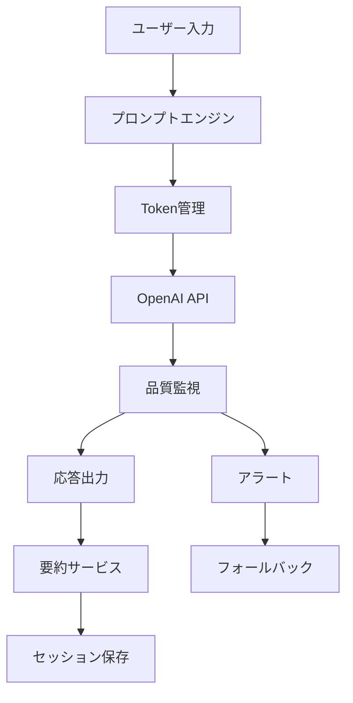

# COCOSiL AIチャット機能再実装 - 実装計画書

## 1. 実装概要

### 1.1 実装アプローチ
**段階的実装**: 4つのPhaseに分けてリスクを最小化し、継続的な価値提供を実現

### 1.2 実装期間
**総期間**: 8週間（2025年9月22日 〜 2025年11月17日）

### 1.3 品質保証戦略
各Phase毎にGo/No-Go判定を実施し、品質基準未達の場合は次Phaseに進まない

## 2. Phase別実装計画

### Phase 1: 基盤改善（Week 1-2）🚨 緊急
**目標**: 既存の致命的問題を即座に解決

#### 実装項目
1. **プロンプトエンジニアリング改善**
   - システムプロンプトの再設計
   - 相槌禁止・本質分析特化指示
   - 4診断統合プロンプト

2. **基本的Token管理**
   - 固定150 → 動的300-800への変更
   - 基本的なコンテキスト長判定

#### 具体的実装
```typescript
// src/lib/ai/prompt-engine.ts (新規作成)
interface DiagnosisData {
  mbti: string;
  taiheki: { primary: number; secondary: number };
  fortune: { animal: string; sixStar: string };
  basic: { age: number; name: string };
}

export class IntegratedPromptEngine {
  generateSystemPrompt(userData: DiagnosisData, topic: string): string {
    return `
あなたは統合診断に基づく専門カウンセラーです。

## 禁止事項
- 相槌や挨拶は一切禁止
- 一般的な励ましや慰めは不要
- 表面的な質問は避ける

## 実行指示
1. ${userData.mbti}型の思考パターンを考慮
2. 体癖${userData.taiheki.primary}種の身体的傾向を分析
3. ${userData.fortune.animal}の性格特性を統合
4. ${userData.fortune.sixStar}の運命傾向を加味
5. ${topic}における根本原因を3層掘り下げて質問

## 応答形式
- 最重要質問1つのみ
- 具体的状況の深掘り
- 300-400文字で簡潔に
    `;
  }

  calculateOptimalTokens(context: string, complexity: number): number {
    const baseTokens = 300;
    const contextMultiplier = Math.min(context.length / 1000, 2);
    const complexityBonus = complexity * 100;
    return Math.min(baseTokens + contextMultiplier * 100 + complexityBonus, 800);
  }
}
```

#### 成果物
- [ ] `src/lib/ai/prompt-engine.ts`
- [ ] `src/app/api/ai/chat/route.ts` 更新
- [ ] プロンプト改善テスト結果

#### Go/No-Go基準
- 応答完結率 80%以上
- 相槌検出率 5%以下
- 平均応答文字数 250文字以上

---

### Phase 2: 要約機能統合（Week 3-4）⚡ 重要
**目標**: AI要約機能を実装し、真の内容理解を実現

#### 実装項目
1. **インテリジェント要約サービス**
   - OpenAI API活用要約
   - Q&Aペア個別要約
   - セッション全体統合要約

2. **品質監視システム**
   - 応答品質メトリクス
   - 異常検知アラート

#### 具体的実装
```typescript
// src/lib/ai/intelligent-summarizer.ts (新規作成)
export class IntelligentSummarizer {
  async summarizeQAExchange(question: string, answer: string): Promise<string> {
    const prompt = `
以下のQ&A交換を要約してください：

質問: ${question}
回答: ${answer}

要件:
- 核心的な内容のみ抽出
- 100文字以内
- 感情的ニュアンスも保持
    `;

    const response = await openai.chat.completions.create({
      model: 'gpt-4',
      messages: [{ role: 'user', content: prompt }],
      max_tokens: 100,
      temperature: 0.3
    });

    return response.choices[0]?.message?.content || '';
  }

  async generateSessionSummary(qaExchanges: QAExchange[]): Promise<string> {
    const prompt = `
以下のカウンセリングセッションを統合要約してください：

${qaExchanges.map((qa, i) => `${i+1}. Q: ${qa.question}\n   A: ${qa.answer}`).join('\n\n')}

要件:
- 主要な課題と洞察を抽出
- 成長のポイントを明確化
- 200文字以内で構造化
    `;

    const response = await openai.chat.completions.create({
      model: 'gpt-4',
      messages: [{ role: 'user', content: prompt }],
      max_tokens: 200,
      temperature: 0.3
    });

    return response.choices[0]?.message?.content || '';
  }
}

// src/lib/monitoring/quality-monitor.ts (新規作成)
export class QualityMonitor {
  async analyzeResponse(response: string): Promise<QualityMetrics> {
    return {
      completeness: this.checkCompleteness(response),
      relevance: await this.checkRelevance(response),
      inappropriateContent: this.detectInappropriatePhrases(response),
      tokenEfficiency: this.calculateTokenEfficiency(response)
    };
  }

  private detectInappropriatePhrases(response: string): string[] {
    const inappropriatePhrases = [
      'そうですね', 'なるほど', 'よくわかります',
      'がんばって', '大丈夫', 'きっと'
    ];
    return inappropriatePhrases.filter(phrase => response.includes(phrase));
  }
}
```

#### 成果物
- [ ] `src/lib/ai/intelligent-summarizer.ts`
- [ ] `src/lib/monitoring/quality-monitor.ts`
- [ ] `src/lib/counseling/summarizer.ts` 更新
- [ ] 要約品質検証レポート

#### Go/No-Go基準
- 要約精度 85%以上（人間評価）
- 要約生成時間 5秒以内
- 品質監視検知精度 90%以上

---

### Phase 3: 最適化・A/Bテスト（Week 5-6）⚙️ 最適化
**目標**: パフォーマンス最適化と体験向上

#### 実装項目
1. **パフォーマンス最適化**
   - レスポンス時間短縮
   - Token使用量最適化
   - キャッシュ戦略

2. **A/Bテスト基盤**
   - プロンプトバリエーション
   - 応答品質比較
   - ユーザー満足度測定

#### 具体的実装
```typescript
// src/lib/optimization/performance-optimizer.ts (新規作成)
export class PerformanceOptimizer {
  private promptCache = new Map<string, string>();
  private responseCache = new LRUCache<string, string>(50);

  async optimizeRequest(request: ChatRequest): Promise<OptimizedRequest> {
    // キャッシュされたプロンプトを使用
    const cachedPrompt = this.promptCache.get(request.contextKey);
    if (cachedPrompt) {
      request.systemPrompt = cachedPrompt;
    }

    // Token使用量を最適化
    const optimizedTokens = this.calculateOptimalTokens(
      request.context,
      request.complexity,
      request.priority
    );

    return {
      ...request,
      maxTokens: optimizedTokens,
      temperature: this.getOptimalTemperature(request.topic)
    };
  }

  private calculateOptimalTokens(
    context: string,
    complexity: number,
    priority: 'speed' | 'quality'
  ): number {
    const baseTokens = priority === 'speed' ? 300 : 500;
    const contextFactor = Math.min(context.length / 1000, 1.5);
    const complexityFactor = complexity * 0.8;

    return Math.round(baseTokens * (1 + contextFactor + complexityFactor));
  }
}

// src/lib/testing/ab-test-manager.ts (新規作成)
export class ABTestManager {
  async assignVariant(userId: string, testName: string): Promise<'A' | 'B'> {
    const hash = this.hashUserId(userId + testName);
    return hash % 2 === 0 ? 'A' : 'B';
  }

  async logMetric(userId: string, testName: string, metric: string, value: number) {
    // メトリクス収集（将来的にはAnalytics統合）
    console.log(`ABTest: ${testName}, User: ${userId}, ${metric}: ${value}`);
  }
}
```

#### 成果物
- [ ] `src/lib/optimization/performance-optimizer.ts`
- [ ] `src/lib/testing/ab-test-manager.ts`
- [ ] パフォーマンス改善レポート
- [ ] A/Bテスト初期結果

#### Go/No-Go基準
- 平均応答時間 3秒以内
- Token使用量 20%削減
- A/Bテスト基盤動作確認

---

### Phase 4: 安定化・本番デプロイ（Week 7-8）🛡️ 安定化
**目標**: 本番環境での安定稼働

#### 実装項目
1. **障害対策強化**
   - エラーハンドリング
   - フォールバック機能
   - 監視・アラート

2. **本番デプロイ準備**
   - 環境設定
   - ドキュメント整備
   - 運用手順書

#### 具体的実装
```typescript
// src/lib/reliability/error-handler.ts (新規作成)
export class ChatErrorHandler {
  async handleAPIError(error: OpenAIError, context: ChatContext): Promise<ChatResponse> {
    switch (error.code) {
      case 'rate_limit_exceeded':
        await this.waitAndRetry(1000);
        return this.retryRequest(context);

      case 'context_length_exceeded':
        const shortenedContext = this.shortenContext(context);
        return this.makeRequest(shortenedContext);

      case 'model_overloaded':
        return this.useFallbackResponse(context);

      default:
        return this.generateGenericFallback(context);
    }
  }

  private useFallbackResponse(context: ChatContext): ChatResponse {
    const fallbackPrompts = {
      relationship: "人間関係での具体的な困りごとを詳しく教えてください。",
      career: "現在のお仕事で最も課題に感じていることは何ですか？",
      personality: "ご自身の性格で変えたいと思う部分はありますか？",
      future: "今後5年間で実現したい具体的な目標はありますか？"
    };

    return {
      content: fallbackPrompts[context.topic] || "もう少し詳しく教えてください。",
      isFallback: true,
      timestamp: new Date()
    };
  }
}

// src/lib/monitoring/deployment-monitor.ts (新規作成)
export class DeploymentMonitor {
  async startHealthCheck(): Promise<void> {
    setInterval(async () => {
      const health = await this.checkSystemHealth();
      if (health.status === 'unhealthy') {
        await this.sendAlert(health);
      }
    }, 30000); // 30秒間隔
  }

  private async checkSystemHealth(): Promise<HealthStatus> {
    const checks = await Promise.all([
      this.checkAPIAvailability(),
      this.checkResponseTime(),
      this.checkErrorRate(),
      this.checkTokenUsage()
    ]);

    return {
      status: checks.every(check => check.status === 'healthy') ? 'healthy' : 'unhealthy',
      checks,
      timestamp: new Date()
    };
  }
}
```

#### 成果物
- [ ] `src/lib/reliability/error-handler.ts`
- [ ] `src/lib/monitoring/deployment-monitor.ts`
- [ ] 運用手順書
- [ ] 本番デプロイ完了

#### Go/No-Go基準
- エラーハンドリング網羅率 95%以上
- 監視システム正常動作
- 負荷テスト通過

## 3. 技術アーキテクチャ

### 3.1 ディレクトリ構造
```
src/
├── lib/
│   ├── ai/
│   │   ├── prompt-engine.ts          # 統合プロンプト管理
│   │   ├── intelligent-summarizer.ts # AI要約機能
│   │   └── token-manager.ts          # 動的Token管理
│   ├── monitoring/
│   │   ├── quality-monitor.ts        # 品質監視
│   │   └── deployment-monitor.ts     # デプロイ監視
│   ├── optimization/
│   │   └── performance-optimizer.ts  # パフォーマンス最適化
│   ├── reliability/
│   │   └── error-handler.ts          # エラーハンドリング
│   └── testing/
│       └── ab-test-manager.ts        # A/Bテスト管理
├── app/api/ai/chat/
│   └── route.ts                      # 更新: 新機能統合
└── app/diagnosis/chat/
    └── page.tsx                      # 更新: UI改善
```

### 3.2 データフロー


## 4. テスト戦略

### 4.1 単体テスト
- **対象**: 各クラス・関数の動作検証
- **ツール**: Jest + Testing Library
- **カバレッジ**: 85%以上

### 4.2 統合テスト
- **対象**: API統合・データフロー検証
- **ツール**: Jest + MSW
- **シナリオ**: 正常系・異常系・境界値

### 4.3 E2Eテスト
- **対象**: ユーザージャーニー全体
- **ツール**: Playwright
- **シナリオ**: 4つの相談タイプ × 完了フロー

### 4.4 パフォーマンステスト
- **対象**: レスポンス時間・同時接続
- **ツール**: Artillery.js
- **基準**: 50同時接続、3秒以内応答

## 5. リスク管理

### 5.1 技術リスク対策
| リスク | 影響度 | 対策 | 責任者 |
|--------|--------|------|--------|
| OpenAI API障害 | 高 | フォールバック機能実装 | 開発者 |
| Token使用量超過 | 中 | 使用量監視・制限機能 | 開発者 |
| レスポンス品質低下 | 高 | A/Bテスト・継続改善 | 開発者 |

### 5.2 プロジェクトリスク対策
| リスク | 影響度 | 対策 | 責任者 |
|--------|--------|------|--------|
| スケジュール遅延 | 中 | 段階的リリース採用 | PM |
| 品質基準未達 | 高 | Go/No-Go判定厳格運用 | QA |
| 予算超過 | 中 | 日次コスト監視 | 開発者 |

## 6. 運用・保守計画

### 6.1 監視項目
- **技術監視**: API応答時間、エラー率、Token使用量
- **品質監視**: 応答完結率、相槌検出率、ユーザー満足度
- **ビジネス監視**: 利用率、完了率、継続率

### 6.2 保守作業
- **日次**: コスト・品質メトリクス確認
- **週次**: プロンプト効果検証、A/Bテスト結果分析
- **月次**: 総合レビュー、改善計画策定

### 6.3 改善サイクル
1. **データ収集**: メトリクス・フィードバック収集
2. **分析**: 問題特定・改善機会発見
3. **計画**: 改善策立案・優先度決定
4. **実装**: A/Bテスト・段階的展開
5. **評価**: 効果測定・次期計画策定

---

**文書情報**:
- 版数: 1.0
- 作成日: 2025-09-22
- 作成者: Claude Code AI Agent
- 更新予定: 各Phase完了時