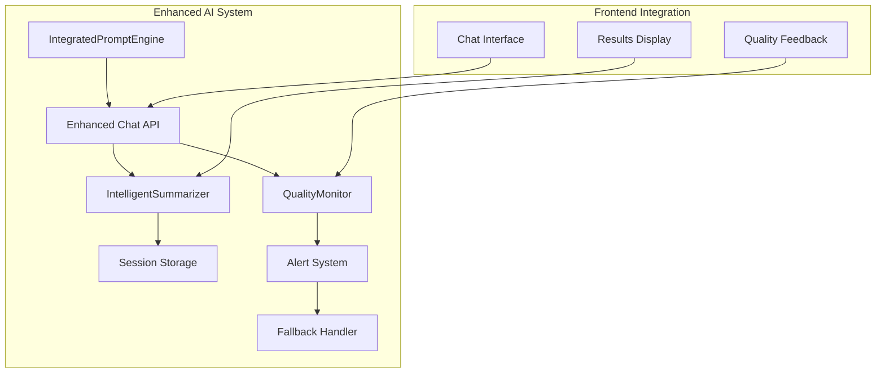

# Phase 2 Implementation Workflow - IntelligentSummarizer & QualityMonitor

## Implementation Strategy Overview

Based on the current Phase 1 completion (95%), this workflow provides systematic implementation steps for Phase 2 components with clear dependencies, validation gates, and integration patterns.

## Pre-Implementation Checklist

### ✅ Phase 1 Validation (COMPLETED)
- [x] IntegratedPromptEngine operational (`src/lib/ai/prompt-engine.ts`)
- [x] Dynamic token management working (300-800 range)
- [x] API streaming integration stable
- [x] Frontend diagnosis data flow validated
- [x] Basic summarization functional

### 🎯 Phase 2 Target Architecture



## Week 3: IntelligentSummarizer Implementation

### Day 1-2: Core Summarization Engine

#### Step 1: Create IntelligentSummarizer Class

**File**: `src/lib/ai/intelligent-summarizer.ts`

```typescript
import OpenAI from 'openai';
import { LRUCache } from 'lru-cache';

interface SummarizationRequest {
  type: 'qa_exchange' | 'session_overview' | 'insight_extraction';
  content: QAExchange[] | ChatMessage[];
  context: {
    diagnosisData: DiagnosisData;
    topic: string;
    sessionDuration?: number;
  };
}

interface SummaryResult {
  summary: string;
  insights: string[];
  keyPoints: string[];
  metadata: {
    originalLength: number;
    summaryLength: number;
    processingTime: number;
    qualityScore: number;
  };
}

export class IntelligentSummarizer {
  private openai: OpenAI;
  private cache: LRUCache<string, SummaryResult>;
  private rateLimiter: RateLimiter;

  constructor(openaiClient: OpenAI) {
    this.openai = openaiClient;
    this.cache = new LRUCache({
      max: 100,
      ttl: 1000 * 60 * 30 // 30 minutes
    });
    this.rateLimiter = new RateLimiter({
      requestsPerMinute: 30,
      burstSize: 5
    });
  }

  async summarize(request: SummarizationRequest): Promise<SummaryResult> {
    const startTime = Date.now();
    const cacheKey = this.generateCacheKey(request);

    // Check cache first
    const cached = this.cache.get(cacheKey);
    if (cached) {
      return {
        ...cached,
        metadata: {
          ...cached.metadata,
          processingTime: Date.now() - startTime
        }
      };
    }

    // Rate limiting
    await this.rateLimiter.acquire();

    try {
      const result = await this.generateSummary(request);
      this.cache.set(cacheKey, result);
      return result;
    } catch (error) {
      console.error('Summarization failed:', error);
      return this.generateFallbackSummary(request);
    }
  }

  private async generateSummary(request: SummarizationRequest): Promise<SummaryResult> {
    const prompt = this.buildPrompt(request);

    const response = await this.openai.chat.completions.create({
      model: 'gpt-4',
      messages: [{ role: 'user', content: prompt }],
      max_tokens: request.type === 'qa_exchange' ? 100 : 200,
      temperature: 0.3,
      presence_penalty: 0.1
    });

    const summary = response.choices[0]?.message?.content || '';
    const insights = this.extractInsights(summary, request.context);
    const keyPoints = this.extractKeyPoints(summary);

    return {
      summary,
      insights,
      keyPoints,
      metadata: {
        originalLength: this.calculateOriginalLength(request.content),
        summaryLength: summary.length,
        processingTime: 0, // Will be set by caller
        qualityScore: this.assessSummaryQuality(summary, request)
      }
    };
  }

  private buildPrompt(request: SummarizationRequest): string {
    const { diagnosisData, topic } = request.context;

    switch (request.type) {
      case 'qa_exchange':
        return this.buildQAPrompt(request.content as QAExchange[], diagnosisData, topic);
      case 'session_overview':
        return this.buildSessionPrompt(request.content as ChatMessage[], diagnosisData, topic);
      case 'insight_extraction':
        return this.buildInsightPrompt(request.content as ChatMessage[], diagnosisData);
      default:
        throw new Error(`Unknown summarization type: ${request.type}`);
    }
  }

  private buildQAPrompt(qaExchanges: QAExchange[], diagnosisData: DiagnosisData, topic: string): string {
    return `
あなたは${diagnosisData.mbti}型、体癖${diagnosisData.taiheki.primary}種、${diagnosisData.fortune.animal}の特性を持つ相談者との${topic}に関するカウンセリング交換を要約してください。

カウンセリング交換:
${qaExchanges.map((qa, i) => `${i+1}. 質問: ${qa.question}\n   回答: ${qa.answer}`).join('\n\n')}

要約要件:
- 核心的な内容のみ抽出（100文字以内）
- 診断結果の特性を考慮した個別化
- 感情的ニュアンスと具体性を保持
- 成長の機会や洞察を優先
- ${topic}の文脈での重要性を考慮

要約:`;
  }

  private buildSessionPrompt(messages: ChatMessage[], diagnosisData: DiagnosisData, topic: string): string {
    const conversationFlow = this.analyzeConversationFlow(messages);

    return `
${diagnosisData.mbti}型、体癖${diagnosisData.taiheki.primary}種、${diagnosisData.fortune.animal}の特性を持つ相談者との${topic}に関するカウンセリングセッション全体を統合要約してください。

セッション内容:
${messages.filter(m => m.role !== 'system').map((msg, i) =>
  `${i+1}. ${msg.role}: ${msg.content.substring(0, 200)}...`
).join('\n')}

会話の進行:
- 開始: ${conversationFlow.startingTopic}
- 展開: ${conversationFlow.developmentAreas.join(', ')}
- 深化: ${conversationFlow.deepeningPoints.join(', ')}

要約要件:
- 主要な課題と洞察を抽出（200文字以内）
- 診断特性に基づく個別化された分析
- 成長のポイントと今後の方向性を明確化
- 感情的な変化や気づきのプロセスを含む

統合要約:`;
  }

  private generateFallbackSummary(request: SummarizationRequest): SummaryResult {
    const fallbackSummaries = {
      'relationship': '人間関係について、個人の特性を踏まえた具体的な状況を相談されました。',
      'career': 'キャリアと働き方について、将来的な方向性を含めて相談されました。',
      'personality': '自己理解と性格特性について、深い洞察を求めて相談されました。',
      'future': '将来の目標設定と人生設計について、具体的な計画を相談されました。'
    };

    return {
      summary: fallbackSummaries[request.context.topic] || '個人的な課題について相談されました。',
      insights: ['詳細な分析は後ほど提供されます'],
      keyPoints: ['相談内容を記録しました'],
      metadata: {
        originalLength: 0,
        summaryLength: 50,
        processingTime: 0,
        qualityScore: 0.5
      }
    };
  }
}
```

#### Step 2: Integration with Existing API

**Enhancement**: `src/app/api/ai/summary/route.ts`

```typescript
import { IntelligentSummarizer } from '@/lib/ai/intelligent-summarizer';
import { openai } from '@/lib/ai/openai-client';

const intelligentSummarizer = new IntelligentSummarizer(openai);

export async function POST(request: NextRequest) {
  try {
    const { sessionData, diagnosisData, summaryType = 'session_overview' } = await request.json();

    // Validate inputs
    if (!sessionData || !diagnosisData) {
      return NextResponse.json(
        { error: '必要なデータが不足しています' },
        { status: 400 }
      );
    }

    // Use IntelligentSummarizer
    const summaryRequest = {
      type: summaryType,
      content: summaryType === 'qa_exchange'
        ? extractQAExchanges(sessionData.messages)
        : sessionData.messages,
      context: {
        diagnosisData,
        topic: sessionData.selectedTopic,
        sessionDuration: calculateSessionDuration(sessionData)
      }
    };

    const result = await intelligentSummarizer.summarize(summaryRequest);

    return NextResponse.json({
      summary: result.summary,
      insights: result.insights,
      keyPoints: result.keyPoints,
      metadata: result.metadata,
      generatedAt: new Date().toISOString()
    });

  } catch (error) {
    console.error('Intelligent summary generation error:', error);

    // Fallback to legacy summarization
    const legacySummary = await generateLegacySummary(sessionData);

    return NextResponse.json({
      summary: legacySummary,
      insights: [],
      keyPoints: [],
      isFallback: true,
      error: 'AI要約は一時的に利用できません'
    });
  }
}
```

### Day 3-4: Caching and Performance Optimization

#### Step 3: Implement Rate Limiting and Caching

**File**: `src/lib/ai/rate-limiter.ts`

```typescript
interface RateLimiterConfig {
  requestsPerMinute: number;
  burstSize: number;
  timeWindow: number; // milliseconds
}

export class RateLimiter {
  private requests: number[] = [];
  private config: RateLimiterConfig;

  constructor(config: RateLimiterConfig) {
    this.config = {
      timeWindow: 60000, // 1 minute default
      ...config
    };
  }

  async acquire(): Promise<void> {
    const now = Date.now();
    const windowStart = now - this.config.timeWindow;

    // Remove expired requests
    this.requests = this.requests.filter(time => time > windowStart);

    // Check if we can make a request
    if (this.requests.length >= this.config.requestsPerMinute) {
      const oldestRequest = Math.min(...this.requests);
      const waitTime = oldestRequest + this.config.timeWindow - now;

      if (waitTime > 0) {
        await new Promise(resolve => setTimeout(resolve, waitTime));
        return this.acquire(); // Retry
      }
    }

    // Allow burst requests
    if (this.requests.length < this.config.burstSize) {
      this.requests.push(now);
      return;
    }

    // Rate limit
    this.requests.push(now);
  }
}
```

#### Step 4: Cache Optimization

**Enhancement**: Cache key generation and management

```typescript
// In IntelligentSummarizer
private generateCacheKey(request: SummarizationRequest): string {
  const contentHash = this.hashContent(request.content);
  const contextHash = this.hashContext(request.context);
  return `${request.type}_${contentHash}_${contextHash}`;
}

private hashContent(content: any): string {
  return btoa(JSON.stringify(content)).slice(0, 16);
}

private hashContext(context: any): string {
  const key = `${context.topic}_${context.diagnosisData.mbti}_${context.diagnosisData.taiheki.primary}`;
  return btoa(key).slice(0, 16);
}
```

### Day 5: Frontend Integration

#### Step 5: Update Chat Interface

**Enhancement**: `src/app/diagnosis/chat/page.tsx`

```typescript
// Add to existing handleEndConsultation function
const handleEndConsultation = async () => {
  if (chatSession && messages.length > 2) {
    const completedSession: ChatSession = {
      ...chatSession,
      messages: messages,
      endTime: new Date(),
      isCompleted: true
    };

    // Save to global store
    setChatSession(completedSession);
    markCounselingCompleted(true);

    // Generate AI-powered summary
    try {
      const summaryResponse = await fetch('/api/ai/summary', {
        method: 'POST',
        headers: { 'Content-Type': 'application/json' },
        body: JSON.stringify({
          sessionData: completedSession,
          diagnosisData: userData,
          summaryType: 'session_overview'
        })
      });

      if (summaryResponse.ok) {
        const summaryResult = await summaryResponse.json();
        setChatSummary({
          topicId: completedSession.selectedTopic,
          topicTitle: getTopicTitle(completedSession.selectedTopic),
          qaExchanges: summaryResult.insights || [],
          sessionDuration: calculateSessionDuration(completedSession.startTime, completedSession.endTime),
          aiSummary: summaryResult.summary,
          keyInsights: summaryResult.keyPoints || []
        });
      } else {
        throw new Error('Summary generation failed');
      }
    } catch (error) {
      console.error('Failed to generate AI summary:', error);
      // Fallback to legacy summarization
      const { generateSessionSummary } = await import('@/lib/counseling/summarizer');
      const legacySummary = generateSessionSummary(completedSession);
      setChatSummary(legacySummary);
    }
  }

  setConversationPhase('summary');
  router.push('/diagnosis/results');
};
```

## Week 4: QualityMonitor Implementation

### Day 1-2: Quality Assessment Engine

#### Step 6: Create QualityMonitor Class

**File**: `src/lib/monitoring/quality-monitor.ts`

```typescript
interface QualityMetrics {
  overall: number;        // 0-100 overall quality score
  completeness: {
    score: number;
    hasProperEnding: boolean;
    hasQuestion: boolean;
    wordCount: number;
  };
  appropriateness: {
    score: number;
    detectedIssues: string[];
    severity: 'none' | 'low' | 'medium' | 'high';
    suggestions: string[];
  };
  relevance: {
    score: number;
    topicAlignment: number;
    contextCoherence: number;
  };
  efficiency: {
    score: number;
    tokensUsed: number;
    optimalTokens: number;
    efficiency: number;
  };
}

export class QualityMonitor {
  private inappropriatePhrases: Map<string, number>;
  private topicKeywords: Map<string, string[]>;

  constructor() {
    this.inappropriatePhrases = this.initializeInappropriatePhrases();
    this.topicKeywords = this.initializeTopicKeywords();
  }

  async analyzeResponse(
    response: string,
    context: {
      topic: string;
      diagnosisData: DiagnosisData;
      conversationHistory: ChatMessage[];
      tokensUsed: number;
    }
  ): Promise<QualityMetrics> {
    const [completeness, appropriateness, relevance, efficiency] = await Promise.all([
      this.analyzeCompleteness(response),
      this.analyzeAppropriateness(response),
      this.analyzeRelevance(response, context),
      this.analyzeEfficiency(response, context.tokensUsed)
    ]);

    const overall = this.calculateOverallScore(completeness, appropriateness, relevance, efficiency);

    return {
      overall,
      completeness,
      appropriateness,
      relevance,
      efficiency
    };
  }

  private analyzeCompleteness(response: string): QualityMetrics['completeness'] {
    const wordCount = response.length;
    const hasProperEnding = this.checkProperEnding(response);
    const hasQuestion = /[?？]/.test(response);
    const hasCoherentStructure = this.checkStructure(response);

    let score = 100;

    // Length penalties
    if (wordCount < 200) score -= 20;
    if (wordCount > 500) score -= 15;

    // Structure penalties
    if (!hasProperEnding) score -= 25;
    if (!hasQuestion) score -= 20;
    if (!hasCoherentStructure) score -= 15;

    return {
      score: Math.max(0, score),
      hasProperEnding,
      hasQuestion,
      wordCount
    };
  }

  private analyzeAppropriateness(response: string): QualityMetrics['appropriateness'] {
    const detectedIssues: string[] = [];
    let score = 100;

    // Check for inappropriate phrases
    for (const [phrase, penalty] of this.inappropriatePhrases) {
      if (response.includes(phrase)) {
        detectedIssues.push(phrase);
        score -= penalty;
      }
    }

    // Determine severity
    let severity: 'none' | 'low' | 'medium' | 'high' = 'none';
    if (detectedIssues.length > 0) {
      if (score < 50) severity = 'high';
      else if (score < 70) severity = 'medium';
      else severity = 'low';
    }

    const suggestions = this.generateImprovementSuggestions(detectedIssues);

    return {
      score: Math.max(0, score),
      detectedIssues,
      severity,
      suggestions
    };
  }

  private analyzeRelevance(response: string, context: any): QualityMetrics['relevance'] {
    const topicKeywords = this.topicKeywords.get(context.topic) || [];
    const keywordMatches = topicKeywords.filter(keyword =>
      response.toLowerCase().includes(keyword.toLowerCase())
    ).length;

    const topicAlignment = Math.min((keywordMatches / topicKeywords.length) * 100, 100);

    // Context coherence based on conversation history
    const contextCoherence = this.assessContextCoherence(response, context.conversationHistory);

    const score = (topicAlignment + contextCoherence) / 2;

    return {
      score,
      topicAlignment,
      contextCoherence
    };
  }

  private analyzeEfficiency(response: string, tokensUsed: number): QualityMetrics['efficiency'] {
    const responseLength = response.length;
    const estimatedOptimalTokens = Math.ceil(responseLength / 4); // Rough estimate: 4 chars per token

    const efficiency = Math.min((estimatedOptimalTokens / tokensUsed) * 100, 100);
    let score = efficiency;

    // Penalties for extreme inefficiency
    if (efficiency < 50) score -= 20;
    if (efficiency < 30) score -= 30;

    return {
      score: Math.max(0, score),
      tokensUsed,
      optimalTokens: estimatedOptimalTokens,
      efficiency
    };
  }

  private calculateOverallScore(
    completeness: QualityMetrics['completeness'],
    appropriateness: QualityMetrics['appropriateness'],
    relevance: QualityMetrics['relevance'],
    efficiency: QualityMetrics['efficiency']
  ): number {
    // Weighted average with appropriateness being most important
    const weights = {
      completeness: 0.25,
      appropriateness: 0.4,  // Highest weight for 相槌禁止 compliance
      relevance: 0.25,
      efficiency: 0.1
    };

    return Math.round(
      completeness.score * weights.completeness +
      appropriateness.score * weights.appropriateness +
      relevance.score * weights.relevance +
      efficiency.score * weights.efficiency
    );
  }

  private initializeInappropriatePhrases(): Map<string, number> {
    return new Map([
      // 相槌・同意 (High penalty)
      ['そうですね', 20],
      ['なるほど', 20],
      ['よくわかります', 20],
      ['そうなんですね', 15],
      ['確かに', 15],

      // 慰め・励まし (High penalty)
      ['がんばって', 25],
      ['大丈夫', 25],
      ['きっと', 20],
      ['必ず', 20],
      ['安心してください', 20],

      // 一般論 (Medium penalty)
      ['一般的に', 15],
      ['普通は', 15],
      ['多くの人は', 10],
      ['よくあることです', 15],

      // 過度な感情表現 (Low penalty)
      ['素晴らしい', 5],
      ['最高', 10],
      ['完璧', 10],
      ['びっくり', 5]
    ]);
  }

  private initializeTopicKeywords(): Map<string, string[]> {
    return new Map([
      ['relationship', ['関係', '人間', 'コミュニケーション', '職場', '友人', '家族', '恋愛']],
      ['career', ['仕事', 'キャリア', '転職', '昇進', '職場', '働き方', '将来']],
      ['personality', ['性格', '特性', '自分', '理解', '強み', '弱み', '成長']],
      ['future', ['将来', '目標', '計画', '夢', '方向性', 'ビジョン', '人生']]
    ]);
  }
}
```

### Day 3-4: Alert System and Fallback

#### Step 7: Alert Manager Implementation

**File**: `src/lib/monitoring/alert-manager.ts`

```typescript
interface AlertConfig {
  qualityThreshold: number;
  enableRealTimeAlerts: boolean;
  fallbackEnabled: boolean;
  maxRegenerationAttempts: number;
}

interface Alert {
  id: string;
  type: 'quality_warning' | 'quality_critical' | 'system_error';
  severity: 'low' | 'medium' | 'high';
  message: string;
  context: any;
  timestamp: Date;
  resolved: boolean;
}

export class AlertManager {
  private config: AlertConfig;
  private activeAlerts: Map<string, Alert> = new Map();
  private fallbackResponseGenerator: FallbackResponseGenerator;

  constructor(config: AlertConfig) {
    this.config = config;
    this.fallbackResponseGenerator = new FallbackResponseGenerator();
  }

  async handleQualityCheck(
    response: string,
    metrics: QualityMetrics,
    context: ChatContext
  ): Promise<{
    approved: boolean;
    response: string;
    alerts: Alert[];
    fallbackUsed: boolean;
  }> {
    const alerts: Alert[] = [];

    // Check if response meets quality threshold
    if (metrics.overall < this.config.qualityThreshold) {
      const alert = this.createQualityAlert(metrics, context);
      alerts.push(alert);

      if (this.config.fallbackEnabled) {
        const fallbackResponse = await this.fallbackResponseGenerator.generate(context);
        return {
          approved: true,
          response: fallbackResponse,
          alerts,
          fallbackUsed: true
        };
      }

      return {
        approved: false,
        response,
        alerts,
        fallbackUsed: false
      };
    }

    return {
      approved: true,
      response,
      alerts,
      fallbackUsed: false
    };
  }

  private createQualityAlert(metrics: QualityMetrics, context: ChatContext): Alert {
    const alertId = `quality_${Date.now()}`;
    const severity = metrics.overall < 50 ? 'high' : metrics.overall < 70 ? 'medium' : 'low';

    const alert: Alert = {
      id: alertId,
      type: severity === 'high' ? 'quality_critical' : 'quality_warning',
      severity,
      message: `Response quality below threshold: ${metrics.overall}%`,
      context: {
        metrics,
        topic: context.topic,
        userId: context.userId
      },
      timestamp: new Date(),
      resolved: false
    };

    this.activeAlerts.set(alertId, alert);
    return alert;
  }
}

class FallbackResponseGenerator {
  private fallbackTemplates: Map<string, string[]>;

  constructor() {
    this.fallbackTemplates = this.initializeFallbackTemplates();
  }

  async generate(context: ChatContext): Promise<string> {
    const templates = this.fallbackTemplates.get(context.topic) || this.fallbackTemplates.get('default')!;
    const template = templates[Math.floor(Math.random() * templates.length)];

    return this.personalizeTemplate(template, context);
  }

  private personalizeTemplate(template: string, context: ChatContext): string {
    return template
      .replace('{topic}', this.getTopicContext(context.topic))
      .replace('{mbti}', context.diagnosisData.mbti)
      .replace('{taiheki}', context.diagnosisData.taiheki.primary.toString());
  }

  private initializeFallbackTemplates(): Map<string, string[]> {
    return new Map([
      ['relationship', [
        '{topic}について、{mbti}型の特性を考えると、どのような具体的な状況で困難を感じていますか？',
        '人間関係での課題について、もう少し詳しい状況を教えていただけますか？',
        '{topic}で最も改善したいと感じる部分は何でしょうか？'
      ]],
      ['career', [
        'キャリアについて、現在最も重要だと感じている課題は何ですか？',
        '{mbti}型の強みを活かせる働き方について、どのようにお考えですか？',
        '仕事での成長について、具体的にどのような目標をお持ですか？'
      ]],
      ['personality', [
        'ご自身の{mbti}型の特性について、どの部分を深く理解したいですか？',
        '体癖{taiheki}種の特徴で、日常生活で最も影響を感じる部分はありますか？',
        '自己理解を深めるために、最も知りたいことは何でしょうか？'
      ]],
      ['future', [
        '将来の目標について、最も実現したいことは何ですか？',
        '人生設計で重要視している価値観は何でしょうか？',
        '今後5年間で達成したい具体的な目標はありますか？'
      ]],
      ['default', [
        'もう少し詳しく教えていただけますか？',
        'どのような点で最も改善したいとお考えですか？',
        '具体的にはどのような状況でしょうか？'
      ]]
    ]);
  }
}
```

#### Step 8: Integration with Chat API

**Enhancement**: `src/app/api/ai/chat/route.ts`

```typescript
import { QualityMonitor } from '@/lib/monitoring/quality-monitor';
import { AlertManager } from '@/lib/monitoring/alert-manager';

const qualityMonitor = new QualityMonitor();
const alertManager = new AlertManager({
  qualityThreshold: 75,
  enableRealTimeAlerts: true,
  fallbackEnabled: true,
  maxRegenerationAttempts: 2
});

export async function POST(request: NextRequest) {
  try {
    // ... existing prompt generation logic ...

    const response = await openai.chat.completions.create({
      model: 'gpt-4',
      messages: enhancedMessages,
      temperature,
      max_tokens: maxTokens,
    });

    const content = response.choices[0]?.message?.content || '';

    // Quality monitoring
    const qualityMetrics = await qualityMonitor.analyzeResponse(content, {
      topic: topic || 'relationship',
      diagnosisData,
      conversationHistory: messages,
      tokensUsed: response.usage?.total_tokens || 0
    });

    // Alert handling
    const qualityCheck = await alertManager.handleQualityCheck(
      content,
      qualityMetrics,
      {
        topic: topic || 'relationship',
        diagnosisData,
        userId: diagnosisData.basic.name
      }
    );

    // Return response (original or fallback)
    return NextResponse.json({
      message: qualityCheck.response,
      usage: response.usage,
      metadata: {
        maxTokens,
        temperature,
        complexity: promptContext.complexity,
        qualityMetrics,
        alerts: qualityCheck.alerts,
        fallbackUsed: qualityCheck.fallbackUsed
      }
    });

  } catch (error) {
    // ... existing error handling ...
  }
}
```

### Day 5: End-to-End Testing and Validation

#### Step 9: Comprehensive Testing

**File**: `src/__tests__/integration/phase2-integration.test.ts`

```typescript
import { IntelligentSummarizer } from '@/lib/ai/intelligent-summarizer';
import { QualityMonitor } from '@/lib/monitoring/quality-monitor';
import { AlertManager } from '@/lib/monitoring/alert-manager';

describe('Phase 2 Integration Tests', () => {
  let summarizer: IntelligentSummarizer;
  let qualityMonitor: QualityMonitor;
  let alertManager: AlertManager;

  beforeAll(() => {
    summarizer = new IntelligentSummarizer(mockOpenAI);
    qualityMonitor = new QualityMonitor();
    alertManager = new AlertManager({
      qualityThreshold: 75,
      enableRealTimeAlerts: true,
      fallbackEnabled: true,
      maxRegenerationAttempts: 2
    });
  });

  describe('IntelligentSummarizer', () => {
    test('should generate high-quality summaries', async () => {
      const mockSession = createMockSession();
      const result = await summarizer.summarize({
        type: 'session_overview',
        content: mockSession.messages,
        context: {
          diagnosisData: mockDiagnosisData,
          topic: 'relationship'
        }
      });

      expect(result.summary).toBeDefined();
      expect(result.summary.length).toBeGreaterThan(50);
      expect(result.metadata.qualityScore).toBeGreaterThan(0.7);
    });

    test('should use cache for repeated requests', async () => {
      const request = createMockSummarizationRequest();

      // First call
      const start1 = Date.now();
      await summarizer.summarize(request);
      const time1 = Date.now() - start1;

      // Second call (should be cached)
      const start2 = Date.now();
      await summarizer.summarize(request);
      const time2 = Date.now() - start2;

      expect(time2).toBeLessThan(time1 * 0.5); // Should be significantly faster
    });
  });

  describe('QualityMonitor', () => {
    test('should detect inappropriate phrases', async () => {
      const inappropriateResponse = 'そうですね、なるほど、がんばってください。';
      const metrics = await qualityMonitor.analyzeResponse(inappropriateResponse, mockContext);

      expect(metrics.appropriateness.detectedIssues).toContain('そうですね');
      expect(metrics.appropriateness.severity).toBe('high');
      expect(metrics.overall).toBeLessThan(50);
    });

    test('should approve high-quality responses', async () => {
      const goodResponse = 'あなたの人間関係での具体的な困難について、どのような状況で最も課題を感じているか教えてください。';
      const metrics = await qualityMonitor.analyzeResponse(goodResponse, mockContext);

      expect(metrics.overall).toBeGreaterThan(80);
      expect(metrics.appropriateness.severity).toBe('none');
    });
  });

  describe('AlertManager', () => {
    test('should trigger fallback for low-quality responses', async () => {
      const lowQualityResponse = 'そうですね。がんばって。';
      const metrics = await qualityMonitor.analyzeResponse(lowQualityResponse, mockContext);

      const result = await alertManager.handleQualityCheck(
        lowQualityResponse,
        metrics,
        mockContext
      );

      expect(result.fallbackUsed).toBe(true);
      expect(result.response).not.toBe(lowQualityResponse);
      expect(result.alerts).toHaveLength(1);
    });
  });

  describe('End-to-End Workflow', () => {
    test('should handle complete chat flow with monitoring', async () => {
      // Simulate full chat API call with monitoring
      const chatRequest = createMockChatRequest();
      const response = await simulateChatAPICall(chatRequest);

      expect(response.message).toBeDefined();
      expect(response.metadata.qualityMetrics).toBeDefined();
      expect(response.metadata.qualityMetrics.overall).toBeGreaterThan(70);
    });
  });
});
```

#### Step 10: Performance Validation

**File**: `src/scripts/performance-test.ts`

```typescript
// Performance benchmarking script
async function runPerformanceTests() {
  const summarizer = new IntelligentSummarizer(openai);
  const qualityMonitor = new QualityMonitor();

  console.log('Starting Phase 2 Performance Tests...');

  // Test 1: Summarization Speed
  const summaryTimes: number[] = [];
  for (let i = 0; i < 10; i++) {
    const start = Date.now();
    await summarizer.summarize(createTestRequest());
    summaryTimes.push(Date.now() - start);
  }

  console.log(`Average Summarization Time: ${summaryTimes.reduce((a, b) => a + b) / summaryTimes.length}ms`);
  console.log(`Max Time: ${Math.max(...summaryTimes)}ms`);

  // Test 2: Quality Monitoring Speed
  const qualityTimes: number[] = [];
  for (let i = 0; i < 100; i++) {
    const start = Date.now();
    await qualityMonitor.analyzeResponse(generateTestResponse(), mockContext);
    qualityTimes.push(Date.now() - start);
  }

  console.log(`Average Quality Analysis Time: ${qualityTimes.reduce((a, b) => a + b) / qualityTimes.length}ms`);

  // Test 3: Cache Hit Rate
  const cacheTests = await runCacheTests(summarizer);
  console.log(`Cache Hit Rate: ${cacheTests.hitRate}%`);

  // Test 4: Memory Usage
  const memoryUsage = process.memoryUsage();
  console.log(`Memory Usage: ${Math.round(memoryUsage.heapUsed / 1024 / 1024)}MB`);
}

// Run performance tests
runPerformanceTests().catch(console.error);
```

## Validation & Go/No-Go Criteria

### Phase 2.1 Validation (IntelligentSummarizer)

| Metric | Target | Test Method | Status |
|--------|--------|-------------|--------|
| **Summarization Accuracy** | 85%+ | Manual evaluation of 20 samples | [ ] |
| **Response Time** | <5 seconds | Automated performance testing | [ ] |
| **Cache Hit Rate** | 60%+ | Analytics during testing | [ ] |
| **API Error Rate** | <2% | Error logging analysis | [ ] |
| **Memory Usage** | <100MB | Process monitoring | [ ] |

### Phase 2.2 Validation (QualityMonitor)

| Metric | Target | Test Method | Status |
|--------|--------|-------------|--------|
| **Inappropriate Detection** | 95%+ accuracy | Curated test dataset (100 samples) | [ ] |
| **False Positive Rate** | <5% | Manual validation | [ ] |
| **Response Time Impact** | <200ms | Performance comparison | [ ] |
| **Fallback Success Rate** | 98%+ | Failure simulation testing | [ ] |

### Go/No-Go Decision Points

**Green Light Criteria** (Proceed to Phase 3):
- [ ] All validation metrics meet targets
- [ ] No critical bugs in 48-hour testing period
- [ ] User acceptance testing passes
- [ ] Performance benchmarks achieved

**Yellow Light Criteria** (Address issues before Phase 3):
- [ ] Minor performance issues identified
- [ ] Cache optimization needed
- [ ] Non-critical fallback improvements

**Red Light Criteria** (Return to development):
- [ ] Critical quality detection failures
- [ ] Performance degradation >50%
- [ ] System instability or crashes

## Success Metrics & KPIs

### Week 3 Success Criteria
- **Summarization Quality**: 85%+ human evaluation score
- **System Integration**: Seamless API enhancement
- **Performance**: <5 second average response time
- **Error Handling**: Graceful degradation to legacy system

### Week 4 Success Criteria
- **Quality Detection**: 95%+ inappropriate content detection
- **System Stability**: No critical failures during testing
- **User Experience**: Improved conversation quality metrics
- **Operational**: Complete monitoring dashboard

---

**Implementation Status Tracking:**
- [ ] Week 3 Day 1-2: Core Summarization Engine
- [ ] Week 3 Day 3-4: Caching and Performance
- [ ] Week 3 Day 5: Frontend Integration
- [ ] Week 4 Day 1-2: Quality Assessment Engine
- [ ] Week 4 Day 3-4: Alert System and Fallback
- [ ] Week 4 Day 5: End-to-End Testing

**Next Phase Preparation:**
Upon successful completion of Phase 2, the system will be ready for Phase 3 optimization and A/B testing with a solid foundation of intelligent summarization and quality monitoring capabilities.