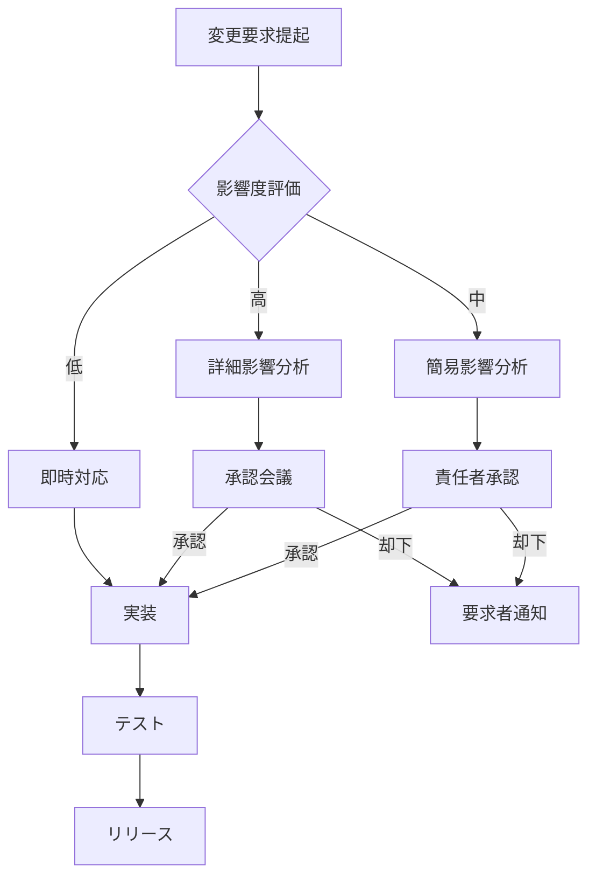

# 詳細要件定義書

## 1. イントロダクション

### 1.1 目的
本詳細要件定義書は、COCOSiL（ココシル）分析システムの具体的な機能・性能・品質要件を詳述し、設計・開発・テストの直接的なインプットとして活用することを目的とする。

### 1.2 背景とビジネスゴール
**現状の課題**：
- 複数の診断手法（体癖理論・MBTI・動物占い・算命学）が個別に運用されており、統合的な人間理解が困難
- テストユーザーから系統的にデータ収集し、Claude AIを活用した診断精度向上の仕組みが不在
- 専門的な体癖理論の学習機会と実践的診断の統合が不十分

**本システムで解決すべき課題**：
- 検証フェーズでのテストユーザーデータの体系的収集とClaude AI向けプロンプト生成
- 4つの専門サイト間のシームレスな連携による包括的診断システムの構築
- プライバシー保護を徹底した安全なデータ管理システムの実現

### 1.3 用語集・略語

| 用語 | 読み | 定義 |
|------|------|------|
| COCOSiL | ココシル | 本システムの正式名称。体癖・MBTI・動物占い・算命学を統合した分析システム |
| 体癖 | たいへき | 野口整体の理論に基づく10種類の体質・性格分類システム |
| 主体癖 | しゅたいへき | 最も強く現れる体癖の種類（1-10種） |
| 副体癖 | ふくたいへき | 二番目に強く現れる体癖の種類 |
| 算命学 | さんめいがく | 中国発祥の占術。生年月日から個人の運勢や性格を分析 |
| 動物占い | どうぶつうらない | 算命学をベースとした12種の動物による性格分析 |
| MBTI |  | Myers-Briggs Type Indicator。16タイプの性格類型論 |
| OpenAI API |  | GPT-4等を利用するためのAPI |
| Zustand |  | React用の軽量状態管理ライブラリ |

### 1.4 参照資料・関連文書
- システム要件定義書（docs/output/system_requirements.md）
- フロントエンドフローチャート（docs/input/frontend_flowchart.mermaid）
- フロントエンドシーケンス図（docs/input/frontend_sequence.mermaid）

## 2. システム全体像

### 2.1 システムスコープ

#### 2.1.1 IN スコープ（本システムで実装）
- **ココシル入口サイト**：基本情報収集、診断結果統合表示、Claude AI向けデータ生成
- **体癖診断システム**：20問診断、主体癖・副体癖算出、結果画像生成
- **体癖理論学習サイト**：体癖論教育コンテンツ、インタラクティブ学習機能
- **管理者データベースシステム**：診断データ管理、統計分析、プロンプト生成
- **サイト間連携機能**：4サイト間のデータ共有、ナビゲーション統合

#### 2.1.2 OUT スコープ（本システムでは扱わない）
- **決済機能**：検証フェーズでは無料のため実装しない
- **ユーザー認証**：個人特定を避けるため会員システムは構築しない
- **多言語対応**：初期段階では日本語のみ
- **モバイルアプリ**：Webアプリケーションのみ実装

### 2.2 システム構成図

```
┌─────────────────┐    ┌──────────────────┐    ┌─────────────────┐
│   ココシル入口   │    │   体癖診断       │    │  体癖理論学習   │
│   (Next.js)     │◄──►│   システム       │◄──►│   サイト        │
│                 │    │   (Next.js)      │    │   (Next.js)     │
└─────────┬───────┘    └──────┬───────────┘    └─────────────────┘
          │                   │
          ▼                   ▼
┌─────────────────────────────────┐
│     管理者データベースシステム      │
│         (Next.js + API)         │
│    ※ユーザーからは直接アクセス不可    │
└─────────────────────────────────┘
```

### 2.3 主要ユースケース図

#### 2.3.1 テストユーザーの利用フロー
1. **ココシル入口**にアクセス → 基本情報入力
2. **算命学・動物占い**結果自動算出（Python API）
3. **MBTI診断**実施（既知の場合は選択、未知の場合は12問診断）
4. **体癖理論学習**（任意）→ **体癖診断**実施
5. **統合結果確認** → **管理者向けデータ送信**

#### 2.3.2 管理者の利用フロー
1. **データベースシステム**にアクセス
2. **収集済みデータ**の閲覧・検索
3. **統計分析ダッシュボード**で傾向把握
4. **Claude AI向けプロンプト**生成・ダウンロード
5. **Excelエクスポート**機能でデータ出力

## 3. 利用者分類と利用シナリオ

### 3.1 利用者ペルソナ

#### 3.1.1 テストユーザー
- **役割**：システム検証のためのデータ提供者
- **技術リテラシー**：一般的なWebサイト利用可能レベル
- **利用頻度**：1回のみ（検証期間中）
- **主要ゴール**：自己理解の深化、複合診断結果の取得

#### 3.1.2 システム管理者
- **役割**：収集データの分析とClaude AI活用
- **技術リテラシー**：Excel操作、Web管理画面操作が可能
- **利用頻度**：週1-2回程度
- **主要ゴール**：診断精度向上のためのデータ分析と活用

### 3.2 利用シナリオ詳細

#### 3.2.1 正常シナリオ：テストユーザーの完全利用
```
1. ランディングページアクセス
2. 基本情報入力（名前・生年月日）
3. 算命学・動物占い自動算出（Python API経由）
4. MBTI情報収集（既知選択 or 12問診断）
5. 体癖理論学習（任意）
6. 体癖診断実施（20問）
7. 統合結果表示・確認
8. 管理者向けデータ自動送信
9. 完了画面表示
```

#### 3.2.2 例外シナリオ：部分完了
```
1-4. （正常シナリオと同様）
5. 体癖診断をスキップまたは中断
6. 収集済みデータのみで統合結果表示
7. 部分データとして管理者向け送信
```

### 3.3 エラー・例外処理シナリオ

#### 3.3.1 システムエラー対応
- **Python APIエラー**：算命学計算失敗時はリトライ機能提供
- **OpenAI APIエラー**：接続失敗時は再試行ボタン表示
- **データ保存エラー**：ローカルストレージ復旧機能
- **ネットワークエラー**：オフライン対応とデータ復元機能

#### 3.3.2 入力エラー対応
- **日付入力エラー**：リアルタイムバリデーション
- **必須項目未入力**：項目ハイライト表示
- **無効なデータ形式**：形式例表示とガイダンス

## 4. 機能要件

### 4.1 ココシル入口サイト（F001）

#### F001-1：基本情報入力フォーム
**概要**：テストユーザーの基本情報を収集し、他システムとの連携データを生成

**詳細仕様**：

| 項目名 | 必須 | データ型 | 制約 | バリデーション | 例 |
|--------|------|----------|------|----------------|-----|
| 名前 | ○ | 文字列 | 1-50文字 | 空文字チェック | 山田太郎 |
| 生年月日（年） | ○ | 数値 | 1900-2025 | 範囲チェック | 1990 |
| 生年月日（月） | ○ | 数値 | 1-12 | 範囲チェック | 5 |
| 生年月日（日） | ○ | 数値 | 1-31 | 月日整合性チェック | 15 |

**処理ロジック**：
1. **前提**：Zustand初期状態確認
2. **入力受付**：React Hook Formによるリアルタイムバリデーション
3. **算命学API呼び出し**：`POST /api/fortune-calc` に年月日送信
4. **結果保存**：ZustandストアとlocalStorageに保存
5. **進捗更新**：20% → 次画面遷移

**受入れ基準**：
- [ ] 必須項目未入力時はエラーメッセージ表示
- [ ] 無効な日付（2月30日等）はエラー表示
- [ ] 算命学API成功時は結果が正しく保存される
- [ ] ページ更新時もZustandから状態復元される

#### F001-2：MBTI情報収集
**概要**：ユーザーのMBTI情報を既知選択または簡易診断で取得

**詳細仕様**：

**既知選択パターン**：
- 16タイプからプルダウン選択
- 各タイプの特徴を簡潔に表示

**簡易診断パターン**：
- 12問のY/N質問形式
- 各質問はE/I、S/N、T/F、J/Pの4軸を判定
- クライアントサイドで結果算出

**処理ロジック**：
1. **前提**：基本情報入力完了済み
2. **分岐判定**：「既知」「診断希望」ボタン選択
3. **既知の場合**：プルダウン選択 → Zustand保存
4. **診断の場合**：12問回答 → 算出アルゴリズム実行 → 結果保存
5. **進捗更新**：40% → 次画面遷移

**MBTI算出アルゴリズム**：
```javascript
function calculateMBTI(answers) {
  const scores = { E: 0, I: 0, S: 0, N: 0, T: 0, F: 0, J: 0, P: 0 };
  
  // 各質問の回答をスコアに反映
  answers.forEach((answer, index) => {
    const dimension = questionMappings[index];
    if (answer === 'YES') {
      scores[dimension.positive]++;
    } else {
      scores[dimension.negative]++;
    }
  });
  
  // 各軸で優位な方を選択
  const result = '';
  result += scores.E > scores.I ? 'E' : 'I';
  result += scores.S > scores.N ? 'S' : 'N';
  result += scores.T > scores.F ? 'T' : 'F';
  result += scores.J > scores.P ? 'J' : 'P';
  
  return result;
}
```

**受入れ基準**：
- [ ] 既知選択時は16タイプすべて選択可能
- [ ] 12問診断実施時は正しいMBTIタイプが算出される
- [ ] 診断中断時は「既知選択」に戻れる
- [ ] MBTI結果はZustandとlocalStorageに保存される

#### F001-3：統合結果表示・管理者向けデータ生成
**概要**：収集した全データを統合表示し、管理者向けプロンプトファイル(.md)を生成

**詳細仕様**：

**表示項目**：
- 基本情報（名前・生年月日・年齢）
- 算命学結果（十二支・六星占術等）
- 動物占い結果
- MBTI結果
- 体癖結果（実施済みの場合）
- 相談内容(深掘り質問チャットの要約)

**管理者向けデータ形式**：
```markdown
# COCOSiL診断データ

## 基本情報
- 名前: [ユーザー名]
- 生年月日: [YYYY年MM月DD日] ([年齢]歳)
- 診断実施日: [YYYY-MM-DD HH:MM]

## 診断結果サマリー
- 星座: [結果]
- 動物占い: [結果]
- MBTI: [結果]
- 体癖: [主体癖X種・副体癖Y種]

## Claude AI向けプロンプト
この人物の診断結果を踏まえて、以下の観点から分析してください：
[診断結果に基づく分析観点の自動生成]

## 生データ（開発者向け）
[JSON形式の全データ]
```

**処理ロジック**：
1. **前提**：全診断データがZustandに保存済み
2. **データ統合**：各診断結果を統合オブジェクトに統合
3. **Markdownファイル生成**：クライアントサイドで.md文字列生成
4. **プレビュー表示**：生成されたファイル内容をユーザーに表示
5. **送信処理**：`POST /api/admin-submit`でサーバー送信
6. **完了通知**：送信成功時は管理者向けアクセス情報表示

**受入れ基準**：
- [ ] 統合結果に全診断データが正しく表示される
- [ ] .mdファイルが適切なフォーマットで生成される
- [ ] プレビュー画面で内容確認可能
- [ ] 管理者向けサーバーへの送信が成功する
- [ ] エラー時はリトライ機能が動作する

### 4.2 体癖診断システム（F002）

#### F002-1：体癖診断フロー（20問形式）
**概要**：20問の質問により主体癖・副体癖を精密に算出

**詳細仕様**：

**質問形式**：
- 各質問は4択選択式
- 選択肢にはそれぞれ体癖タイプ（1-10種）が対応
- 進捗バー表示（1/20 → 20/20）

**例質問**：
```
Q1. あなたの体の特徴として最も当てはまるものは？
A. 頭が大きく、体全体がしっかりしている (1種)
B. 左右均等で、バランスが良い体型 (2種)
C. 上半身が発達し、エネルギッシュ (3種)
D. 下半身が安定し、どっしりしている (4種)
```

**処理ロジック**：
1. **前提**：体癖理論学習完了または診断直接遷移
2. **質問表示**：現在の問題番号と進捗表示
3. **回答記録**：選択肢に対応する体癖番号をスコアリング
4. **次問遷移**：回答後0.5秒で次の質問に自動遷移
5. **結果算出**：20問完了時に主体癖・副体癖を算出

**体癖算出アルゴリズム**：
```javascript
function calculateTaiheki(answers) {
  const scores = Array(11).fill(0); // 1-10種のスコア配列
  
  // 各回答をスコアに加算（重み付け考慮）
  answers.forEach((answer, questionIndex) => {
    const weights = questionWeights[questionIndex];
    scores[answer.taihekiType] += weights[answer.choice];
  });
  
  // 最高得点を主体癖、2番目を副体癖とする
  const sortedIndices = scores
    .map((score, index) => ({ score, index }))
    .filter(item => item.index > 0) // 0番目は除外
    .sort((a, b) => b.score - a.score);
  
  return {
    primary: sortedIndices[0].index,
    secondary: sortedIndices[1].index,
    scores: scores
  };
}
```

**受入れ基準**：
- [ ] 20問すべてが順序通り表示される
- [ ] 各質問で4択選択が正しく動作する
- [ ] 進捗バーが正確に更新される
- [ ] 算出された主体癖・副体癖が理論的に妥当である

#### F002-2：診断結果詳細表示
**概要**：算出された体癖結果の詳細な解説と特徴を表示

**表示内容**：
- **基本情報**：主体癖X種・副体癖Y種
- **体型特徴**：身体的特徴の説明
- **性格特徴**：行動パターン・思考傾向
- **適職・向いている環境**
- **注意点・改善アドバイス**
- **他の体癖との相性**

**処理ロジック**：
1. **前提**：体癖算出完了
2. **データ取得**：主体癖・副体癖の詳細情報をJSONから取得
3. **組み合わせ解析**：主+副の組み合わせ特有の特徴を算出
4. **表示生成**：テンプレートに診断結果を埋め込み
5. **画像生成準備**：結果画像生成用データ準備

**受入れ基準**：
- [ ] 主体癖・副体癖の特徴が正確に表示される
- [ ] 組み合わせ特有の解説が含まれる
- [ ] すべての解説項目が漏れなく表示される
- [ ] 読みやすい形式でレイアウトされる

#### F002-3：結果画像生成・ダウンロード機能
**概要**：診断結果を画像化してダウンロード可能にする

**画像仕様**：
- **サイズ**：1200x630px（SNSシェア最適サイズ）
- **形式**：PNG
- **内容**：体癖タイプ、特徴要約、QRコード（詳細URL）

**処理ロジック**：
1. **前提**：診断結果表示完了
2. **Canvas生成**：HTML5 Canvasを使用
3. **テキスト描画**：体癖結果と特徴要約をレンダリング
4. **QRコード生成**：詳細結果URLのQRコード挿入
5. **画像変換**：CanvasからPNGファイル生成
6. **ダウンロード**：ブラウザのdownload機能で保存

**実装例**：
```javascript
function generateResultImage(taihekiResult) {
  const canvas = document.createElement('canvas');
  canvas.width = 1200;
  canvas.height = 630;
  const ctx = canvas.getContext('2d');
  
  // 背景描画
  ctx.fillStyle = '#f0f8ff';
  ctx.fillRect(0, 0, 1200, 630);
  
  // タイトル描画
  ctx.fillStyle = '#333';
  ctx.font = 'bold 48px "Noto Sans JP"';
  ctx.fillText(`あなたの体癖：${taihekiResult.primary}種`, 100, 100);
  
  // 特徴描画
  ctx.font = '32px "Noto Sans JP"';
  ctx.fillText(taihekiResult.features, 100, 200);
  
  // QRコード挿入
  const qrCode = generateQRCode(window.location.href);
  ctx.drawImage(qrCode, 1000, 450, 150, 150);
  
  return canvas.toDataURL('image/png');
}
```

**受入れ基準**：
- [ ] 1200x630pxのPNG画像が生成される
- [ ] 体癖結果が画像内に正しく表示される
- [ ] QRコードから詳細ページにアクセスできる
- [ ] ダウンロード機能が正常動作する

### 4.3 体癖理論学習サイト（F003）

#### F003-1：体癖論基本理論解説
**概要**：体癖理論の基礎概念を段階的に学習できるコンテンツ

**学習コンテンツ構成**：
1. **体癖とは**：野口整体における位置づけ
2. **10種類の体癖**：各タイプの基本概念
3. **主体癖・副体癖**：組み合わせの考え方
4. **体癖の活用法**：日常生活での応用方法
5. **診断の意義**：自己理解の深化について

**インタラクティブ要素**：
- 理解度チェック（進捗表示）
- 関連する体癖タイプのハイライト
- 用語集へのリンク

**受入れ基準**：
- [ ] 全5章のコンテンツが順序通り表示される
- [ ] 進捗状況が視覚的に分かる
- [ ] 体癖診断への導線が適切に配置される

#### F003-2：10種体癖詳細解説
**概要**：各体癖タイプの詳細な特徴・傾向を学習

**各体癖の解説項目**：
- **基本特徴**：体型・性格の特徴
- **長所・短所**：優れている点と注意点
- **行動パターン**：典型的な行動例
- **適職・環境**：向いている職業や環境
- **改善アドバイス**：成長のためのヒント
- **有名人例**：理解促進のための参考人物

**表示形式**：
- タブ切り替え式（1種〜10種）
- 各タイプ専用のカラーテーマ
- 図解・イラストによる視覚的説明
- 比較表による他タイプとの違い

**受入れ基準**：
- [ ] 10種すべての体癖詳細が表示される
- [ ] タブ切り替えが正常に動作する
- [ ] 各タイプの特徴が分かりやすく説明される
- [ ] 視覚的要素（色・図）が効果的に使用される

### 4.4 管理者向けデータベースシステム（F004）

#### F004-1：診断記録一元管理
**概要**：収集した診断データの検索・閲覧・管理機能

**データ管理機能**：
- **一覧表示**：収集データの表形式表示
- **検索機能**：名前・日付・体癖タイプによる検索
- **フィルタリング**：診断完了状況・データ品質による絞り込み
- **詳細表示**：個別データの詳細閲覧
- **データ削除**：個人情報保護のための削除機能

**表示項目**：
| 項目 | 表示形式 | ソート | 検索対象 |
|------|----------|--------|----------|
| 診断ID | DGN-YYYYMMDD-XXX | ○ | ○ |
| 実施日時 | YYYY/MM/DD HH:MM | ○ | ○ |
| 名前 | 文字列 | ○ | ○ |
| 年齢 | 数値 | ○ | ○ |
| MBTI | 4文字 | ○ | ○ |
| 主体癖 | X種 | ○ | ○ |
| 副体癖 | Y種 | ○ | ○ |
| 完了状況 | 完了/部分 | ○ | ○ |

**受入れ基準**：
- [ ] 収集データが表形式で一覧表示される
- [ ] 各項目でソート機能が動作する
- [ ] 検索・フィルタリングが正確に動作する
- [ ] 詳細表示で全データが確認できる
- [ ] データ削除機能が正常動作する

#### F004-2：統計分析ダッシュボード
**概要**：収集データの統計分析とトレンド表示

**分析項目**：
1. **基本統計**
   - 総診断数
   - 完了率（完了/開始）
   - 平均所要時間
   - 日別実施数

2. **体癖分布**
   - 主体癖の分布（1〜10種）
   - 副体癖の分布
   - 組み合わせ頻度TOP10

3. **MBTI分布**
   - 16タイプ分布
   - 4軸別分布（E/I, S/N, T/F, J/P）

4. **クロス分析**
   - 体癖×MBTI相関分析
   - 年代別傾向
   - 季節性分析

**表示形式**：
- 円グラフ：分布系データ
- 棒グラフ：比較系データ  
- 線グラフ：時系列データ
- ヒートマップ：相関分析

**実装技術**：
- Chart.js または Recharts によるグラフ描画
- リアルタイム更新（データ追加時）
- CSV/PNG エクスポート機能

**受入れ基準**：
- [ ] 基本統計が正確に算出・表示される
- [ ] 各種分布グラフが正しく描画される
- [ ] クロス分析結果が妥当である
- [ ] グラフのエクスポート機能が動作する

#### F004-3：Claude AIプロンプト生成機能
**概要**：収集データを基にClaude AI向け最適プロンプトを自動生成

**プロンプト生成ロジック**：
1. **個別プロンプト生成**
```markdown
# 個人分析プロンプト

あなたは体癖理論・MBTI・算命学の専門家です。以下の診断結果から、この人物の特徴・傾向・適職について分析してください。

## 診断データ
- 年齢: [年齢]歳
- MBTI: [MBTI結果] 
- 体癖: 主体癖[X]種・副体癖[Y]種
- 算命学: [算命学結果]
- 動物占い: [動物占い結果]

## 分析観点
1. 性格特徴の統合分析（各診断手法の共通点・相違点）
2. 強み・弱みの整理
3. 適職・キャリア提案
4. 人間関係での特徴
5. 成長のためのアドバイス

## 出力形式
- 簡潔で実用的なアドバイス
- 根拠を明確にした分析
- 本人が納得できる表現
```

2. **統計プロンプト生成**
```markdown
# 統計分析プロンプト

COCOSiLシステムで収集した[N]件のデータから、以下の傾向分析を行ってください。

## 統計データ
[統計サマリーJSONを挿入]

## 分析依頼
1. 体癖×MBTI の相関性分析
2. 診断精度向上のための仮説提案
3. 追加収集すべきデータ項目の提案
4. システム改善点の指摘

## 期待する出力
- データドリブンな改善提案
- 統計的に有意な傾向の抽出
- 次フェーズでの検証項目
```

**プロンプト管理機能**：
- テンプレート編集機能
- 生成履歴の保存
- バージョン管理
- 一括生成・ダウンロード

**受入れ基準**：
- [ ] 個別データから適切なプロンプトが生成される
- [ ] 統計データプロンプトが正確に生成される
- [ ] テンプレート編集が可能である
- [ ] 生成結果をファイルダウンロードできる

## 5. 非機能要件

### 5.1 性能・スケーラビリティ要件

#### 5.1.1 レスポンス時間要件
| 機能 | 目標時間 | 測定条件 | 測定方法 |
|------|----------|----------|----------|
| ページ表示 | ≤2秒 | 初回ロード | Performance API |
| 診断算出 | ≤3秒 | 20問完了時 | クライアント測定 |
| API応答 | ≤1秒 | 算命学計算 | サーバーログ |
| OpenAI API | ≤5秒 | 初回レスポンス | ストリーミング開始まで |

#### 5.1.2 スループット要件
- **同時接続ユーザー数**：最大50人（検証フェーズ想定）
- **1日あたり診断実行数**：最大100件
- **データベース同時アクセス**：最大10セッション

#### 5.1.3 リソース利用要件
- **メモリ使用量**：クライアント側 ≤100MB（ブラウザタブ）
- **ローカルストレージ**：≤10MB per user
- **APIリクエスト頻度**：≤1req/sec per user（通常利用時）

### 5.2 可用性・信頼性要件

#### 5.2.1 稼働率要件
- **システム全体稼働率**：99%以上（検証期間6か月間）
- **計画停止時間**：月4時間以内（メンテナンス窓口：平日深夜）
- **障害復旧時間**：4時間以内（重大障害時）

#### 5.2.2 データ整合性要件
- **診断データ**：算出ロジックの一貫性保証
- **状態管理**：Zustand⇔localStorage間の整合性
- **API連携**：サーバー⇔クライアント間のデータ整合性

#### 5.2.3 エラー処理要件
- **自動リトライ**：APIエラー時3回まで自動再試行
- **エラーログ**：全エラーをサーバーサイドログに記録
- **ユーザー通知**：分かりやすいエラーメッセージ表示

### 5.3 セキュリティ要件

#### 5.3.1 データ保護要件
- **個人情報暗号化**：localStorageデータのクライアントサイド暗号化
- **通信暗号化**：全API通信でHTTPS必須
- **データ匿名化**：管理者向け統計データの個人特定情報除去

#### 5.3.2 アクセス制御要件
- **管理者認証**：データベースシステムへの適切な認証機構
- **API認証**：サーバーサイドAPIの不正アクセス防止
- **セッション管理**：適切なセッションタイムアウト設定

#### 5.3.3 プライバシー要件
- **データ保持期間**：個人識別情報は診断完了後30日で自動削除
- **データ共有禁止**：診断データの他サイト間での共有禁止
- **削除権**：ユーザーからの削除要求に対する即座の対応

### 5.4 ユーザビリティ要件

#### 5.4.1 レスポンシブデザイン要件
- **対応デバイス**：
  - デスクトップ（1920x1080以上）
  - タブレット（768x1024〜1024x768）
  - スマートフォン（375x667〜414x896）
- **ブレークポイント**：Tailwind CSS標準ブレークポイント採用
- **タッチ操作**：ボタン最小サイズ44x44px

#### 5.4.2 アクセシビリティ要件
- **WCAG 2.1 AA準拠**：色覚異常・視覚障害への配慮
- **キーボード操作**：すべての機能のキーボード操作対応
- **スクリーンリーダー**：適切なARIAラベル設定
- **コントラスト比**：4.5:1以上（通常テキスト）

#### 5.4.3 多言語対応要件
- **初期対応**：日本語のみ
- **将来対応**：英語・中国語・韓国語（Phase 2以降）
- **国際化対応**：i18n対応の設計（文字列外部化）

### 5.5 保守性・拡張性要件

#### 5.5.1 コード品質要件
- **TypeScript**：型安全性の確保
- **ESLint/Prettier**：コード品質・フォーマット統一
- **テストカバレッジ**：単体テスト80%以上
- **ドキュメント**：関数・API仕様の適切な文書化

#### 5.5.2 デプロイ・運用要件
- **CI/CD**：GitHub Actions による自動テスト・デプロイ
- **環境分離**：開発・ステージング・本番環境の分離
- **ログ管理**：構造化ログによる運用監視
- **バックアップ**：診断データの日次バックアップ

#### 5.5.3 モニタリング要件
- **パフォーマンス監視**：Web Vitals（LCP、FID、CLS）測定
- **エラー追跡**：JavaScript エラーの自動収集・通知
- **利用統計**：診断実行数・完了率・滞在時間の計測

## 6. データ要件

### 6.1 論理データモデル

#### 6.1.1 ユーザー診断データ（クライアントサイド）
```typescript
interface UserDiagnosisData {
  // 基本情報
  basic: {
    name: string;
    birthdate: {
      year: number;
      month: number;
      day: number;
    };
    age: number;
    sessionId: string;
    startedAt: Date;
    completedAt?: Date;
  };
  
  // 算命学・動物占い結果
  fortune: {
    zodiac: string;          // 十二支
    sixStar: string;         // 六星占術
    animal: string;          // 動物占い
    element: string;         // 五行
    calculatedAt: Date;
  };
  
  // MBTI結果
  mbti: {
    type: string;            // 16タイプ（例：INFP）
    method: 'known' | 'diagnosis'; // 取得方法
    confidence?: number;      // 診断の場合の信頼度
    answeredAt: Date;
  };
  
  // 体癖結果
  taiheki?: {
    primary: number;         // 主体癖（1-10）
    secondary: number;       // 副体癖（1-10）
    scores: number[];        // 各タイプのスコア
    answers: number[];       // 20問の回答
    completedAt: Date;
  };
  
  // 進捗管理
  progress: {
    currentStep: string;     // 'basic' | 'mbti' | 'taiheki' | 'result'
    percentage: number;      // 0-100
    completedSteps: string[];
  };
}
```

#### 6.1.2 管理者データベース（サーバーサイド）
```typescript
interface AdminDiagnosisRecord {
  id: string;              // DGN-YYYYMMDD-XXX
  userId: string;          // ハッシュ化されたセッションID
  name: string;            // 暗号化された名前
  age: number;
  submittedAt: Date;
  
  // 診断結果（正規化）
  mbti: string;
  taihekiPrimary: number;
  taihekiSecondary: number;
  fortuneData: any;        // JSON形式
  
  // メタデータ
  completionStatus: 'partial' | 'complete';
  dataQuality: 'high' | 'medium' | 'low';
  generatedPrompt: string; // Claude AI向けプロンプト
  downloadCount: number;   // ダウンロード回数
  
  // プライバシー管理
  privacyConsent: boolean;
  deletionScheduledAt?: Date;
  actuallyDeletedAt?: Date;
}
```

### 6.2 データ辞書

#### 6.2.1 体癖関連データ
| 属性名 | データ型 | 桁数 | NULL | ドメイン | 説明 |
|--------|----------|------|------|----------|------|
| taihekiType | INTEGER | 2 | NO | 1-10 | 体癖番号（1種〜10種） |
| score | DECIMAL | 5,2 | NO | 0.00-100.00 | 体癖スコア |
| questionId | INTEGER | 2 | NO | 1-20 | 質問番号 |
| answerId | INTEGER | 1 | NO | 1-4 | 選択肢番号 |

#### 6.2.2 MBTI関連データ
| 属性名 | データ型 | 桁数 | NULL | ドメイン | 説明 |
|--------|----------|------|----------|----------|------|
| mbtiType | CHAR | 4 | NO | [EINS][EINS][TFTS][JPJP] | MBTI4文字表記 |
| dimension | CHAR | 1 | NO | E,I,S,N,T,F,J,P | MBTI次元 |
| confidence | DECIMAL | 3,2 | YES | 0.00-1.00 | 診断信頼度 |

### 6.3 データライフサイクル管理

#### 6.3.1 データ保持ポリシー
1. **クライアントサイド（localStorage）**
   - 保持期間：診断完了から7日間
   - 自動削除：期限到来時にJavaScriptで自動削除
   - 手動削除：ユーザーによる即座削除機能

2. **サーバーサイド（管理者DB）**
   - 個人識別情報：30日間保持後自動匿名化
   - 統計用データ：匿名化後永続保持
   - 削除ログ：削除実行の証跡として1年間保持

#### 6.3.2 データマイグレーション要件
- **バージョンアップ対応**：localStorage スキーマ変更時の互換性維持
- **データ移行ツール**：旧形式データの新形式への変換
- **ロールバック**：データ移行失敗時の復旧機能

## 7. 外部インタフェース要件

### 7.1 OpenAI API連携仕様

#### 7.1.1 ChatGPT API（ストリーミング）
**エンドポイント**：`https://api.openai.com/v1/chat/completions`
**利用モデル**：GPT-4 turbo
**認証方式**：Bearer Token（サーバーサイドで管理）

**リクエスト仕様**：
```typescript
interface OpenAIChatRequest {
  model: "gpt-4-turbo-preview";
  messages: {
    role: "system" | "user" | "assistant";
    content: string;
  }[];
  stream: true;
  temperature: 0.7;
  max_tokens: 4000;
}
```

**レスポンス処理**：
```javascript
// Server-Sent Events によるストリーミング処理
const response = await fetch('/api/chat/stream', {
  method: 'POST',
  body: JSON.stringify(chatData)
});

const reader = response.body.getReader();
const decoder = new TextDecoder();

while (true) {
  const { value, done } = await reader.read();
  if (done) break;
  
  const chunk = decoder.decode(value);
  const lines = chunk.split('\n');
  
  for (const line of lines) {
    if (line.startsWith('data: ')) {
      const data = JSON.parse(line.slice(6));
      if (data.choices[0].delta.content) {
        // リアルタイムでUI更新
        updateChatUI(data.choices[0].delta.content);
      }
    }
  }
}
```

**エラーハンドリング**：
- **Rate Limit**：429エラー時は指数バックオフで再試行
- **Network Error**：接続エラー時はユーザーに再試行ボタン表示

#### 7.1.2 システムプロンプト設計
```typescript
const systemPrompt = `
あなたはCOCOSiLシステムのAI相談員です。以下の診断結果を持つ方の相談に乗ってください。

## ユーザー情報
- 名前: {{name}}
- 年齢: {{age}}歳
- MBTI: {{mbti}}
- 体癖: 主体癖{{primaryTaiheki}}種・副体癖{{secondaryTaiheki}}種
- 算命学: {{fortune}}

## 相談対応方針
1. 診断結果を踏まえた個別化されたアドバイス
2. 複数の診断手法の統合的な解釈
3. 実用的で具体的な改善提案
4. ユーザーの自律性を尊重した支援

## 注意事項
- 診断結果を絶対視せず、参考情報として扱う
- ユーザーの主体性を重視する
- 医療的判断は行わない
- プライバシーに配慮し、情報を外部に漏らさない
`;
```

### 7.2 Python API連携仕様（算命学計算）

#### 7.2.1 fortune-calc API
**エンドポイント**：`POST /api/fortune-calc`
**実装場所**：`pages/api/fortune-calc.ts`（Next.js API Routes）

**リクエスト形式**：
```typescript
interface FortuneCalcRequest {
  year: number;   // 1900-2025
  month: number;  // 1-12
  day: number;    // 1-31
}
```

**レスポンス形式**：
```typescript
interface FortuneCalcResponse {
  success: boolean;
  data?: {
    age: number;
    zodiac: string;      // 十二支
    animal: string;      // 動物占い
    sixStar: string;     // 六星占術
    element: string;     // 五行
    fortune: string;     // 運勢概要
  };
  error?: string;
}
```

**エラーハンドリング**：
- **日付エラー**：無効な日付（2月30日等）の場合はバリデーションエラー
- **データ不足**：CSV データに該当情報がない場合はデフォルト値返却
- **Python実行エラー**：スクリプトエラー時はフォールバック処理

### 7.3 CSV データファイル仕様

#### 7.3.1 fortune_data.csv
算命学・動物占い計算のマスターデータ

**ファイル場所**：`data/fortune_data.csv`
**文字コード**：UTF-8
**形式**：CSV（ヘッダー行あり）

**列定義**：
```csv
year_from,year_to,month,day,zodiac,animal,six_star,element,fortune
1900,2025,1,1,子,チータ,土星,土,堅実な一年となりそうです
1900,2025,1,2,子,黒ひょう,金星,金,創造性を発揮する時期です
...
```

| 列名 | データ型 | 説明 | 例 |
|------|----------|------|-----|
| year_from | INTEGER | 適用開始年 | 1900 |
| year_to | INTEGER | 適用終了年 | 2025 |
| month | INTEGER | 月 | 1-12 |
| day | INTEGER | 日 | 1-31 |
| zodiac | VARCHAR | 十二支 | 子、丑、寅... |
| animal | VARCHAR | 動物占い | チータ、黒ひょう... |
| six_star | VARCHAR | 六星占術 | 土星、金星... |
| element | VARCHAR | 五行 | 木、火、土、金、水 |
| fortune | TEXT | 運勢コメント | 堅実な一年... |

### 7.4 管理者向けデータ送信API

#### 7.4.1 admin-submit API
**エンドポイント**：`POST /api/admin-submit`
**認証**：APIキーによる認証

**リクエスト仕様**：
```typescript
interface AdminSubmitRequest {
  userData: UserDiagnosisData;
  mdContent: string;        // 生成された.mdファイル内容
  metadata: {
    sessionDuration: number;  // 診断所要時間（秒）
    browserInfo: string;      // ブラウザ情報
    referrer?: string;        // 参照元URL
  };
}
```

**レスポンス仕様**：
```typescript
interface AdminSubmitResponse {
  success: boolean;
  downloadId?: string;      // ダウンロード用ID
  adminUrl?: string;        // 管理者向けアクセスURL
  message: string;
}
```

**実装例**：
```typescript
// pages/api/admin-submit.ts
export default async function handler(req: NextApiRequest, res: NextApiResponse) {
  if (req.method !== 'POST') {
    return res.status(405).json({ success: false, message: 'Method not allowed' });
  }
  
  try {
    const { userData, mdContent, metadata } = req.body;
    
    // データベース保存
    const record = await saveToDatabase(userData, mdContent, metadata);
    
    // ダウンロードID生成
    const downloadId = generateDownloadId();
    
    return res.status(200).json({
      success: true,
      downloadId,
      adminUrl: `https://admin.cocoseal.com/download/${downloadId}`,
      message: 'データが正常に送信されました'
    });
    
  } catch (error) {
    console.error('Admin submit error:', error);
    return res.status(500).json({
      success: false,
      message: '送信に失敗しました。しばらくしてから再試行してください。'
    });
  }
}
```

## 8. 技術スタック詳細仕様

### 8.1 フロントエンド技術スタック

#### 8.1.1 Next.js 構成
**バージョン**：Next.js 14（App Router）
**理由**：
- **SSR/SSG対応**：SEO最適化とパフォーマンス向上
- **API Routes**：サーバーサイド処理の統合
- **ファイルベースルーティング**：直感的なページ管理
- **Image最適化**：自動的な画像最適化機能

**ディレクトリ構成**：
```
src/
  app/
    (sites)/
      cocosil/          # ココシル入口サイト
        page.tsx
        layout.tsx
        components/
      taiheki-diagnosis/  # 体癖診断システム
      taiheki-theory/     # 体癖理論学習
      admin/             # 管理者データベース（認証必要）
    api/
      fortune-calc/      # 算命学API
      admin-submit/      # 管理者向け送信
      chat/             # OpenAI連携
    globals.css
    layout.tsx
  components/
    ui/                 # shadcn/ui コンポーネント
    shared/             # サイト間共通コンポーネント
  lib/
    utils.ts
    zustand/           # 状態管理ストア
  types/
    index.ts           # 型定義
```

#### 8.1.2 React Hook Form 実装
**バージョン**：React Hook Form 7.x
**利用箇所**：全フォーム入力（基本情報・MBTI・体癖診断）

**基本設定**：
```typescript
// lib/form-config.ts
import { zodResolver } from "@hookform/resolvers/zod";
import { z } from "zod";

export const basicInfoSchema = z.object({
  name: z.string().min(1, "名前を入力してください").max(50, "50文字以内で入力してください"),
  birthYear: z.number().min(1900, "1900年以降を選択してください").max(2025, "2025年以前を選択してください"),
  birthMonth: z.number().min(1).max(12),
  birthDay: z.number().min(1).max(31),
});

export type BasicInfoForm = z.infer<typeof basicInfoSchema>;
```

**フォーム実装例**：
```typescript
// components/forms/BasicInfoForm.tsx
export function BasicInfoForm() {
  const { control, handleSubmit, formState: { errors } } = useForm<BasicInfoForm>({
    resolver: zodResolver(basicInfoSchema),
    defaultValues: {
      name: "",
      birthYear: 1990,
      birthMonth: 1,
      birthDay: 1,
    }
  });
  
  const onSubmit = async (data: BasicInfoForm) => {
    // Zustand状態更新
    useUserStore.getState().setBasicInfo(data);
    
    // 算命学API呼び出し
    const fortuneResult = await callFortuneAPI(data);
    useUserStore.getState().setFortuneData(fortuneResult);
    
    // 次ページへ遷移
    router.push('/cocosil/mbti');
  };
  
  return (
    <form onSubmit={handleSubmit(onSubmit)}>
      {/* フォーム要素 */}
    </form>
  );
}
```

#### 8.1.3 Zustand 状態管理
**バージョン**：Zustand 4.x
**利用目的**：サイト間でのデータ共有、進捗管理

**ストア設計**：
```typescript
// lib/zustand/userStore.ts
import { create } from 'zustand';
import { persist } from 'zustand/middleware';

interface UserState {
  // 基本情報
  basicInfo: {
    name: string;
    birthdate: { year: number; month: number; day: number };
    age: number;
  } | null;
  
  // 診断結果
  fortuneData: FortuneResult | null;
  mbtiData: MBTIResult | null;
  taihekiData: TaihekiResult | null;
  
  // 進捗管理
  progress: {
    currentStep: 'basic' | 'mbti' | 'taiheki' | 'result';
    percentage: number;
    completedSteps: string[];
  };
  
  // アクション
  setBasicInfo: (info: BasicInfo) => void;
  setFortuneData: (data: FortuneResult) => void;
  setMBTIData: (data: MBTIResult) => void;
  setTaihekiData: (data: TaihekiResult) => void;
  updateProgress: (step: string, percentage: number) => void;
  clearData: () => void;
}

export const useUserStore = create<UserState>()(
  persist(
    (set, get) => ({
      // 初期状態
      basicInfo: null,
      fortuneData: null,
      mbtiData: null,
      taihekiData: null,
      progress: {
        currentStep: 'basic',
        percentage: 0,
        completedSteps: []
      },
      
      // アクション実装
      setBasicInfo: (info) => set({ basicInfo: info }),
      setFortuneData: (data) => set({ fortuneData: data }),
      setMBTIData: (data) => set({ mbtiData: data }),
      setTaihekiData: (data) => set({ taihekiData: data }),
      updateProgress: (step, percentage) => set((state) => ({
        progress: {
          currentStep: step as any,
          percentage,
          completedSteps: [...state.progress.completedSteps, step]
        }
      })),
      clearData: () => set({
        basicInfo: null,
        fortuneData: null,
        mbtiData: null,
        taihekiData: null,
        progress: {
          currentStep: 'basic',
          percentage: 0,
          completedSteps: []
        }
      }),
    }),
    {
      name: 'cocosil-user-data',
      // localStorageに自動保存
    }
  )
);
```

#### 8.1.4 shadcn/ui + Tailwind CSS
**shadcn/ui コンポーネント**：
- Button, Input, Select, Progress
- Dialog, Alert, Card
- Form系コンポーネント

**カスタムTailwindスタイル**：
```typescript
// tailwind.config.ts
export default {
  content: [
    './src/pages/**/*.{js,ts,jsx,tsx,mdx}',
    './src/components/**/*.{js,ts,jsx,tsx,mdx}',
    './src/app/**/*.{js,ts,jsx,tsx,mdx}',
  ],
  theme: {
    extend: {
      colors: {
        // COCOSiLブランドカラー
        'cocosil': {
          50: '#f0f8ff',
          100: '#e0f1ff',
          500: '#0ea5e9',
          900: '#0c4a6e',
        },
        // 体癖タイプ別カラー（10色）
        'taiheki': {
          1: '#ff6b6b',  // 1種：赤
          2: '#4ecdc4',  // 2種：青緑
          3: '#45b7d1',  // 3種：青
          4: '#96ceb4',  // 4種：緑
          5: '#feca57',  // 5種：黄
          6: '#ff9ff3',  // 6種：ピンク
          7: '#54a0ff',  // 7種：青
          8: '#5f27cd',  // 8種：紫
          9: '#00d2d3',  // 9種：シアン
          10: '#ff6348', // 10種：オレンジ
        }
      },
    },
  },
  plugins: [],
}
```

### 8.2 バックエンド技術スタック

#### 8.2.1 Next.js API Routes
**実装パターン**：
```typescript
// pages/api/fortune-calc.ts
import { NextApiRequest, NextApiResponse } from 'next';
import { spawn } from 'child_process';

export default async function handler(req: NextApiRequest, res: NextApiResponse) {
  if (req.method !== 'POST') {
    return res.status(405).json({ message: 'Method not allowed' });
  }
  
  const { year, month, day } = req.body;
  
  // Python スクリプト実行
  const pythonProcess = spawn('python3', [
    'scripts/fortune_calculator.py',
    year.toString(),
    month.toString(),
    day.toString()
  ]);
  
  let result = '';
  pythonProcess.stdout.on('data', (data) => {
    result += data.toString();
  });
  
  pythonProcess.on('close', (code) => {
    if (code === 0) {
      try {
        const fortuneData = JSON.parse(result);
        res.status(200).json({ success: true, data: fortuneData });
      } catch (error) {
        res.status(500).json({ success: false, error: 'JSON parse error' });
      }
    } else {
      res.status(500).json({ success: false, error: 'Python script error' });
    }
  });
}
```

#### 8.2.2 OpenAI API ストリーミング実装
```typescript
// pages/api/chat/stream.ts
import { OpenAI } from 'openai';

const openai = new OpenAI({
  apiKey: process.env.OPENAI_API_KEY,
});

export default async function handler(req: NextApiRequest, res: NextApiResponse) {
  const { messages, userData } = req.body;
  
  // Server-Sent Events ヘッダー設定
  res.writeHead(200, {
    'Content-Type': 'text/event-stream',
    'Cache-Control': 'no-cache',
    'Connection': 'keep-alive',
    'Access-Control-Allow-Origin': '*',
  });
  
  try {
    const stream = await openai.chat.completions.create({
      model: 'gpt-4-turbo-preview',
      messages: [
        { role: 'system', content: generateSystemPrompt(userData) },
        ...messages
      ],
      stream: true,
      temperature: 0.7,
      max_tokens: 2000,
    });
    
    for await (const chunk of stream) {
      const content = chunk.choices[0]?.delta?.content || '';
      if (content) {
        res.write(`data: ${JSON.stringify({ content })}\n\n`);
      }
    }
    
    res.write('data: [DONE]\n\n');
    res.end();
    
  } catch (error) {
    res.write(`data: ${JSON.stringify({ error: error.message })}\n\n`);
    res.end();
  }
}
```

#### 8.2.3 Python 統合

## 9. 制約・前提条件

### 9.1 法規制・コンプライアンス制約

#### 9.1.1 個人情報保護法対応
- **取得同意**：個人情報取得時の明示的同意取得
- **利用目的**：診断・分析目的に限定した利用
- **第三者提供禁止**：個人データの外部提供は一切行わない
- **安全管理措置**：暗号化・アクセス制御・削除機能の実装

**実装要件**：
```typescript
// プライバシー同意コンポーネント
export function PrivacyConsent() {
  return (
    <Dialog>
      <DialogContent>
        <h2>個人情報の取り扱いについて</h2>
        <div className="privacy-notice">
          <h3>取得する個人情報</h3>
          <ul>
            <li>お名前</li>
            <li>生年月日</li>
            <li>診断回答内容</li>
          </ul>
          
          <h3>利用目的</h3>
          <ul>
            <li>診断結果の算出・表示</li>
            <li>システム改善のための統計分析（匿名化後）</li>
          </ul>
          
          <h3>保存期間</h3>
          <p>個人識別情報は診断完了から30日後に自動削除いたします</p>
          
          <h3>お客様の権利</h3>
          <p>いつでも削除要求が可能です</p>
        </div>
        
        <Checkbox 
          id="privacy-consent" 
          onCheckedChange={(checked) => setConsent(checked)}
        />
        <label htmlFor="privacy-consent">上記に同意する</label>
      </DialogContent>
    </Dialog>
  );
}
```

#### 9.1.2 GDPR対応（将来的な海外展開想定）
- **Right to be forgotten**：削除権への対応
- **Data portability**：データ持ち出し権への対応
- **Privacy by design**：プライバシー保護を前提とした設計

### 9.2 技術的制約

#### 9.2.1 ブラウザ対応
**対応ブラウザ**：
- Chrome 90+ (85%+ シェア想定)
- Safari 14+ (iPhone/Mac対応)
- Edge 90+ (Windows対応)
- Firefox 88+ (一部ユーザー対応)

**非対応ブラウザ**：
- Internet Explorer (全バージョン)
- 5年以上前のブラウザバージョン

**対応確認項目**：
- ES6+ JavaScript機能
- localStorage/sessionStorage
- Fetch API
- Canvas API（画像生成）
- Server-Sent Events（ストリーミング）

#### 9.2.2 デバイス・OS制約
**対応デバイス**：
- デスクトップPC（Windows 10+, macOS 10.15+）
- タブレット（iPad 9+, Android 10+）
- スマートフォン（iOS 14+, Android 10+）

**パフォーマンス要件**：
- RAM: 最小2GB（4GB推奨）
- ストレージ: 100MB以上の空き容量
- ネットワーク: 安定したインターネット接続

#### 9.2.3 外部サービス依存
**必須サービス**：
- **OpenAI API**：GPT-4へのアクセス
- **Node.js環境**：サーバーサイド実行
- **Python環境**：算命学計算処理

**障害時の対応**：
- OpenAI API障害：オフライン診断モードへの切り替え
- Python実行エラー：簡易計算ロジックでのフォールバック
- ネットワーク障害：ローカルストレージからの復旧

### 9.3 運用・スケジュール制約

#### 9.3.1 開発スケジュール制約
**検証開始予定**：システム要件定義完了から10週間後
**開発期間**：10週間（Phase 1-3）
**テスト期間**：各Phase完了時に1週間のテスト期間

**マイルストーン**：
- Week 4: Phase 1完了（基盤構築）
- Week 7: Phase 2完了（診断機能拡充）
- Week 10: Phase 3完了（検証・最適化）

#### 9.3.2 検証期間制約
**検証期間**：6ヶ月間
**目標ユーザー数**：50-100人
**データ収集目標**：完了率80%以上

### 9.4 予算・リソース制約

#### 9.4.1 インフラコスト制約
**OpenAI API**：月額$500まで（1,000リクエスト想定）
**ホスティング**：Vercel Proプラン程度
**ドメイン・SSL**：年額$100程度

#### 9.4.2 開発リソース制約
**開発者**：フルスタック1名（Claude Code活用）
**専門家監修**：体癖理論専門家による診断ロジック監修
**テスター**：内部テスト3-5名、外部テスト10-20名

## 10. 受け入れ基準・テスト要件

### 10.1 機能テスト要件

#### 10.1.1 ユニットテスト（単体テスト）
**対象範囲**：
- 診断算出ロジック（体癖・MBTI）
- データ変換・バリデーション機能
- Zustand状態管理アクション
- ユーティリティ関数

**テストフレームワーク**：Jest + Testing Library
**カバレッジ目標**：80%以上

**テスト実装例**：
```typescript
// __tests__/lib/taiheki-calculator.test.ts
import { calculateTaiheki } from '@/lib/taiheki-calculator';

describe('体癖計算ロジック', () => {
  test('正常な回答で主体癖・副体癖が算出される', () => {
    const answers = [1, 2, 1, 3, 2, 1, 4, 2, 1, 3, 2, 1, 4, 2, 1, 3, 2, 1, 4, 2];
    const result = calculateTaiheki(answers);
    
    expect(result.primary).toBeGreaterThan(0);
    expect(result.primary).toBeLessThanOrEqual(10);
    expect(result.secondary).toBeGreaterThan(0);
    expect(result.secondary).toBeLessThanOrEqual(10);
    expect(result.primary).not.toBe(result.secondary);
  });
  
  test('極端な回答で妥当な結果が算出される', () => {
    const allOnes = Array(20).fill(1);
    const result = calculateTaiheki(allOnes);
    
    // 1種選択が多い場合、主体癖は1種になりやすい
    expect([1, 2, 3]).toContain(result.primary);
  });
});
```

#### 10.1.2 統合テスト（Integration Test）
**対象範囲**：
- API Routes ⇔ Python スクリプト連携
- OpenAI API ストリーミング処理
- Zustand ⇔ localStorage 同期
- サイト間データ受け渡し

**テスト実装例**：
```typescript
// __tests__/api/fortune-calc.test.ts
import handler from '@/pages/api/fortune-calc';
import { createMocks } from 'node-mocks-http';

describe('/api/fortune-calc API', () => {
  test('有効な生年月日で正常な結果を返す', async () => {
    const { req, res } = createMocks({
      method: 'POST',
      body: { year: 1990, month: 5, day: 15 },
    });

    await handler(req, res);

    expect(res._getStatusCode()).toBe(200);
    const data = JSON.parse(res._getData());
    expect(data.success).toBe(true);
    expect(data.data.age).toBeGreaterThan(0);
    expect(data.data.zodiac).toBeDefined();
    expect(data.data.animal).toBeDefined();
  });

  test('無効な日付でエラーを返す', async () => {
    const { req, res } = createMocks({
      method: 'POST',
      body: { year: 2023, month: 2, day: 30 }, // 2月30日は無効
    });

    await handler(req, res);

    expect(res._getStatusCode()).toBe(400);
    const data = JSON.parse(res._getData());
    expect(data.success).toBe(false);
  });
});
```

#### 10.1.3 E2Eテスト（End-to-End Test）
**対象シナリオ**：
- テストユーザーの完全利用フロー
- 診断中断・復帰シナリオ
- エラー発生・リトライシナリオ
- レスポンシブデザイン確認

**テストツール**：Playwright
**実行環境**：Chrome, Safari, Firefox

**テスト実装例**：
```typescript
// e2e/complete-diagnosis.spec.ts
import { test, expect } from '@playwright/test';

test('完全な診断フローの実行', async ({ page }) => {
  // ランディングページアクセス
  await page.goto('/cocosil');
  await expect(page.locator('h1')).toContainText('COCOSiL');
  
  // 基本情報入力
  await page.fill('[name="name"]', 'テスト太郎');
  await page.selectOption('[name="birthYear"]', '1990');
  await page.selectOption('[name="birthMonth"]', '5');
  await page.selectOption('[name="birthDay"]', '15');
  await page.click('button[type="submit"]');
  
  // 算命学結果の表示待ち
  await expect(page.locator('.fortune-result')).toBeVisible();
  await expect(page.locator('.progress-bar')).toHaveAttribute('data-progress', '20');
  
  // MBTI入力
  await page.click('button:has-text("既知のMBTIを選択")');
  await page.selectOption('[name="mbti"]', 'INFP');
  await page.click('button:has-text("次へ")');
  
  // 体癖診断（20問）
  for (let i = 1; i <= 20; i++) {
    await page.click(`input[name="q${i}"][value="1"]`); // 1番目の選択肢
    if (i < 20) {
      await page.waitForTimeout(500); // 次の質問への遷移待ち
    }
  }
  
  // 結果表示確認
  await expect(page.locator('.taiheki-result')).toBeVisible();
  await expect(page.locator('.progress-bar')).toHaveAttribute('data-progress', '100');
  
  // 統合結果表示
  await expect(page.locator('.integrated-result')).toContainText('テスト太郎');
  await expect(page.locator('.integrated-result')).toContainText('INFP');
  await expect(page.locator('.integrated-result')).toContainText('種');
  
  // 管理者向けデータ送信
  await page.click('button:has-text("データを送信")');
  await expect(page.locator('.success-message')).toBeVisible();
});
```

### 10.2 非機能テスト要件

#### 10.2.1 パフォーマンステスト
**測定項目**：
- **ページロード時間**：2秒以内（First Contentful Paint）
- **診断算出時間**：3秒以内（体癖計算完了まで）
- **API応答時間**：1秒以内（算命学API）
- **ストリーミング開始時間**：5秒以内（OpenAI初回レスポンス）

**測定ツール**：
- Lighthouse（Core Web Vitals）
- Chrome DevTools Performance
- Next.js Analytics

**実装例**：
```typescript
// lib/performance-monitor.ts
export class PerformanceMonitor {
  static measureDiagnosisTime(startTime: number) {
    const endTime = performance.now();
    const duration = endTime - startTime;
    
    // 3秒超過の場合は警告
    if (duration > 3000) {
      console.warn(`体癖診断時間が目標を超過: ${duration}ms`);
    }
    
    // 分析用にデータ送信
    this.sendMetrics('diagnosis_duration', duration);
  }
  
  static measureAPIResponse(endpoint: string, startTime: number) {
    const endTime = performance.now();
    const duration = endTime - startTime;
    
    if (duration > 1000) {
      console.warn(`API応答時間が目標を超過: ${endpoint} - ${duration}ms`);
    }
    
    this.sendMetrics(`api_response_${endpoint}`, duration);
  }
}
```

#### 10.2.2 負荷テスト
**テスト条件**：
- **同時ユーザー数**：50人
- **テスト時間**：30分間
- **実行シナリオ**：完全診断フロー実行

**期待結果**：
- **レスポンス時間**：99%のリクエストが3秒以内
- **エラー率**：1%以下
- **スループット**：100リクエスト/分以上

**実装ツール**：k6 または Artillery

```javascript
// load-test/diagnosis-flow.js (k6)
import http from 'k6/http';
import { check, sleep } from 'k6';

export let options = {
  vus: 50, // 50同時ユーザー
  duration: '30m',
};

export default function() {
  // 基本情報送信
  let response = http.post('http://localhost:3000/api/fortune-calc', {
    year: 1990,
    month: 5,
    day: 15
  });
  
  check(response, {
    'fortune API status is 200': (r) => r.status === 200,
    'fortune API response time < 1s': (r) => r.timings.duration < 1000,
  });
  
  sleep(5); // 5秒間隔で次のリクエスト
}
```

#### 10.2.3 セキュリティテスト

### 10.3 ユーザビリティテスト要件

#### 10.3.1 アクセシビリティテスト
**準拠基準**：WCAG 2.1 AA
**テスト項目**：
- **キーボード操作**：Tabキーでの全機能アクセス
- **スクリーンリーダー**：NVDA/VoiceOverでの読み上げ
- **色覚異常**：色のみに依存しない情報表示
- **コントラスト比**：4.5:1以上の確保

**実装確認例**：
```typescript
// components/ui/Button.tsx
export function Button({ children, ...props }) {
  return (
    <button
      className="
        bg-blue-600 text-white px-4 py-2 rounded
        hover:bg-blue-700 
        focus:outline-none focus:ring-2 focus:ring-blue-500 focus:ring-offset-2
        disabled:opacity-50 disabled:cursor-not-allowed
        min-h-[44px] min-w-[44px] // タッチ操作最小サイズ
      "
      aria-describedby={props['aria-describedby']}
      {...props}
    >
      {children}
    </button>
  );
}
```

#### 10.3.2 レスポンシブデザインテスト
**テスト対象デバイス**：
- iPhone 14 (390x844)
- iPad Air (820x1180)
- MacBook Pro (1440x900)
- Windows Desktop (1920x1080)

**確認項目**：
- レイアウト崩れがない
- テキストが読みやすい
- ボタンがタップしやすい
- 横スクロールが発生しない

### 10.4 総合受け入れ基準

#### 10.4.1 機能完成度基準
**必須機能（100%実装必要）**：
- [ ] 基本情報入力・算命学計算
- [ ] MBTI診断・選択機能
- [ ] 体癖診断20問・算出
- [ ] 統合結果表示
- [ ] 管理者向けデータ送信

**重要機能（90%以上実装）**：
- [ ] OpenAI チャット機能
- [ ] 結果画像生成・ダウンロード
- [ ] プログレス表示・状態管理
- [ ] エラーハンドリング・リトライ
- [ ] 管理者向け統計ダッシュボード

**付加機能（70%以上実装）**：
- [ ] 体癖理論学習コンテンツ
- [ ] 診断結果の詳細解説
- [ ] データエクスポート機能

#### 10.4.2 品質基準
**性能要件**：
- [ ] ページロード時間 ≤2秒
- [ ] 診断算出時間 ≤3秒
- [ ] API応答時間 ≤1秒
- [ ] 同時接続50人対応

**信頼性要件**：
- [ ] 稼働率 ≥99%
- [ ] エラー率 ≤1%
- [ ] データ整合性100%

**セキュリティ要件**：
- [ ] 個人情報暗号化100%
- [ ] XSS/CSRF対策実装
- [ ] HTTPS通信100%

#### 10.4.3 検証開始判定基準
**技術要件**：
- [ ] 全機能のE2Eテスト通過
- [ ] パフォーマンステスト合格
- [ ] セキュリティテスト合格
- [ ] アクセシビリティテスト合格

**運用要件**：
- [ ] 運用手順書完成
- [ ] 障害対応手順完成
- [ ] データバックアップ体制構築
- [ ] 管理者向けマニュアル完成

**法務要件**：
- [ ] プライバシーポリシー策定
- [ ] 利用規約策定
- [ ] 個人情報管理体制構築

## 11. 変更管理・トレーサビリティマトリクス

### 11.1 要件トレーサビリティ

#### 11.1.1 ビジネス要求→機能要件マッピング

| ビジネス要求ID | ビジネス要求 | 機能要件ID | 機能要件 | 実装状況 |
|----------------|-------------|------------|----------|----------|
| BR-001 | 体癖・MBTI・算命学の統合診断 | F001-3, F002-1, F002-2 | 統合結果表示、体癖診断、結果詳細表示 | 未実装 |
| BR-002 | Claude AI向けプロンプト生成 | F001-3, F004-3 | 管理者向けデータ生成、AIプロンプト生成 | 未実装 |
| BR-003 | テストユーザーデータ収集 | F001-1, F001-2, F004-1 | 基本情報入力、MBTI収集、データ管理 | 未実装 |
| BR-004 | 4サイト連携システム | F005-1, F005-2 | 統一ナビゲーション、データ引き継ぎ | 未実装 |
| BR-005 | プライバシー保護徹底 | NF-003, NF-007 | データ暗号化、削除機能 | 未実装 |

#### 11.1.2 機能要件→設計・実装マッピング

| 機能要件ID | 機能要件 | 設計書ID | 設計書 | 実装ファイル | テストID |
|------------|----------|----------|--------|-------------|----------|
| F001-1 | 基本情報入力フォーム | DS-001 | フォーム設計 | `components/forms/BasicInfoForm.tsx` | UT-001, IT-001 |
| F001-2 | MBTI情報収集 | DS-002 | MBTI診断設計 | `components/forms/MBTIForm.tsx` | UT-002, IT-002 |
| F002-1 | 体癖診断フロー | DS-003 | 体癖算出設計 | `lib/taiheki-calculator.ts` | UT-003, IT-003 |
| F004-3 | Claude AIプロンプト生成 | DS-004 | プロンプト設計 | `lib/prompt-generator.ts` | UT-004 |

#### 11.1.3 非機能要件→実装マッピング

| 非機能要件ID | 要件 | 実装方式 | 検証方法 |
|-------------|------|----------|----------|
| NF-001 | レスポンス時間≤2秒 | Next.js最適化、画像最適化 | Lighthouse、Performance API |
| NF-002 | 同時接続50人対応 | 静的サイト生成、CDN利用 | k6負荷テスト |
| NF-003 | 個人情報暗号化 | crypto-js、localStorage暗号化 | セキュリティテスト |
| NF-004 | WCAG 2.1 AA準拠 | aria-label、semantic HTML | axe-core、手動テスト |

### 11.2 変更管理プロセス

#### 11.2.1 変更要求プロセス


#### 11.2.2 変更影響度分類

| 影響度 | 定義 | 例 | 承認者 | 期間 |
|--------|------|-----|--------|------|
| 高 | アーキテクチャ変更、スケジュール影響 | 技術スタック変更 | プロジェクト責任者 | 5営業日 |
| 中 | 機能追加・変更、他機能への影響 | 新診断項目追加 | 開発リーダー | 2営業日 |
| 低 | バグ修正、UI改善 | ボタンデザイン変更 | 開発者判断 | 即日 |

#### 11.2.3 変更履歴管理

| 版数 | 日付 | 変更者 | 変更概要 | 影響範囲 | 承認者 |
|------|------|--------|----------|----------|--------|
| 1.0 | 2025-01-15 | Claude | 初版作成 | 全体 | - |
| 1.1 | 2025-01-20 | Claude | Mermaid図反映によるアーキテクチャ変更 | 技術スタック全般 | プロジェクト責任者 |

### 11.3 品質ゲート管理

#### 11.3.1 フェーズゲート基準

**Phase 1完了基準（Week 4）**：
- [ ] 4サイトの基本構造実装完了
- [ ] 統一デザインシステム適用完了  
- [ ] サイト間データ連携動作確認
- [ ] 基本情報入力・算命学計算動作確認
- [ ] 単体テスト実装・合格
- [ ] コードレビュー完了

**Phase 2完了基準（Week 7）**：
- [ ] 体癖診断・MBTI診断機能完成
- [ ] OpenAI API連携実装・動作確認
- [ ] 統合結果表示機能完成
- [ ] 管理者向けデータベース基本機能完成
- [ ] 統合テスト合格
- [ ] パフォーマンステスト基準達成

**Phase 3完了基準（Week 10）**：
- [ ] 全機能の品質基準達成
- [ ] E2Eテストシナリオ全通過
- [ ] セキュリティ・アクセシビリティテスト合格
- [ ] 運用ドキュメント整備完了
- [ ] 検証開始判定基準全項目クリア

#### 11.2.2 継続的品質管理

**日次チェック項目**：
- [ ] 自動テスト実行結果確認
- [ ] ビルド・デプロイ成功確認
- [ ] パフォーマンスメトリクス確認
- [ ] エラーログ確認

**週次チェック項目**：
- [ ] テストカバレッジ確認（目標80%）
- [ ] 技術的負債レビュー
- [ ] 進捗対スケジュール確認
- [ ] リスク項目見直し

---

<function_calls>
<invoke name="TodoWrite">
<parameter name="todos">[{"content": "システム要件定義書を基に詳細要件定義書を作成する", "status": "completed", "activeForm": "詳細要件定義書を作成中"}]