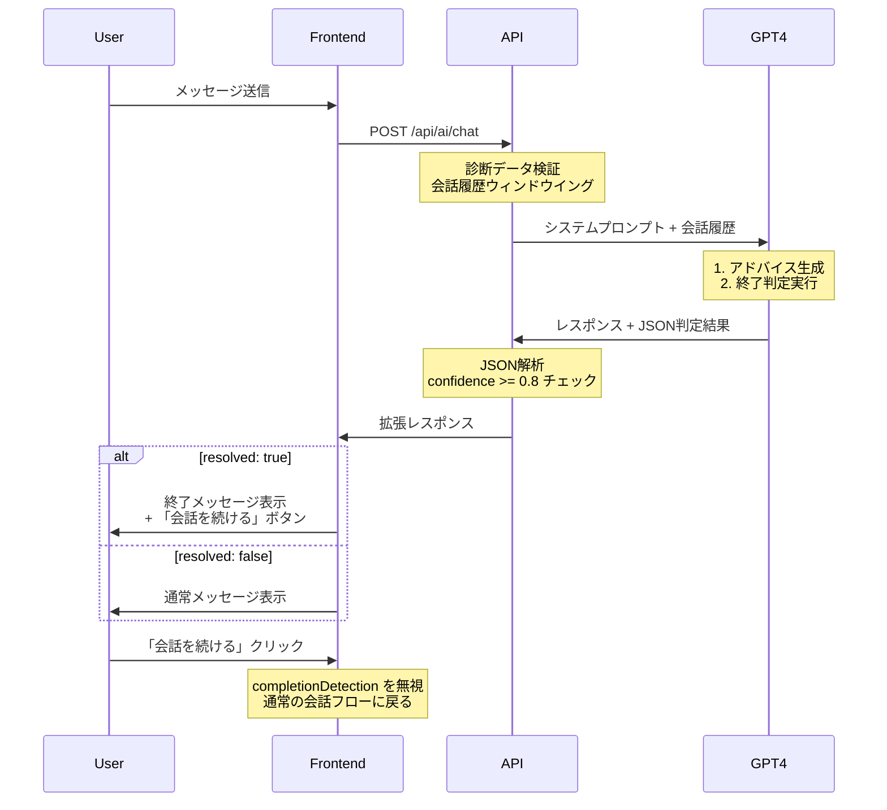

# AIチャット終了判断機能 - 詳細要件仕様書

**作成日**: 2025-10-09
**対象システム**: COCOSiL Analysis - 統合診断アドバイスチャット
**実装範囲**: MVP (Minimum Viable Product)
**推定工数**: 2-3日

---

## 📋 1. 要件定義サマリー

### 1.1 機能概要
AIチャット機能に**終了判断機能**を追加し、ユーザーの当初の悩みが解決されたとAIが判断した場合、自動的にチャットを終了する。

### 1.2 ユーザー決定事項

| 質問 | 決定 | 説明 |
|------|------|------|
| **Q1: 解決判定方法** | A | AI自身が会話の文脈から判断（GPT-4メタ判断） |
| **Q2: 誤判定リカバリー** | A | 継続要求ボタンで誤判定に対応 |
| **Q3: 終了メッセージトーン** | B | フレンドリーな雰囲気（親しみやすいパーソナル診断サービス） |
| **Q4: MVP範囲** | A | 基本的な終了判定のみ（2-3日実装） |
| **Q5: 当初の悩み定義** | B（推奨） | 診断結果から自動抽出 |
| **Q6: 診断結果連携** | A（推奨） | 参照する（パーソナライズ判定） |
| **Q7: パフォーマンス** | B（推奨） | 1-3秒（既存API活用） |

### 1.3 成功指標 (KPI)

| 指標 | 目標値 | 測定方法 |
|------|--------|----------|
| **判定精度** | 80%以上 | ユーザーフィードバック収集 |
| **False Positive率** | 15%以下 | 誤終了→継続ボタン押下率 |
| **ユーザー満足度** | 4.0/5.0以上 | 終了後の満足度アンケート |
| **応答時間** | 平均2秒以内 | サーバーログ分析 |

---

## 🏗️ 2. 技術仕様

### 2.1 システムアーキテクチャ

```
┌─────────────────────────────────────────────────────────┐
│                    Frontend (React)                      │
│  ┌─────────────────────────────────────────────────┐   │
│  │  Chat Interface Component                        │   │
│  │  - メッセージ表示                                  │   │
│  │  - 終了メッセージUI                               │   │
│  │  - 「会話を続ける」ボタン                          │   │
│  └──────────────────┬──────────────────────────────┘   │
└────────────────────┼────────────────────────────────────┘
                     │ API Request (POST /api/ai/chat)
                     ↓
┌─────────────────────────────────────────────────────────┐
│              Backend API (Next.js 14)                    │
│  ┌─────────────────────────────────────────────────┐   │
│  │  src/app/api/ai/chat/route.ts                    │   │
│  │  1. メッセージ受信                                │   │
│  │  2. GPT-4に送信（システムプロンプト拡張）          │   │
│  │  3. 終了判定結果を解析                            │   │
│  │  4. レスポンス生成                                │   │
│  └──────────────────┬──────────────────────────────┘   │
└────────────────────┼────────────────────────────────────┘
                     │ OpenAI API Request
                     ↓
┌─────────────────────────────────────────────────────────┐
│                   OpenAI GPT-4                           │
│  - システムプロンプト（判定ロジック含む）                 │
│  - 会話履歴（最新6ターン）                               │
│  - メタ判断実行                                         │
│  - JSON形式レスポンス生成                                │
└─────────────────────────────────────────────────────────┘
```

### 2.2 GPT-4 システムプロンプト設計

#### 2.2.1 プロンプト構造

```typescript
// 新規追加: 終了判定用システムプロンプト拡張
const COMPLETION_DETECTION_PROMPT = `
## 会話終了判定タスク

あなたは2つの役割を持ちます：
1. **アドバイザー役**: ユーザーの悩みに対して温かく共感的にアドバイスを提供
2. **判定者役**: 会話終了後、ユーザーの問題が解決したかを判断

### 判定基準（以下をすべて評価）

a) **明示的解決シグナル**: ユーザーが「ありがとう」「助かりました」「解決しました」など感謝や完了を示す
b) **質問の消滅**: 新たな質問や疑問が含まれていない
c) **実用的解決**: 提案した行動計画が実現可能で、ユーザーが納得している
d) **前向きな締めくくり**: ユーザーの発言トーンがポジティブまたは満足感を示す

### 判定出力フォーマット

会話の最後に、以下のJSON形式**のみ**を出力してください（他の説明文は含めない）：

\`\`\`json
{
  "resolved": <true|false>,
  "confidence": <0.0-1.0>,
  "next_action": "<string>",
  "_reasoning": "<free-text>"
}
\`\`\`

- **resolved**: 問題が解決したと判断する場合はtrue
- **confidence**: 判定の確信度（0.8以上でのみresolvedをtrueにする）
- **next_action**: 次に取るべきアクション（resolved: true → "会話を終了します", false → 具体的な質問提案）
- **_reasoning**: 判定理由（内部処理用）

### 保守的判定の原則

- **False Positiveを避ける**: 迷った場合はresolvedをfalseにする
- **確信度閾値**: confidence < 0.8の場合は必ずresolvedをfalseにする
- **丁寧な確認**: ユーザーが新しい質問を暗に示唆していないか注意深く読む

### COCOSiL固有のコンテキスト

- **当初の悩み**: ${initialConcern} （診断結果から自動抽出）
- **MBTI**: ${mbtiType} （${mbtiCharacteristics}）
- **体癖**: ${taihekiPrimary}種 （${taihekiCharacteristics}）
- **算命学**: ${fortuneAnimal} / ${fortuneSixStar}

### パーソナライズ判定ロジック

- **Thinking型（T）**: 論理的解決策が明確か確認 → "具体的な行動計画は明確ですか？"
- **Feeling型（F）**: 感情的納得感を確認 → "お気持ちは少し楽になりましたか？"
- **体癖6種**: 完璧主義 → "すべての疑問が解消されましたか？"
- **体癖3種**: 感受性高い → "心の中でまだモヤモヤしていることはありませんか？"

### Few-Shot Examples

#### Example 1: Resolved (confidence: 0.9)
**User**: "なるほど、そういう視点で考えればいいんですね。とても参考になりました！ありがとうございます。"
**判定**:
\`\`\`json
{
  "resolved": true,
  "confidence": 0.9,
  "next_action": "お役に立てて嬉しいです！また何かあればいつでもお話しましょう✨",
  "_reasoning": "明確な感謝表現、新しい質問なし、前向きな締めくくり、criteriaのa, b, dを満たす"
}
\`\`\`

#### Example 2: Not Resolved (confidence: 0.4)
**User**: "ありがとうございます。ところで、この方法って職場でも使えますか？"
**判定**:
\`\`\`json
{
  "resolved": false,
  "confidence": 0.4,
  "next_action": "はい、職場でも応用可能です。具体的にどんな場面を想定されていますか？",
  "_reasoning": "感謝表現はあるが、新しい質問（職場での応用）が続いている。criteriaのbを満たさない"
}
\`\`\`

#### Example 3: Borderline (confidence: 0.7 → false)
**User**: "わかりました。ちょっと考えてみます。"
**判定**:
\`\`\`json
{
  "resolved": false,
  "confidence": 0.7,
  "next_action": "ゆっくり考えてみてくださいね。もし疑問が出てきたら、いつでも聞いてください。",
  "_reasoning": "曖昧な応答で確信度が0.8未満。保守的判定の原則により falseにする"
}
\`\`\`
`;
```

### 2.3 API レスポンス拡張

#### 2.3.1 既存レスポンス形式
```typescript
// 現在のレスポンス (src/app/api/ai/chat/route.ts:374-388)
{
  message: string;
  usage: object;
  metadata: {
    maxTokens: number;
    temperature: number;
    usePsychologicalSafety: boolean;
    windowingInfo: object;
  };
  safetyData?: object;
  choiceQuestion?: object;
}
```

#### 2.3.2 拡張後のレスポンス形式
```typescript
// 新規追加: completionDetection フィールド
{
  message: string;
  usage: object;
  metadata: { /* 既存 */ };
  safetyData?: object;
  choiceQuestion?: object;

  // 🆕 終了判定結果
  completionDetection?: {
    resolved: boolean;
    confidence: number;
    nextAction: string;
    shouldShowContinueButton: boolean; // resolved && confidence >= 0.8
  };
}
```

### 2.4 データフロー詳細



---

## 💻 3. 実装計画

### 3.1 タスク分解

| ID | タスク | 工数 | 依存関係 | 担当ファイル |
|----|--------|------|----------|------------|
| **T1** | GPT-4プロンプト設計・実装 | 4h | - | `src/lib/ai/completion-detection-prompt.ts` (新規) |
| **T2** | API レスポンス拡張 | 2h | T1 | `src/app/api/ai/chat/route.ts` |
| **T3** | フロントエンド: 終了メッセージUI | 3h | T2 | `src/ui/components/chat/completion-message.tsx` (新規) |
| **T4** | フロントエンド: 継続ボタン実装 | 2h | T3 | 同上 |
| **T5** | 診断結果統合ロジック | 3h | T1 | `src/lib/ai/diagnosis-context-builder.ts` (新規) |
| **T6** | ユニットテスト | 4h | T1-T5 | `src/__tests__/lib/ai/completion-detection.test.ts` (新規) |
| **T7** | E2Eテスト | 3h | T1-T6 | `tests/e2e/chat-completion.spec.ts` (新規) |

**総工数**: 21時間 ≈ **2.5日**（1日8時間稼働）

### 3.2 実装詳細

#### Task T1: GPT-4プロンプト設計・実装

**新規ファイル**: `src/lib/ai/completion-detection-prompt.ts`

```typescript
import { UserDiagnosisData } from '@/types';

interface CompletionDetectionConfig {
  diagnosisData: UserDiagnosisData;
  initialConcern: string; // 診断結果から自動抽出された悩み
}

export class CompletionDetectionPromptEngine {
  private config: CompletionDetectionConfig;

  constructor(config: CompletionDetectionConfig) {
    this.config = config;
  }

  /**
   * 診断結果から当初の悩みを自動抽出
   */
  static extractInitialConcern(diagnosisData: UserDiagnosisData): string {
    const { mbti, taiheki, fortune } = diagnosisData;

    // MBTI + 体癖の組み合わせから典型的な悩みを生成
    const concerns: string[] = [];

    // MBTI based concerns
    if (mbti?.type.includes('I')) {
      concerns.push('人との関わり方やエネルギーバランス');
    }
    if (mbti?.type.includes('F')) {
      concerns.push('感情のコントロールや他者との感情的つながり');
    }

    // 体癖 based concerns
    switch (taiheki?.primary) {
      case 1:
      case 2:
        concerns.push('頭で考えすぎてしまう傾向');
        break;
      case 3:
      case 4:
        concerns.push('感受性の高さと他者との境界線');
        break;
      case 5:
      case 6:
        concerns.push('完璧主義や自己評価の厳しさ');
        break;
      // ... 他の体癖
    }

    return concerns.join('、');
  }

  /**
   * MBTI特性に基づくパーソナライズ判定ロジック生成
   */
  private generatePersonalizedJudgment(): string {
    const mbtiType = this.config.diagnosisData.mbti?.type || '';
    const taihekiPrimary = this.config.diagnosisData.taiheki?.primary || 0;

    const judgments: string[] = [];

    // Thinking vs Feeling
    if (mbtiType.includes('T')) {
      judgments.push('- **Thinking型**: 論理的解決策が明確か確認 → "具体的な行動計画は明確ですか？"');
    } else if (mbtiType.includes('F')) {
      judgments.push('- **Feeling型**: 感情的納得感を確認 → "お気持ちは少し楽になりましたか？"');
    }

    // 体癖特性
    if (taihekiPrimary === 6 || taihekiPrimary === 5) {
      judgments.push('- **体癖5-6種**: 完璧主義傾向 → "すべての疑問が解消されましたか？"');
    } else if (taihekiPrimary === 3 || taihekiPrimary === 4) {
      judgments.push('- **体癖3-4種**: 感受性高い → "心の中でまだモヤモヤしていることはありませんか？"');
    }

    return judgments.join('\n');
  }

  /**
   * 完全なシステムプロンプトを生成
   */
  generateSystemPrompt(): string {
    const { diagnosisData, initialConcern } = this.config;
    const personalizedJudgment = this.generatePersonalizedJudgment();

    return `
## 会話終了判定タスク

あなたは2つの役割を持ちます：
1. **アドバイザー役**: ユーザーの悩みに対して温かく共感的にアドバイスを提供
2. **判定者役**: 会話終了後、ユーザーの問題が解決したかを判断

### 判定基準（以下をすべて評価）

a) **明示的解決シグナル**: ユーザーが「ありがとう」「助かりました」「解決しました」など感謝や完了を示す
b) **質問の消滅**: 新たな質問や疑問が含まれていない
c) **実用的解決**: 提案した行動計画が実現可能で、ユーザーが納得している
d) **前向きな締めくくり**: ユーザーの発言トーンがポジティブまたは満足感を示す

### 判定出力フォーマット

会話の最後に、以下のJSON形式**のみ**を出力してください（他の説明文は含めない）：

\`\`\`json
{
  "resolved": <true|false>,
  "confidence": <0.0-1.0>,
  "next_action": "<string>",
  "_reasoning": "<free-text>"
}
\`\`\`

- **resolved**: 問題が解決したと判断する場合はtrue
- **confidence**: 判定の確信度（0.8以上でのみresolvedをtrueにする）
- **next_action**: 次に取るべきアクション
- **_reasoning**: 判定理由（内部処理用）

### 保守的判定の原則

- **False Positiveを避ける**: 迷った場合はresolvedをfalseにする
- **確信度閾値**: confidence < 0.8の場合は必ずresolvedをfalseにする

### COCOSiL固有のコンテキスト

- **当初の悩み**: ${initialConcern}
- **MBTI**: ${diagnosisData.mbti?.type || '未診断'}
- **体癖**: ${diagnosisData.taiheki?.primary || '未診断'}種
- **算命学**: ${diagnosisData.fortune?.animal || '未診断'} / ${diagnosisData.fortune?.sixStar || '未診断'}

### パーソナライズ判定ロジック

${personalizedJudgment}

### Few-Shot Examples

#### Example 1: Resolved (confidence: 0.9)
**User**: "なるほど、そういう視点で考えればいいんですね。とても参考になりました！ありがとうございます。"
**判定**:
\`\`\`json
{
  "resolved": true,
  "confidence": 0.9,
  "next_action": "お役に立てて嬉しいです！また何かあればいつでもお話しましょう✨",
  "_reasoning": "明確な感謝表現、新しい質問なし、前向きな締めくくり"
}
\`\`\`

#### Example 2: Not Resolved (confidence: 0.4)
**User**: "ありがとうございます。ところで、この方法って職場でも使えますか？"
**判定**:
\`\`\`json
{
  "resolved": false,
  "confidence": 0.4,
  "next_action": "はい、職場でも応用可能です。具体的にどんな場面を想定されていますか？",
  "_reasoning": "感謝表現はあるが、新しい質問が続いている"
}
\`\`\`
`;
  }

  /**
   * GPT-4レスポンスからJSON判定結果を抽出
   */
  static parseCompletionDetection(gptResponse: string): {
    resolved: boolean;
    confidence: number;
    nextAction: string;
    reasoning: string;
  } | null {
    try {
      // JSON部分を抽出（```json ... ``` または直接JSONオブジェクト）
      const jsonMatch = gptResponse.match(/```json\s*([\s\S]*?)\s*```/) ||
                       gptResponse.match(/\{[\s\S]*"resolved"[\s\S]*\}/);

      if (!jsonMatch) {
        console.warn('No completion detection JSON found in response');
        return null;
      }

      const jsonStr = jsonMatch[1] || jsonMatch[0];
      const parsed = JSON.parse(jsonStr);

      return {
        resolved: parsed.resolved === true && parsed.confidence >= 0.8,
        confidence: parsed.confidence,
        nextAction: parsed.next_action,
        reasoning: parsed._reasoning
      };
    } catch (error) {
      console.error('Failed to parse completion detection:', error);
      return null;
    }
  }
}
```

#### Task T2: API レスポンス拡張

**既存ファイル修正**: `src/app/api/ai/chat/route.ts`

```typescript
// Line 3-6に追加
import { CompletionDetectionPromptEngine } from '@/lib/ai/completion-detection-prompt';

// Line 190-194の後に追加（systemPrompt生成前）
let completionDetectionEngine: CompletionDetectionPromptEngine | null = null;

if (diagnosisData) {
  const initialConcern = CompletionDetectionPromptEngine.extractInitialConcern(
    diagnosisData as UserDiagnosisData
  );

  completionDetectionEngine = new CompletionDetectionPromptEngine({
    diagnosisData: diagnosisData as UserDiagnosisData,
    initialConcern
  });
}

// Line 224付近（psychoEngineのsystemPrompt生成後）に追加
if (completionDetectionEngine) {
  systemPrompt += '\n\n' + completionDetectionEngine.generateSystemPrompt();
}

// Line 372-388のレスポンス生成部分を修正
const content = response.choices[0]?.message?.content || '';

// 🆕 終了判定結果を解析
let completionDetection: any = null;
if (completionDetectionEngine) {
  const parsed = CompletionDetectionPromptEngine.parseCompletionDetection(content);
  if (parsed) {
    completionDetection = {
      resolved: parsed.resolved,
      confidence: parsed.confidence,
      nextAction: parsed.nextAction,
      shouldShowContinueButton: parsed.resolved && parsed.confidence >= 0.8
    };
  }
}

return NextResponse.json({
  message: content,
  usage: response.usage,
  metadata: {
    maxTokens,
    temperature,
    usePsychologicalSafety,
    windowingInfo: {
      droppedCount,
      compressionRatio: contextInfo.compressionRatio
    }
  },
  safetyData,
  choiceQuestion,
  completionDetection // 🆕 追加
});
```

#### Task T3-T4: フロントエンド実装

**新規ファイル**: `src/ui/components/chat/completion-message.tsx`

```typescript
import React from 'react';
import { Button } from '@/components/ui/button';
import { Card, CardContent } from '@/components/ui/card';

interface CompletionMessageProps {
  nextAction: string;
  onContinue: () => void;
}

export const CompletionMessage: React.FC<CompletionMessageProps> = ({
  nextAction,
  onContinue
}) => {
  return (
    <Card className="mt-4 border-brand-500 bg-brand-50">
      <CardContent className="pt-6">
        <div className="flex flex-col gap-4">
          <div className="text-base text-foreground">
            {nextAction}
          </div>
          <div className="flex justify-end gap-3">
            <Button
              variant="outline"
              onClick={onContinue}
              className="border-brand-500 text-brand-700 hover:bg-brand-100"
            >
              会話を続ける
            </Button>
          </div>
        </div>
      </CardContent>
    </Card>
  );
};
```

**既存ファイル修正**: チャットインターフェースコンポーネント（該当ファイルを特定後）

```typescript
// APIレスポンス型拡張
interface ChatResponse {
  message: string;
  completionDetection?: {
    resolved: boolean;
    confidence: number;
    nextAction: string;
    shouldShowContinueButton: boolean;
  };
}

// メッセージ表示部分
{response.completionDetection?.shouldShowContinueButton && (
  <CompletionMessage
    nextAction={response.completionDetection.nextAction}
    onContinue={() => {
      // completionDetectionを無視して通常の会話フローに戻る
      setCompletionDetection(null);
    }}
  />
)}
```

---

## 🧪 4. テスト戦略

### 4.1 ユニットテスト

**新規ファイル**: `src/__tests__/lib/ai/completion-detection.test.ts`

```typescript
import { CompletionDetectionPromptEngine } from '@/lib/ai/completion-detection-prompt';
import { UserDiagnosisData } from '@/types';

describe('CompletionDetectionPromptEngine', () => {
  const mockDiagnosisData: UserDiagnosisData = {
    basic: { name: 'テストユーザー', age: 30, email: 'test@example.com', gender: 'other', birthdate: '1994-01-01' },
    mbti: { type: 'INFP', source: 'self_assessment' },
    taiheki: { primary: 3, secondary: 4, scores: {}, characteristics: [] },
    fortune: { animal: '鳳凰', zodiac: '水瓶座', sixStar: '天貴星' },
    progress: { step: 'completed', completedSteps: [], lastUpdated: new Date() }
  };

  describe('extractInitialConcern', () => {
    test('INFP + 体癖3種から適切な悩みを抽出', () => {
      const concern = CompletionDetectionPromptEngine.extractInitialConcern(mockDiagnosisData);
      expect(concern).toContain('人との関わり方');
      expect(concern).toContain('感情のコントロール');
      expect(concern).toContain('感受性の高さ');
    });
  });

  describe('parseCompletionDetection', () => {
    test('resolved: true, high confidence → shouldShowContinueButton: true', () => {
      const gptResponse = `
        \`\`\`json
        {
          "resolved": true,
          "confidence": 0.9,
          "next_action": "お役に立てて嬉しいです！",
          "_reasoning": "明確な感謝表現"
        }
        \`\`\`
      `;
      const result = CompletionDetectionPromptEngine.parseCompletionDetection(gptResponse);
      expect(result?.resolved).toBe(true);
      expect(result?.confidence).toBe(0.9);
    });

    test('resolved: true, low confidence → false due to threshold', () => {
      const gptResponse = `
        \`\`\`json
        {
          "resolved": true,
          "confidence": 0.7,
          "next_action": "考えてみてください",
          "_reasoning": "曖昧な応答"
        }
        \`\`\`
      `;
      const result = CompletionDetectionPromptEngine.parseCompletionDetection(gptResponse);
      expect(result?.resolved).toBe(false); // confidence < 0.8
    });

    test('invalid JSON → returns null', () => {
      const gptResponse = 'これは普通のテキストです';
      const result = CompletionDetectionPromptEngine.parseCompletionDetection(gptResponse);
      expect(result).toBeNull();
    });
  });
});
```

### 4.2 E2Eテスト（Playwright）

**新規ファイル**: `tests/e2e/chat-completion.spec.ts`

```typescript
import { test, expect } from '@playwright/test';

test.describe('AI Chat Completion Detection', () => {
  test.beforeEach(async ({ page }) => {
    // 診断完了済みの状態でチャットページへ移動
    await page.goto('/diagnosis/chat');
  });

  test('明確な感謝表現で終了判定が動作', async ({ page }) => {
    // メッセージ送信
    await page.fill('[data-testid="chat-input"]', 'ありがとうございます！とても参考になりました。');
    await page.click('[data-testid="send-button"]');

    // 終了メッセージと継続ボタンが表示されるまで待つ
    await expect(page.locator('[data-testid="completion-message"]')).toBeVisible({ timeout: 5000 });
    await expect(page.locator('text=会話を続ける')).toBeVisible();
  });

  test('継続ボタンクリックで通常会話に戻る', async ({ page }) => {
    // ... 終了判定を発生させる ...
    await page.click('text=会話を続ける');

    // 継続ボタンが消え、通常の入力フィールドが表示される
    await expect(page.locator('[data-testid="completion-message"]')).not.toBeVisible();
    await expect(page.locator('[data-testid="chat-input"]')).toBeEnabled();
  });

  test('新しい質問がある場合は終了しない', async ({ page }) => {
    await page.fill('[data-testid="chat-input"]', 'ありがとうございます。ところで、職場でも使えますか？');
    await page.click('[data-testid="send-button"]');

    // 終了メッセージが表示されないことを確認
    await expect(page.locator('[data-testid="completion-message"]')).not.toBeVisible({ timeout: 3000 });
  });
});
```

### 4.3 ユーザーテスト計画

| フェーズ | 参加者 | 期間 | 評価項目 |
|----------|--------|------|----------|
| **Alpha** | 内部テスター 5名 | 3日 | 判定精度、UI/UX、バグ |
| **Beta** | 外部ユーザー 20名 | 1週間 | False Positive率、満足度 |
| **Production** | 全ユーザー | 継続 | KPI追跡、改善提案収集 |

---

## 🚀 5. デプロイメント

### 5.1 デプロイ前チェックリスト

- [ ] ユニットテスト全通過（30+ tests）
- [ ] E2Eテスト全通過（3+ scenarios）
- [ ] TypeScript型チェック通過（`npm run type-check`）
- [ ] ESLint通過（`npm run lint`）
- [ ] ビルド成功（`npm run build`）
- [ ] 環境変数確認（`OPENAI_API_KEY`）
- [ ] ステージング環境での手動テスト

### 5.2 ロールバック計画

**緊急時の対応**:
1. 環境変数で機能無効化フラグを追加
   ```bash
   ENABLE_COMPLETION_DETECTION=false
   ```
2. API側で条件分岐
   ```typescript
   if (process.env.ENABLE_COMPLETION_DETECTION !== 'true') {
     completionDetectionEngine = null;
   }
   ```
3. フロントエンドは既存のレスポンス形式に後方互換性あり

---

## 📈 6. 今後の拡張ロードマップ

### Phase 2: 判定精度向上（実装後1ヶ月）

- ユーザーフィードバック収集機能
  - 「この判定は正しかったですか？」アンケート
  - フィードバックデータをログに蓄積
- 判定ログの分析ダッシュボード
  - False Positive/Negative率の可視化
  - 診断結果別の精度比較

### Phase 3: 診断結果統合強化（実装後2-3ヶ月）

- より高度なパーソナライズ
  - 算命学の「十大主星」に基づく判定ロジック追加
  - Taiheki体癖の詳細特性（偶数種・奇数種）の考慮
- 軽量分類器への移行検討
  - spaCy + scikit-learn によるローカル判定
  - GPT-4はアドバイス生成のみに使用

### Phase 4: A/Bテスト実装（実装後3ヶ月）

- 複数の終了判定戦略を並行テスト
  - Strategy A: 保守的判定（confidence >= 0.9）
  - Strategy B: 中庸判定（confidence >= 0.8）
  - Strategy C: 積極的判定（confidence >= 0.7）
- 最適戦略の選定と自動切り替え

---

## 📚 7. 参考資料

### 技術資料
- [OpenAI GPT-4 System Prompt Best Practices](https://platform.openai.com/docs/guides/prompt-engineering)
- [O3 Conversation Completion Detection Guide](https://docs.anthropic.com/claude/docs)
- [Gemini NLP Implementation Methods](https://ai.google.dev/gemini-api/docs)

### プロジェクト内部資料
- `claudedocs/admin-search-improvement-spec.md` (検索機能改善の前例)
- `src/lib/ai/psychological-safety-prompt-engine.ts` (既存プロンプトエンジン)
- `src/lib/chat/conversation-utils.ts` (会話ウィンドウイング実装)

---

**文書バージョン**: 1.0
**最終更新**: 2025-10-09
**承認者**: [ユーザー名]
**実装開始予定**: 承認後即座
