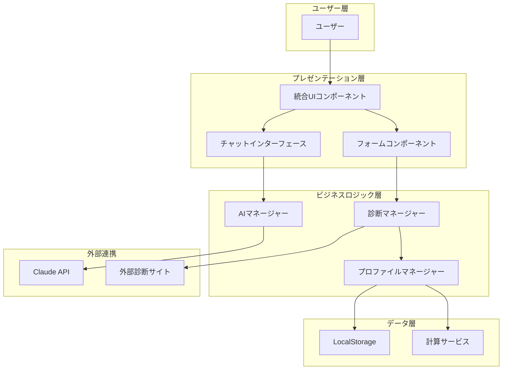
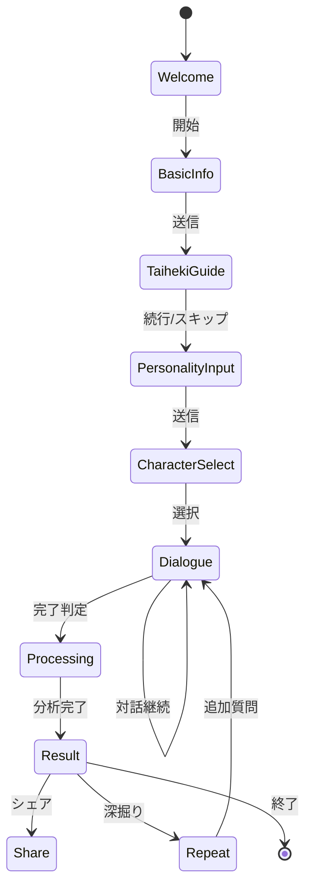
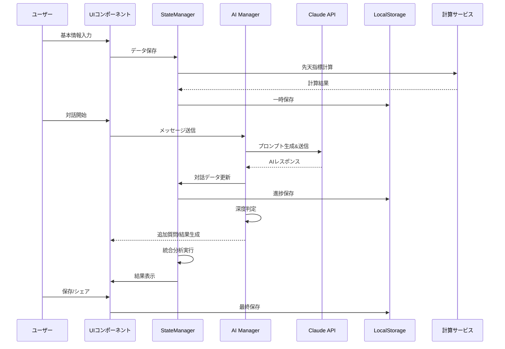
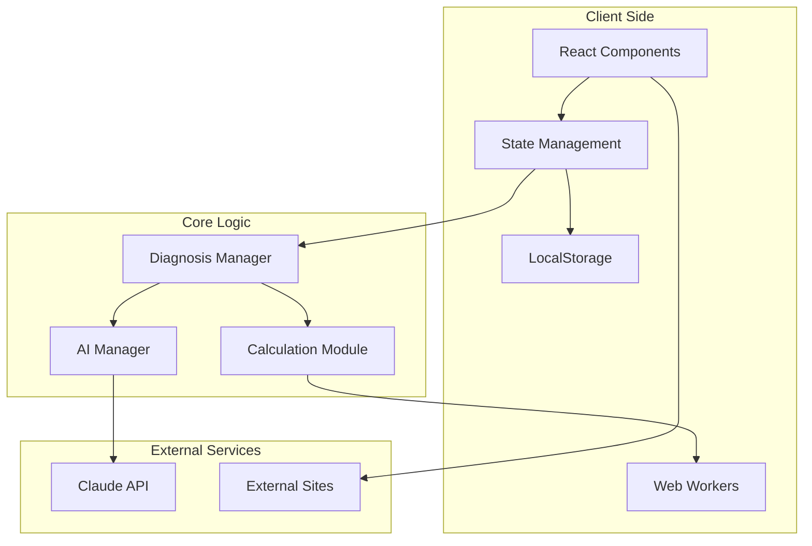

# PersonaLens - AI駆動型多角的性格分析サービス 詳細要件定義書

**Version**: 1.0  
**作成日**: 2025年1月23日  
**プロジェクトフェーズ**: Phase 1 (PoC/MVP)  
**想定開発期間**: 3ヶ月（1人月）  
**予算規模**: 10万円

---

## 目次

1. [エグゼクティブサマリー](#1-エグゼクティブサマリー)
2. [サービス詳細設計](#2-サービス詳細設計)
3. [機能要件詳細](#3-機能要件詳細)
4. [UI/UX詳細設計](#4-uiux詳細設計)
5. [データ設計](#5-データ設計)
6. [AI/診断ロジック詳細](#6-ai診断ロジック詳細)
7. [技術アーキテクチャ](#7-技術アーキテクチャ)
8. [セキュリティ・プライバシー](#8-セキュリティプライバシー)
9. [テスト計画](#9-テスト計画)
10. [リスク管理](#10-リスク管理)
11. [付録](#11-付録)

---

## 1. エグゼクティブサマリー

### 1.1 プロジェクトビジョン

PersonaLensは、**東洋の決定論的世界観（四柱推命的思想）と西洋の心理学的アプローチ（行動主義的分析）を統合**し、AIとの対話を通じて個人の性格的課題を分析し、実践的な解決策を提示する革新的なWebサービスです。

### 1.2 独自価値提案（UVP）

```
従来の性格診断：単一理論 × 一方向的 × 抽象的結果
　　　↓
PersonaLens：複数理論統合 × 対話型 × 具体的解決策
```

### 1.3 ビジネスゴール

| フェーズ | 期間 | 目標 | KPI |
|---------|------|------|-----|
| Phase 1 (PoC) | 3ヶ月 | 技術検証・MVP開発 | 100人のテストユーザー獲得 |
| Phase 2 | 6ヶ月 | 本番環境構築 | 1,000人の月間アクティブユーザー |
| Phase 3 | 12ヶ月 | 収益化開始 | 有料会員100人獲得 |

### 1.4 ターゲットペルソナ

#### プライマリペルソナ：田中さくら（25歳・IT企業勤務）
- **背景**: 入社3年目、キャリアの方向性に悩む
- **課題**: 自己理解不足、強みが分からない
- **ニーズ**: 具体的な行動指針、科学的根拠
- **利用シーン**: 週末の自己分析時間

#### セカンダリペルソナ：鈴木太郎（28歳・営業職）
- **背景**: 恋愛関係で同じ失敗を繰り返す
- **課題**: 行動パターンの自覚不足
- **ニーズ**: 相性診断、コミュニケーション改善
- **利用シーン**: デート前の相性確認

---

## 2. サービス詳細設計

### 2.1 サービスアーキテクチャ



### 2.2 診断理論の統合モデル

#### 2.2.1 理論体系マトリクス

| 分類 | 理論名 | 役割 | 重要度 | データソース |
|------|--------|------|--------|--------------|
| **後天指標** | 体癖論 | 身体-心理相関分析 | ★★★★★ | ユーザー入力/外部診断 |
| **後天指標** | MBTI | 認知機能分析 | ★★★★★ | ユーザー入力/対話推定 |
| **先天指標** | 動物占い | 本質的性格 | ★★★☆☆ | 生年月日計算 |
| **先天指標** | 6星占術 | 運命的傾向 | ★★☆☆☆ | 生年月日計算 |
| **先天指標** | 星座 | 基本的性質 | ★★☆☆☆ | 生年月日計算 |

#### 2.2.2 統合アルゴリズム

```python
def calculate_integrated_profile(user_data):
    # 後天指標（70%の重み）
    acquired_score = {
        'taiheki': analyze_taiheki(user_data.taiheki) * 0.35,
        'mbti': analyze_mbti(user_data.mbti) * 0.35
    }
    
    # 先天指標（30%の重み）
    innate_score = {
        'animal': analyze_animal(user_data.birth_date) * 0.15,
        'six_star': analyze_six_star(user_data.birth_date) * 0.10,
        'zodiac': analyze_zodiac(user_data.birth_date) * 0.05
    }
    
    # AI対話による個別調整（±20%の変動）
    dialogue_adjustment = ai_dialogue_analysis(user_data.conversations)
    
    return integrate_scores(acquired_score, innate_score, dialogue_adjustment)
```

### 2.3 ユーザージャーニーマップ

```
認知段階：
[Google検索] → [LP訪問] → [サービス理解]
　　↓
利用開始段階：
[基本情報入力] → [体癖診断誘導] → [MBTI入力]
　　↓
診断段階：
[AIキャラ選択] → [対話開始] → [深掘り質問] → [追加入力]
　　↓
結果段階：
[結果表示] → [保存/シェア] → [詳細確認]
　　↓
継続利用段階：
[再訪問] → [深掘り診断] → [相性診断] → [定期利用]
```

---

## 3. 機能要件詳細

### 3.1 機能一覧と詳細仕様

#### F-001: 基本診断フロー

**概要**: チャットとフォームを統合した診断の基本フロー

**詳細仕様**:
```javascript
// 診断フローステート管理
const DiagnosisFlow = {
  stages: [
    {
      id: 'welcome',
      type: 'chat',
      content: 'ウェルカムメッセージ',
      next: 'basic_info'
    },
    {
      id: 'basic_info',
      type: 'form',
      fields: ['name', 'birthDate', 'gender'],
      validation: {
        name: /^.{1,50}$/,
        birthDate: /^\d{4}-\d{2}-\d{2}$/,
        gender: ['male', 'female', 'other', 'prefer_not_to_say']
      },
      next: 'taiheki_guide'
    },
    {
      id: 'taiheki_guide',
      type: 'chat_with_links',
      externalLinks: {
        test: 'https://taiheki-test.example.com',
        intro: 'https://taiheki-intro.example.com'
      },
      skipOption: true,
      next: 'personality_input'
    },
    {
      id: 'personality_input',
      type: 'form',
      fields: ['mbti', 'taiheki'],
      optional: ['taiheki'],
      next: 'ai_character_selection'
    },
    {
      id: 'ai_character_selection',
      type: 'selection',
      options: ['friendly', 'professional', 'mystic', 'custom'],
      next: 'dialogue_session'
    },
    {
      id: 'dialogue_session',
      type: 'dynamic_chat',
      minTurns: 3,
      maxTurns: 10,
      next: 'result_generation'
    },
    {
      id: 'result_generation',
      type: 'processing',
      next: 'result_display'
    }
  ]
}
```

**受け入れ条件**:
- [ ] 各ステージ間の遷移がスムーズ
- [ ] バリデーションエラーの適切な表示
- [ ] 進捗インジケーターの表示
- [ ] 戻る機能の実装

#### F-002: リピート深掘り機能

**概要**: 過去の診断データを基にした追加分析

**詳細仕様**:
```javascript
// リピート診断のデータ構造
const RepeatDiagnosis = {
  checkPreviousSession: (userId) => {
    const history = localStorage.getItem(`user_${userId}_history`);
    return history ? JSON.parse(history) : null;
  },
  
  generateFollowUpQuestions: (previousData) => {
    // 前回の診断で不明確だった領域を特定
    const unclearAreas = identifyUnclearAreas(previousData);
    
    // 矛盾する回答の確認
    const contradictions = findContradictions(previousData);
    
    // 時間経過による変化の確認
    const timeBasedQuestions = generateTimeBasedQuestions(previousData.timestamp);
    
    return {
      priority: [...contradictions, ...unclearAreas],
      optional: timeBasedQuestions
    };
  },
  
  mergeResults: (previousResult, newResult) => {
    return {
      core: weightedAverage(previousResult.core, newResult.core, 0.3, 0.7),
      evolution: trackEvolution(previousResult, newResult),
      insights: generateComparativeInsights(previousResult, newResult)
    };
  }
}
```

#### F-003: 診断結果品質向上

**概要**: 複数理論の統合と矛盾解消アルゴリズム

**詳細仕様**:
```javascript
const QualityEnhancement = {
  // 理論間の矛盾検出
  detectContradictions: (results) => {
    const contradictions = [];
    
    // MBTI-体癖の矛盾チェック
    if (results.mbti.includes('E') && results.taiheki.includes('2')) {
      contradictions.push({
        type: 'extraversion_mismatch',
        severity: 'low',
        resolution: 'consider_context'
      });
    }
    
    return contradictions;
  },
  
  // 矛盾の解消
  resolveContradictions: (contradictions, dialogueData) => {
    return contradictions.map(c => {
      switch(c.type) {
        case 'extraversion_mismatch':
          return analyzeContextualExtraversion(dialogueData);
        default:
          return useDialogueWeight(dialogueData);
      }
    });
  },
  
  // 信頼度スコアの計算
  calculateConfidenceScore: (data) => {
    const factors = {
      dataCompleteness: checkDataCompleteness(data) * 0.3,
      consistency: checkConsistency(data) * 0.3,
      dialogueDepth: measureDialogueDepth(data) * 0.4
    };
    
    return Object.values(factors).reduce((a, b) => a + b, 0);
  }
}
```

#### F-004: 履歴保存機能

**概要**: LocalStorageを使用した診断履歴管理

**詳細仕様**:
```javascript
const HistoryManager = {
  // データ構造
  schema: {
    version: '1.0',
    sessions: [
      {
        id: 'uuid',
        timestamp: 'ISO8601',
        basicInfo: {},
        diagnosis: {},
        result: {},
        metadata: {
          completionRate: 0.0,
          timeSpent: 0,
          aiCharacter: 'string'
        }
      }
    ],
    preferences: {
      aiCharacter: 'string',
      language: 'ja',
      theme: 'light'
    }
  },
  
  // 保存処理
  save: (sessionData) => {
    const key = 'personalens_history';
    const existing = localStorage.getItem(key);
    const history = existing ? JSON.parse(existing) : { sessions: [] };
    
    // 容量チェック（5MB制限）
    if (JSON.stringify(history).length > 5 * 1024 * 1024) {
      // 古いセッションを削除
      history.sessions = history.sessions.slice(-10);
    }
    
    history.sessions.push(sessionData);
    localStorage.setItem(key, JSON.stringify(history));
  },
  
  // 読み込み処理
  load: (sessionId = null) => {
    const key = 'personalens_history';
    const history = JSON.parse(localStorage.getItem(key) || '{"sessions":[]}');
    
    if (sessionId) {
      return history.sessions.find(s => s.id === sessionId);
    }
    return history.sessions;
  },
  
  // エクスポート機能
  export: () => {
    const history = JSON.parse(localStorage.getItem('personalens_history') || '{}');
    const blob = new Blob([JSON.stringify(history, null, 2)], 
                          { type: 'application/json' });
    const url = URL.createObjectURL(blob);
    const a = document.createElement('a');
    a.href = url;
    a.download = `personalens_backup_${Date.now()}.json`;
    a.click();
  }
}
```

#### F-005: SNSシェア機能

**概要**: 診断結果のSNS共有機能

**詳細仕様**:
```javascript
const ShareManager = {
  // シェア用データ生成
  generateShareData: (result) => {
    return {
      title: 'PersonaLens診断結果',
      summary: generateShareSummary(result),
      hashtags: ['PersonaLens', '性格診断', 'AI診断'],
      image: generateOGPImage(result)
    };
  },
  
  // プラットフォーム別シェア
  platforms: {
    twitter: (data) => {
      const text = `${data.summary}\n${data.hashtags.map(h => `#${h}`).join(' ')}`;
      const url = `https://twitter.com/intent/tweet?text=${encodeURIComponent(text)}`;
      window.open(url, '_blank');
    },
    
    facebook: (data) => {
      const url = `https://www.facebook.com/sharer/sharer.php?u=${encodeURIComponent(window.location.href)}`;
      window.open(url, '_blank');
    },
    
    line: (data) => {
      const url = `https://social-plugins.line.me/lineit/share?url=${encodeURIComponent(window.location.href)}`;
      window.open(url, '_blank');
    },
    
    copyLink: () => {
      const shareUrl = `${window.location.origin}/result/${getCurrentSessionId()}`;
      navigator.clipboard.writeText(shareUrl);
      showNotification('リンクをコピーしました');
    }
  },
  
  // プライバシー設定
  privacy: {
    excludePersonalInfo: true,
    shareLevel: 'summary', // 'full' | 'summary' | 'minimal'
    expirationDays: 30
  }
}
```

#### F-006: 相性診断機能

**概要**: 2人の診断結果から相性を分析

**詳細仕様**:
```javascript
const CompatibilityAnalyzer = {
  // 相性計算アルゴリズム
  calculate: (person1, person2) => {
    const scores = {
      // MBTI相性（認知機能の補完性）
      mbti: calculateMBTICompatibility(person1.mbti, person2.mbti),
      
      // 体癖相性（エネルギーバランス）
      taiheki: calculateTaihekiCompatibility(person1.taiheki, person2.taiheki),
      
      // 動物占い相性（本質的相性）
      animal: calculateAnimalCompatibility(person1.animal, person2.animal),
      
      // 総合スコア
      overall: 0
    };
    
    // 重み付け平均
    scores.overall = (scores.mbti * 0.4 + 
                     scores.taiheki * 0.4 + 
                     scores.animal * 0.2);
    
    return scores;
  },
  
  // 相性の詳細分析
  analyzeDetails: (person1, person2, scores) => {
    return {
      strengths: identifyStrengths(person1, person2),
      challenges: identifyChallenges(person1, person2),
      advice: generateRelationshipAdvice(person1, person2, scores),
      scenarios: {
        work: analyzeWorkCompatibility(person1, person2),
        romance: analyzeRomanticCompatibility(person1, person2),
        friendship: analyzeFriendshipCompatibility(person1, person2)
      }
    };
  },
  
  // 相性改善アドバイス
  generateAdvice: (analysis) => {
    return {
      communication: generateCommunicationTips(analysis),
      conflictResolution: generateConflictResolutionStrategies(analysis),
      growthAreas: identifyMutualGrowthAreas(analysis)
    };
  }
}
```

---

## 4. UI/UX詳細設計

### 4.1 画面構成詳細

#### 4.1.1 レイアウト設計

```html
<!-- メインレイアウト構造 -->
<div class="app-container">
  <!-- ヘッダー -->
  <header class="app-header">
    <div class="logo">PersonaLens</div>
    <nav class="main-nav">
      <button class="nav-item">診断履歴</button>
      <button class="nav-item">設定</button>
      <button class="nav-item">ヘルプ</button>
    </nav>
  </header>
  
  <!-- メインコンテンツ -->
  <main class="main-content">
    <!-- プログレスバー -->
    <div class="progress-bar">
      <div class="progress-fill" style="width: 40%"></div>
      <div class="progress-steps">
        <span class="step completed">基本情報</span>
        <span class="step active">対話中</span>
        <span class="step">結果</span>
      </div>
    </div>
    
    <!-- チャットエリア -->
    <div class="chat-container">
      <div class="messages-area">
        <!-- AIメッセージ -->
        <div class="message ai-message">
          <div class="avatar ai-avatar"></div>
          <div class="message-content">
            <p>こんにちは！あなたのことを教えてください。</p>
            <!-- 埋め込みフォーム -->
            <div class="embedded-form">
              <input type="text" placeholder="お名前" />
              <input type="date" placeholder="生年月日" />
              <select>
                <option>性別を選択</option>
                <option>男性</option>
                <option>女性</option>
                <option>その他</option>
                <option>回答しない</option>
              </select>
              <button class="submit-btn">送信</button>
            </div>
          </div>
        </div>
        
        <!-- ユーザーメッセージ -->
        <div class="message user-message">
          <div class="message-content">
            <p>田中太郎です。1995年5月15日生まれです。</p>
          </div>
          <div class="avatar user-avatar"></div>
        </div>
      </div>
      
      <!-- 入力エリア -->
      <div class="input-area">
        <textarea placeholder="メッセージを入力..."></textarea>
        <button class="send-btn">送信</button>
      </div>
    </div>
  </main>
  
  <!-- フッター -->
  <footer class="app-footer">
    <p>&copy; 2025 PersonaLens. All rights reserved.</p>
  </footer>
</div>
```

#### 4.1.2 レスポンシブ対応

```css
/* ブレークポイント定義 */
:root {
  --mobile: 375px;
  --tablet: 768px;
  --desktop: 1024px;
  --wide: 1440px;
}

/* モバイル対応 */
@media (max-width: 767px) {
  .chat-container {
    height: calc(100vh - 120px);
    padding: 10px;
  }
  
  .embedded-form {
    flex-direction: column;
  }
  
  .progress-steps span {
    display: none;
  }
}

/* タブレット対応 */
@media (min-width: 768px) and (max-width: 1023px) {
  .chat-container {
    max-width: 90%;
    margin: 0 auto;
  }
}

/* デスクトップ対応 */
@media (min-width: 1024px) {
  .chat-container {
    max-width: 800px;
    margin: 0 auto;
  }
}
```

### 4.2 インタラクション設計

#### 4.2.1 状態遷移図



#### 4.2.2 エラーハンドリング

```javascript
const ErrorHandler = {
  types: {
    VALIDATION: 'validation_error',
    API: 'api_error',
    NETWORK: 'network_error',
    STORAGE: 'storage_error',
    UNKNOWN: 'unknown_error'
  },
  
  messages: {
    validation: {
      name: '名前は1〜50文字で入力してください',
      birthDate: '生年月日を正しい形式で入力してください',
      mbti: 'MBTIは4文字のアルファベットで入力してください',
      taiheki: '体癖は1〜10の数字で入力してください'
    },
    api: {
      claude: 'AI接続エラー：しばらく待ってから再試行してください',
      rateLimit: 'API制限に達しました：1分後に再試行してください'
    },
    network: {
      offline: 'インターネット接続を確認してください',
      timeout: '接続がタイムアウトしました'
    },
    storage: {
      full: 'ストレージ容量が不足しています',
      corrupted: 'データが破損しています'
    }
  },
  
  handle: (error, context) => {
    console.error('Error:', error, 'Context:', context);
    
    // ユーザーへの通知
    showNotification({
      type: error.type,
      message: ErrorHandler.messages[error.category][error.code],
      action: error.recoverable ? 'retry' : 'dismiss'
    });
    
    // エラーログの保存
    logError(error, context);
  }
}
```

### 4.3 AIキャラクター詳細設計

```javascript
const AICharacters = {
  friendly: {
    name: 'ユウキ',
    avatar: '😊',
    tone: {
      greeting: 'やっほー！',
      questioning: '〜って感じかな？',
      encouragement: 'いいね！その調子！',
      closing: 'また話そうね！'
    },
    personality: {
      formality: 0.2,
      empathy: 0.9,
      humor: 0.7,
      emoji_usage: 0.8
    }
  },
  
  professional: {
    name: 'ユミ',
    avatar: '👔',
    tone: {
      greeting: 'こんにちは。本日の診断を始めさせていただきます。',
      questioning: '〜についてお聞かせください。',
      encouragement: 'ありがとうございます。理解いたしました。',
      closing: '診断結果をまとめさせていただきました。'
    },
    personality: {
      formality: 0.9,
      empathy: 0.6,
      humor: 0.2,
      emoji_usage: 0.1
    }
  },
  
  mystic: {
    name: 'ルナ',
    avatar: '🔮',
    tone: {
      greeting: '星々があなたを導いています…',
      questioning: '〜の真実を見せてください',
      encouragement: '素晴らしい波動を感じます',
      closing: '運命の扉が開かれました'
    },
    personality: {
      formality: 0.6,
      empathy: 0.8,
      humor: 0.3,
      emoji_usage: 0.5,
      special_tokens: ['✨', '🌙', '⭐']
    }
  },
  
  custom: {
    configurable: true,
    parameters: {
      name: { type: 'string', maxLength: 20 },
      formality: { type: 'slider', min: 0, max: 1 },
      empathy: { type: 'slider', min: 0, max: 1 },
      humor: { type: 'slider', min: 0, max: 1 },
      emoji_usage: { type: 'slider', min: 0, max: 1 }
    }
  }
}
```

---

## 5. データ設計

### 5.1 データモデル

```typescript
// TypeScript型定義
interface UserSession {
  id: string;
  version: string;
  timestamp: string;
  
  basicInfo: {
    name: string;
    birthDate: string;
    gender: 'male' | 'female' | 'other' | 'prefer_not_to_say';
    email?: string;
  };
  
  personalityData: {
    mbti?: string;
    taiheki?: number;
    calculated: {
      animal: string;
      animalDetails: {
        number: number;
        color: string;
        label: string;
      };
      sixStar: string;
      zodiac: string;
      age: number;
    };
  };
  
  dialogueData: {
    aiCharacter: string;
    messages: Array<{
      id: string;
      role: 'user' | 'assistant' | 'system';
      content: string;
      timestamp: string;
      metadata?: {
        formData?: any;
        emotions?: string[];
        topics?: string[];
      };
    }>;
    summary: {
      totalTurns: number;
      duration: number;
      depth: number;
      completionRate: number;
    };
  };
  
  analysisResult: {
    timestamp: string;
    confidence: number;
    
    corePersonality: {
      primary: string[];
      secondary: string[];
      hidden: string[];
    };
    
    behaviorPatterns: {
      daily: string[];
      thinking: string[];
      relationship: string[];
    };
    
    currentIssues: Array<{
      issue: string;
      severity: 'high' | 'medium' | 'low';
      rootCause: string;
      relatedTraits: string[];
    }>;
    
    solutions: {
      immediate: Array<{
        action: string;
        expectedImpact: string;
        difficulty: number;
      }>;
      midTerm: Array<{
        action: string;
        timeline: string;
        milestones: string[];
      }>;
      longTerm: Array<{
        transformation: string;
        requirements: string[];
        benefits: string[];
      }>;
    };
    
    insights: {
      strengths: string[];
      growthAreas: string[];
      recommendations: string[];
    };
  };
  
  metadata: {
    device: string;
    browser: string;
    referrer?: string;
    completionPath: string[];
    abTestGroup?: string;
  };
}
```

### 5.2 データフロー



### 5.3 データ永続化戦略

```javascript
const PersistenceStrategy = {
  // LocalStorage構造
  structure: {
    'personalens_current': 'currentSession',
    'personalens_history': 'sessionHistory[]',
    'personalens_preferences': 'userPreferences',
    'personalens_cache': 'temporaryData'
  },
  
  // データ圧縮
  compression: {
    enable: true,
    algorithm: 'LZ-string',
    threshold: 1024 // 1KB以上で圧縮
  },
  
  // データ暗号化（将来実装）
  encryption: {
    enable: false,
    algorithm: 'AES-256',
    keyDerivation: 'PBKDF2'
  },
  
  // 自動クリーンアップ
  cleanup: {
    maxSessions: 20,
    maxAge: 90 * 24 * 60 * 60 * 1000, // 90日
    maxSize: 5 * 1024 * 1024 // 5MB
  },
  
  // バックアップ戦略
  backup: {
    autoExport: false,
    format: 'json',
    includeMetadata: true
  }
}
```

---

## 6. AI/診断ロジック詳細

### 6.1 プロンプトエンジニアリング

#### 6.1.1 システムプロンプト

```javascript
const SystemPrompt = `
あなたはPersonaLensの対話型性格分析AIです。

## 役割
- ユーザーとの自然な対話を通じて性格分析に必要な情報を収集
- 東洋の決定論的視点と西洋の心理学的視点を統合した分析
- 具体的で実践可能な解決策の提示

## 分析フレームワーク
1. 後天指標（70%）
   - 体癖論: 身体的特徴と心理の相関
   - MBTI: 認知機能パターン
   
2. 先天指標（30%）
   - 動物占い: 本質的性格
   - 6星占術: 運命的傾向
   - 星座: 基本的性質

## 対話ガイドライン
- ユーザーの感情に共感しながら質問
- 抽象的な質問より具体的な場面を想定
- 3-5回の対話で十分な情報を収集
- 矛盾する回答があれば優しく確認

## 出力形式
- 分析の確信度を0-1で表現
- 具体的な行動例を3つ以上提示
- 解決策は即効性/中期/長期の3段階

## キャラクター設定
${characterSettings}
`;
```

#### 6.1.2 対話フロー制御

```javascript
const DialogueController = {
  // 質問生成ロジック
  generateQuestion: (context, depth) => {
    const prompt = `
    現在の対話コンテキスト:
    ${JSON.stringify(context)}
    
    深度レベル: ${depth}/10
    
    次の質問を生成してください：
    1. より具体的な情報を引き出す
    2. 前回の回答を深掘りする
    3. 矛盾がある場合は確認する
    
    質問形式:
    - 開かれた質問を優先
    - 具体的な場面を想定
    - 感情に配慮した表現
    `;
    
    return callClaudeAPI(prompt);
  },
  
  // 深度判定アルゴリズム
  assessDepth: (dialogue) => {
    const factors = {
      messageCount: dialogue.messages.length,
      wordCount: dialogue.messages.reduce((sum, m) => sum + m.content.split(' ').length, 0),
      topicsCovered: new Set(dialogue.messages.flatMap(m => m.metadata?.topics || [])).size,
      emotionalDepth: calculateEmotionalDepth(dialogue),
      consistency: checkConsistency(dialogue)
    };
    
    // 重み付けスコア計算
    const score = (
      factors.messageCount * 0.1 +
      Math.min(factors.wordCount / 500, 1) * 0.2 +
      Math.min(factors.topicsCovered / 5, 1) * 0.3 +
      factors.emotionalDepth * 0.2 +
      factors.consistency * 0.2
    );
    
    return {
      score,
      isComplete: score > 0.7,
      needsMoreInfo: score < 0.5,
      specificAreas: identifyMissingAreas(factors)
    };
  }
}
```

### 6.2 診断アルゴリズム詳細

#### 6.2.1 体癖論分析

```javascript
const TaihekiAnalyzer = {
  // 体癖特性マッピング
  characteristics: {
    1: {
      name: '上下型・頭脳型・奇数',
      physical: ['面長', '首が長い', '前屈み姿勢'],
      psychological: ['論理的', '観念的', '善悪重視'],
      behavioral: ['考えてから行動', '言葉に敏感', '理屈好き'],
      stress: ['首の後ろが痛む', '思考による発散'],
      compatibility: {
        good: [9, 3],
        challenging: [2, 8]
      }
    },
    // ... 他の体癖データ
  },
  
  // 統合分析
  analyze: (taihekiNumber, dialogueData) => {
    const base = TaihekiAnalyzer.characteristics[taihekiNumber];
    
    // 対話データから特性の強度を判定
    const strengthAnalysis = analyzeStrength(dialogueData, base);
    
    // 複合体癖の可能性を検討
    const complexPattern = detectComplexPattern(dialogueData);
    
    return {
      primary: base,
      strength: strengthAnalysis,
      secondary: complexPattern,
      recommendations: generateTaihekiRecommendations(base, strengthAnalysis)
    };
  }
}
```

#### 6.2.2 MBTI認知機能分析

```javascript
const MBTICognitiveFunctions = {
  // 認知機能スタック
  stacks: {
    'INTJ': ['Ni', 'Te', 'Fi', 'Se'],
    'ENTP': ['Ne', 'Ti', 'Fe', 'Si'],
    // ... 全16タイプ
  },
  
  // 機能の詳細
  functions: {
    'Ni': {
      name: '内向的直観',
      description: 'パターン認識、未来予測、洞察',
      behaviors: ['長期的視点', '直感的理解', '象徴的思考']
    },
    'Te': {
      name: '外向的思考',
      description: '効率性、組織化、客観的判断',
      behaviors: ['目標達成志向', 'システム構築', '論理的決定']
    },
    // ... 全8機能
  },
  
  // 対話からの推定
  inferFromDialogue: (dialogueData) => {
    const indicators = {
      Ne: countPatternMatches(dialogueData, ['可能性', 'アイデア', '関連性']),
      Ni: countPatternMatches(dialogueData, ['洞察', '直感', '本質']),
      Te: countPatternMatches(dialogueData, ['効率', '計画', '結果']),
      Ti: countPatternMatches(dialogueData, ['論理', '分析', '原理']),
      Fe: countPatternMatches(dialogueData, ['調和', '共感', '配慮']),
      Fi: countPatternMatches(dialogueData, ['価値観', '信念', '真正性']),
      Se: countPatternMatches(dialogueData, ['現在', '実践', '感覚']),
      Si: countPatternMatches(dialogueData, ['経験', '詳細', '伝統'])
    };
    
    return estimateMBTIType(indicators);
  }
}
```

### 6.3 統合分析エンジン

```javascript
const IntegrationEngine = {
  // メイン分析フロー
  analyze: async (userData) => {
    // Step 1: 各理論による個別分析
    const analyses = {
      taiheki: await analyzeTaiheki(userData),
      mbti: await analyzeMBTI(userData),
      animal: await analyzeAnimal(userData),
      sixStar: await analyzeSixStar(userData),
      zodiac: await analyzeZodiac(userData)
    };
    
    // Step 2: 矛盾の検出と解消
    const contradictions = detectContradictions(analyses);
    const resolved = resolveContradictions(contradictions, userData.dialogue);
    
    // Step 3: 統合プロファイル生成
    const profile = {
      core: mergeCoreTraits(analyses, resolved),
      behavioral: extractBehavioralPatterns(analyses),
      emotional: analyzeEmotionalPatterns(userData.dialogue),
      cognitive: analyzeCognitiveStyle(analyses.mbti, analyses.taiheki)
    };
    
    // Step 4: 問題分析
    const issues = {
      identified: identifyIssues(profile, userData.dialogue),
      rootCauses: analyzeRootCauses(profile),
      priority: prioritizeIssues(issues.identified)
    };
    
    // Step 5: 解決策生成
    const solutions = {
      immediate: generateImmediateActions(issues, profile),
      midTerm: generateMidTermStrategies(issues, profile),
      longTerm: generateLongTermTransformations(issues, profile)
    };
    
    // Step 6: 信頼度スコア計算
    const confidence = calculateConfidence({
      dataCompleteness: assessDataCompleteness(userData),
      consistency: resolved.consistencyScore,
      dialogueQuality: assessDialogueQuality(userData.dialogue)
    });
    
    return {
      profile,
      issues,
      solutions,
      confidence,
      metadata: {
        analysisVersion: '1.0',
        timestamp: new Date().toISOString(),
        processingTime: Date.now() - startTime
      }
    };
  }
}
```

---

## 7. 技術アーキテクチャ

### 7.1 システムアーキテクチャ



### 7.2 コンポーネント構成

```javascript
// React コンポーネントツリー
const ComponentStructure = {
  App: {
    Router: {
      HomePage: {
        WelcomeSection: {},
        StartButton: {}
      },
      DiagnosisPage: {
        ProgressBar: {},
        ChatContainer: {
          MessageList: {
            AIMessage: {
              EmbeddedForm: {}
            },
            UserMessage: {}
          },
          InputArea: {
            TextInput: {},
            SendButton: {}
          }
        }
      },
      ResultPage: {
        ResultSummary: {},
        DetailedAnalysis: {},
        ShareButtons: {},
        SaveButton: {}
      },
      HistoryPage: {
        SessionList: {},
        SessionDetail: {}
      }
    },
    GlobalComponents: {
      Header: {},
      Footer: {},
      NotificationToast: {},
      LoadingSpinner: {},
      ErrorBoundary: {}
    }
  }
}
```

### 7.3 状態管理設計

```javascript
// Zustand Store設計
const useStore = create((set, get) => ({
  // User State
  user: {
    currentSession: null,
    history: [],
    preferences: {}
  },
  
  // Diagnosis State
  diagnosis: {
    stage: 'welcome',
    progress: 0,
    data: {
      basic: {},
      personality: {},
      dialogue: []
    }
  },
  
  // UI State
  ui: {
    loading: false,
    error: null,
    notification: null,
    theme: 'light'
  },
  
  // Actions
  actions: {
    startDiagnosis: () => set(state => ({
      diagnosis: {
        ...state.diagnosis,
        stage: 'basic_info',
        progress: 0
      }
    })),
    
    updateDiagnosisData: (category, data) => set(state => ({
      diagnosis: {
        ...state.diagnosis,
        data: {
          ...state.diagnosis.data,
          [category]: data
        }
      }
    })),
    
    saveToHistory: () => {
      const currentData = get().diagnosis.data;
      const history = get().user.history;
      
      set(state => ({
        user: {
          ...state.user,
          history: [...history, currentData]
        }
      }));
      
      // LocalStorageに保存
      localStorage.setItem('personalens_history', 
                          JSON.stringify(get().user.history));
    }
  }
}));
```

### 7.4 パフォーマンス最適化

```javascript
const PerformanceOptimization = {
  // 遅延ローディング
  lazyLoading: {
    components: [
      'ResultVisualization',
      'HistoryChart',
      'CompatibilityAnalyzer'
    ],
    
    implementation: `
      const ResultVisualization = lazy(() => 
        import('./components/ResultVisualization')
      );
    `
  },
  
  // メモ化戦略
  memoization: {
    expensiveCalculations: [
      'calculateCompatibility',
      'generateDetailedAnalysis',
      'processDialogueData'
    ],
    
    implementation: `
      const memoizedCalculation = useMemo(() => 
        expensiveCalculation(data), [data]
      );
    `
  },
  
  // バーチャルスクロール
  virtualScrolling: {
    threshold: 50, // 50件以上でバーチャル化
    implementation: 'react-window'
  },
  
  // Web Worker活用
  webWorkers: {
    tasks: [
      'fortuneCalculation',
      'dataCompression',
      'exportGeneration'
    ],
    
    implementation: `
      const worker = new Worker('./workers/calculator.js');
      worker.postMessage({ type: 'calculate', data });
      worker.onmessage = (e) => handleResult(e.data);
    `
  },
  
  // キャッシュ戦略
  caching: {
    apiResponses: {
      ttl: 5 * 60 * 1000, // 5分
      storage: 'memory'
    },
    calculations: {
      ttl: 30 * 60 * 1000, // 30分
      storage: 'localStorage'
    }
  }
}
```

---

## 8. セキュリティ・プライバシー

### 8.1 セキュリティ要件

```javascript
const SecurityMeasures = {
  // 入力検証
  inputValidation: {
    sanitization: {
      html: 'DOMPurify',
      sql: 'parameterized queries',
      xss: 'content-security-policy'
    },
    
    validation: {
      name: /^[\p{L}\p{N}\s\-'.]{1,50}$/u,
      email: /^[^\s@]+@[^\s@]+\.[^\s@]+$/,
      date: /^\d{4}-\d{2}-\d{2}$/
    }
  },
  
  // APIキー管理
  apiKeyManagement: {
    storage: 'sessionStorage', // 一時的な保存
    encryption: false, // Phase 1では未実装
    validation: /^sk-[a-zA-Z0-9]{48}$/,
    masking: (key) => `${key.slice(0, 6)}...${key.slice(-4)}`
  },
  
  // CSP設定
  contentSecurityPolicy: `
    default-src 'self';
    script-src 'self' 'unsafe-inline' https://api.anthropic.com;
    style-src 'self' 'unsafe-inline';
    img-src 'self' data: https:;
    connect-src 'self' https://api.anthropic.com;
    font-src 'self';
    object-src 'none';
    media-src 'self';
    frame-src 'none';
  `,
  
  // Rate Limiting
  rateLimiting: {
    api: {
      requests: 10,
      window: 60000 // 1分
    },
    diagnosis: {
      sessions: 5,
      window: 3600000 // 1時間
    }
  }
}
```

### 8.2 プライバシー保護

```javascript
const PrivacyProtection = {
  // データ最小化
  dataMinimization: {
    required: ['name', 'birthDate'],
    optional: ['email', 'gender', 'taiheki'],
    never: ['address', 'phone', 'creditCard']
  },
  
  // 匿名化
  anonymization: {
    sharing: {
      exclude: ['name', 'email', 'birthDate'],
      generalize: {
        age: 'ageRange', // 25 -> 20-29
        birthDate: 'birthYear'
      }
    }
  },
  
  // データ削除
  dataRetention: {
    active: 'unlimited',
    inactive: 90 * 24 * 60 * 60 * 1000, // 90日
    deleted: 'immediate'
  },
  
  // ユーザー権利
  userRights: {
    access: true,
    rectification: true,
    erasure: true,
    portability: true,
    objection: true
  }
}
```

---

## 9. テスト計画

### 9.1 テスト戦略

```javascript
const TestStrategy = {
  // 単体テスト
  unit: {
    coverage: 80,
    tools: ['Jest', 'React Testing Library'],
    targets: [
      'Utility functions',
      'React components',
      'State management',
      'Calculation modules'
    ]
  },
  
  // 統合テスト
  integration: {
    coverage: 60,
    tools: ['Cypress'],
    scenarios: [
      'Complete diagnosis flow',
      'Data persistence',
      'API integration',
      'Error handling'
    ]
  },
  
  // E2Eテスト
  e2e: {
    coverage: 40,
    tools: ['Playwright'],
    userJourneys: [
      'First-time user',
      'Returning user',
      'Share functionality',
      'History management'
    ]
  },
  
  // パフォーマンステスト
  performance: {
    tools: ['Lighthouse', 'WebPageTest'],
    metrics: {
      FCP: '< 1.5s',
      LCP: '< 2.5s',
      TTI: '< 3.5s',
      CLS: '< 0.1'
    }
  }
}
```

### 9.2 テストケース例

```javascript
// 診断フローのテストケース
describe('Diagnosis Flow', () => {
  it('should complete basic diagnosis successfully', async () => {
    // Arrange
    const mockUser = {
      name: 'テスト太郎',
      birthDate: '1995-05-15',
      gender: 'male',
      mbti: 'INTJ'
    };
    
    // Act
    await userEvent.type(screen.getByLabelText('名前'), mockUser.name);
    await userEvent.type(screen.getByLabelText('生年月日'), mockUser.birthDate);
    await userEvent.selectOptions(screen.getByLabelText('性別'), mockUser.gender);
    await userEvent.click(screen.getByText('次へ'));
    
    // Assert
    expect(screen.getByText('体癖診断')).toBeInTheDocument();
  });
  
  it('should handle API errors gracefully', async () => {
    // Arrange
    mockClaudeAPI.mockRejectedValue(new Error('API Error'));
    
    // Act
    await userEvent.click(screen.getByText('診断開始'));
    
    // Assert
    expect(screen.getByText('エラーが発生しました')).toBeInTheDocument();
    expect(screen.getByText('再試行')).toBeInTheDocument();
  });
});
```

---

## 10. リスク管理

### 10.1 技術的リスク

| リスク | 影響度 | 発生確率 | 対策 |
|--------|--------|----------|------|
| Claude API料金超過 | 高 | 中 | ユーザー自身のAPIキー使用、レート制限実装 |
| LocalStorage容量超過 | 中 | 低 | 自動クリーンアップ、データ圧縮 |
| ブラウザ互換性問題 | 中 | 低 | Polyfill使用、段階的機能劣化 |
| パフォーマンス劣化 | 中 | 中 | 遅延ローディング、Web Worker活用 |

### 10.2 ビジネスリスク

| リスク | 影響度 | 発生確率 | 対策 |
|--------|--------|----------|------|
| 診断精度への不満 | 高 | 中 | 継続的改善、フィードバック収集 |
| 体癖論の認知度不足 | 中 | 高 | 丁寧な説明、外部リンク提供 |
| 競合サービスの出現 | 中 | 中 | 独自機能の強化、UX改善 |
| 個人情報漏洩懸念 | 高 | 低 | ローカル処理、透明性確保 |

### 10.3 対策優先順位

```javascript
const RiskMitigation = {
  immediate: [
    'API key validation',
    'Rate limiting',
    'Error handling',
    'Data validation'
  ],
  
  shortTerm: [
    'Performance optimization',
    'Browser compatibility',
    'User feedback system',
    'Documentation'
  ],
  
  longTerm: [
    'Backend implementation',
    'Data encryption',
    'Advanced analytics',
    'ML model training'
  ]
}
```

---

## 11. 付録

### 11.1 用語集

| 用語 | 説明 |
|------|------|
| 体癖論 | 野口晴哉による身体的特徴と心理の相関理論 |
| MBTI | Myers-Briggs Type Indicatorの略、16タイプ性格診断 |
| 先天指標 | 生まれ持った変更不可能な性質 |
| 後天指標 | 経験により形成された変更可能な性質 |
| 認知機能 | MBTIにおける8つの心理機能 |
| 動物占い | 生年月日から12動物に分類する占い |
| 6星占術 | 細木数子による6つの星による運勢占い |

### 11.2 参考資料

- 体癖論レポート（250809_体癖論レポート.md）
- 動物占いリファレンス（動物占い（個性心理學）リファレンス.md）
- 動物占いデータ（doubutsu_uranai_essence_lookup_1960_2025.csv）
- 占い計算モジュール（fortune_calculator_fixed.py）

### 11.3 変更履歴

| バージョン | 日付 | 変更内容 |
|------------|------|----------|
| 1.0 | 2025-01-23 | 初版作成 |

### 11.4 連絡先

- プロジェクトオーナー: [Your Name]
- 技術的な質問: [Email]
- フィードバック: [Feedback Form URL]

---

## 承認

| 役割 | 氏名 | 承認日 |
|------|------|--------|
| プロジェクトオーナー | | |
| 技術リード | | |
| UXデザイナー | | |

---

*本ドキュメントは継続的に更新される生きた文書です。*  
*最新版は常にプロジェクトリポジトリを参照してください。*